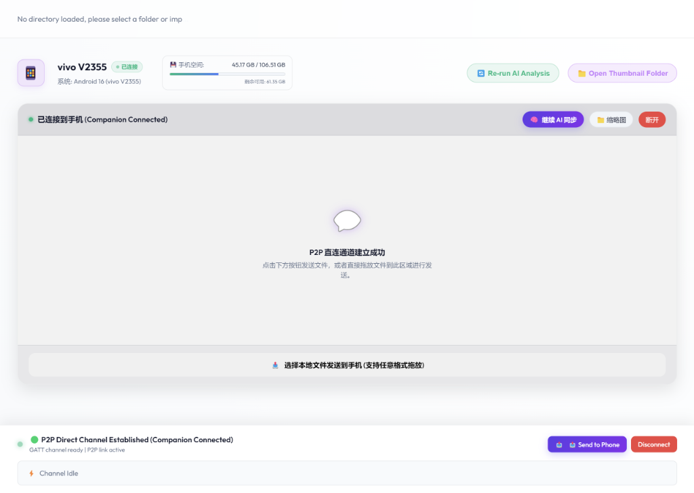
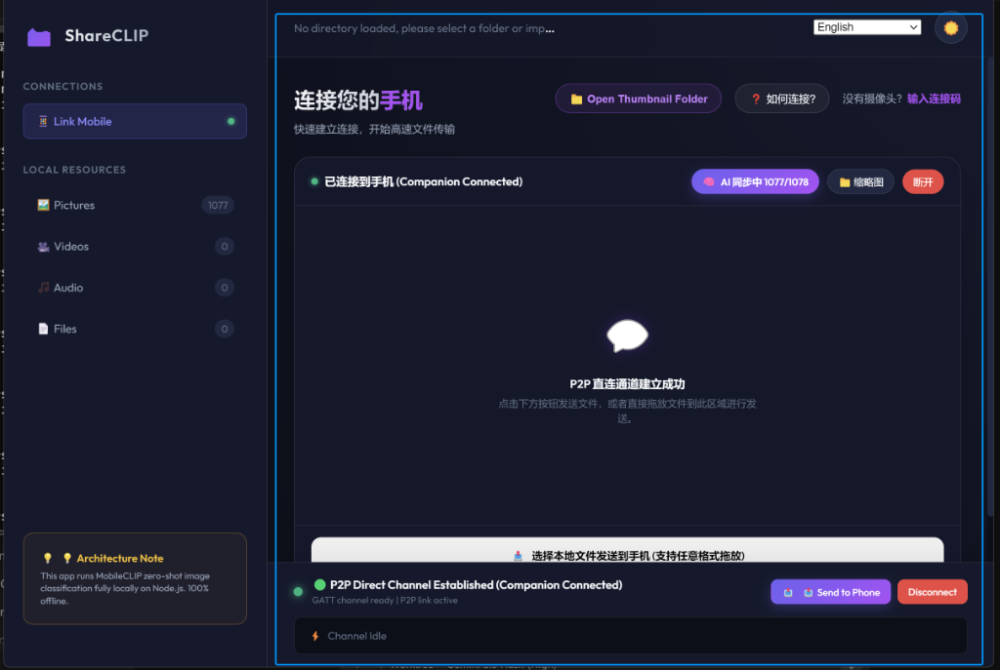

<div align="center">

  

  <br/><br/>

  # 📸 ShareCLIP
  ### Private P2P Photo Sync & Local AI Gallery
  *(Formerly AIShare-Grabber)*

  <p align="center">
    <b>Transfer photos directly from your Android phone to your PC over high-speed local Wi-Fi.</b><br/>
    <b>Then search and organize your entire photo library using 100% on-device AI.</b>
  </p>

  <p align="center">
    <b>🚫 No Cloud Uploads &nbsp;•&nbsp; 🔌 No USB Cables &nbsp;•&nbsp; 💳 No Subscriptions &nbsp;•&nbsp; 🔒 100% Private</b>
  </p>

  <p align="center">
    <a href="https://github.com/NovaMindLab/AIShare-Grabber/releases/latest">
      
    </a>
    &nbsp;&nbsp;
    <a href="https://github.com/NovaMindLab/AIShare-Grabber/releases/latest">
      
    </a>
    &nbsp;&nbsp;
    <a href="https://novamindlab.github.io/AIShare-Grabber/webshare/">
      
    </a>
  </p>

  <p align="center">
    <a href="https://github.com/NovaMindLab/AIShare-Grabber/releases"></a>
    <a href="https://github.com/NovaMindLab/AIShare-Grabber/stargazers"></a>
    
    
    <a href="https://github.com/NovaMindLab/AIShare-Grabber/blob/main/LICENSE"></a>
  </p>

  <p align="center">
    <a href="#-see-it-in-action"><b>🎬 Demo</b></a> •
    <a href="#-real-world-scenarios"><b>💡 Real Scenarios</b></a> •
    <a href="#-why-shareclip-comparison"><b>⚖️ Comparison</b></a> •
    <a href="#-key-capabilities"><b>✨ Features</b></a> •
    <a href="#-quick-start"><b>🚀 Quick Start</b></a> •
    <a href="#-technical-architecture"><b>🧠 Under the Hood</b></a> •
    <a href="#-中文详细介绍"><b>🇨🇳 中文说明</b></a>
  </p>

</div>

---

## ⚡ How It Works (In 5 Seconds)

```
┌─────────────────┐        Local Wi-Fi / P2P        ┌─────────────────┐
│   Android 📱    │ ──────────────────────────────> │     PC 🖥️       │
│  (Scan QR Code) │     (Zero Cloud • 80+ MB/s)     │ (Local Storage) │
└─────────────────┘                                 └────────┬────────┘
                                                             │
                                                             ▼
                                                    ┌─────────────────┐
                                                    │   Local AI 🧠   │
                                                    │ (100% Offline)  │
                                                    └────────┬────────┘
                                                             │
                                                             ▼
                                                🔍 "dog playing on grass"
                                                🔍 "sunset at the beach"
                                                🔍 "receipts from last month"
```

1. **Instant Wireless Pairing**: Open the Android companion app, scan the QR code on your PC screen—connected in seconds.
2. **Lightning P2P Transfer**: Your photos stream directly over your local Wi-Fi at gigabit speeds (**80+ MB/s**). No USB cables, no mobile data usage.
3. **On-Device AI Indexing**: PC indexes and classifies your photos completely locally using embedded vision models.
4. **Natural Language Search**: Type what you remember in everyday language to find any photo instantly.

---

## 🎬 See It In Action

### 1. High-Speed Wireless P2P Stream Pipeline
Your photos never route through external servers. Mobile and desktop discover each other offline via Bluetooth Low Energy (BLE) or LAN broadcast, negotiating a direct **WebRTC P2P DataChannel** over local Wi-Fi:

<div align="center">
  
</div>

<br/>

> 🎥 **Interactive Web Demo & Video**: Watch the full 1080P real-world walkthrough on our [Official Website](https://novamindlab.github.io/AIShare-Grabber/#video-demo) or try the [Zero-Install WebShare](https://novamindlab.github.io/AIShare-Grabber/webshare/).

---

## 💡 Real-World Scenarios

### 🚀 1. Transfer Photos Without USB Cables
> *“Transfer 1,000 vacation photos from Android to PC without hunting for a USB-C cable.”*

- No driver installation, no ADB configuration, and no cable swapping.
- Tap **Sync**, and high-resolution thumbnails and photos stream straight into your organized PC folders at local Wi-Fi line rate.
- Backpressure flow control ensures butter-smooth transfers without choking your phone or PC.

### 🔍 2. Search Photos with Natural Language
> *“Where was that photo of my golden retriever in the snow?”*

Instead of scrolling through thousands of file names like `IMG_20240827_103211.jpg`, just search:
- **`"golden retriever running in the snow"`**
- **`"sunset at the beach"`**
- **`"tax invoices and receipts"`**
- **`"coffee latte art on wooden table"`**

The embedded **MobileCLIP** multimodal AI maps both your query and your pictures into a shared 512-dimensional vector space completely offline.

### 👥 3. Biometric Face Grouping & Timeline
> *“Group all photos of family members automatically into dedicated albums.”*

- Cascaded on-device face pipeline (**SCRFD 500M** detection + **MobileFaceNet** 512-D ArcFace).
- Groups portraits by individual identity using vectorized clustering—all calculated on your CPU/GPU without sharing biometric profiles to any third party.

### 🔒 4. 100% Private by Design
> *“Keep personal memories, family moments, and sensitive documents off the cloud.”*

- **Zero Cloud Upload**: Everything stays on your physical devices.
- **Zero Telemetry**: No tracking, no user profiling, no subscriptions.
- **Offline Capable**: Works even without an internet connection (e.g., local router or phone mobile hotspot).

---

## ⚖️ Why ShareCLIP? (Comparison)

| Capability / Feature | ✨ ShareCLIP | ☁️ Cloud Albums (Google / iCloud) | 🔌 USB Cable Transfer |
|:---|:---:|:---:|:---:|
| **P2P Wireless Transfer** | ✅ **Yes** (Gigabit Wi-Fi Direct) | ❌ No (Routes to remote server) | ❌ No (Wired only) |
| **Zero Cloud Upload** | ✅ **100% Private & Local** | ❌ Uploaded to 3rd-party servers | ✅ Local only |
| **Natural Language AI Search** | ✅ **Local AI** (100% Offline) | ⚠️ Cloud AI (Privacy trade-off) | ❌ No search capability |
| **Facial Recognition & Albums** | ✅ **On-Device** (WASM / SIMD) | ⚠️ Cloud AI | ❌ No |
| **Requires Physical Cable** | ❌ **No** (Wireless QR link) | ❌ No | ⚠️ **Yes** (Must carry cable) |
| **Storage & Subscription Cost** | 🆓 **Free & Open Source** | 💳 Monthly storage fee ($2~$10/mo) | 🆓 Free |
| **Internet / Cellular Data Usage** | ⚡ **0 MB** (LAN traffic only) | 📶 Consumes broadband/data plan | ⚡ 0 MB |
| **Cross-Device Deletion & Cleanup** | ✅ **Synchronized cleanup** | ⚠️ Partial / Complex sync | ❌ Manual file browsing |

---

## ✨ Key Capabilities

<div align="center">
  
</div>

<br/>

* **⚡ Ultra-Fast Local P2P Sync**: Seamless discovery over BLE GATT / UDP broadcast, automatically establishing encrypted WebRTC DataChannels for gigabit transfers.
* **🔍 Multimodal Semantic Image Search**: 512-D neural embeddings enable natural text-to-photo queries without manual tagging.
* **👥 Biometric Face Recognition & People Albums**: Fast face detection and clustering grouping family, friends, and portraits in seconds.
* **🧹 Intelligent Duplicate & Burst Shot Cleanup**: Cosine similarity leader-clustering locates duplicate shots and lets you free disk space on both PC and phone with one click.
* **🗺️ EXIF Travel Footprint Map**: Extracts GPS coordinates from camera EXIF tags, plotting your life memories on an interactive clustered map.
* **🖼️ 4K Immersive Lightbox**: Instant thumbnail browsing with on-demand 4K RAW image streaming from your phone when connected.
* **🌐 20+ Global Languages**: Fully internationalized UI (English, 简体中文, 繁體中文, 日本語, 한국어, Español, Français, Deutsch, etc.).

---

## 📸 Real App Screenshots

<table width="100%">
  <tr>
    <td width="50%" align="center">
      <b>📱 One-Tap Phone Connection & Storage Status</b><br/>
      
    </td>
    <td width="50%" align="center">
      <b>⚡ High-Speed Transfer & AI Synchronization</b><br/>
      
    </td>
  </tr>
  <tr>
    <td width="50%" align="center">
      <b>🧹 Smart Duplicate & Similar Image Clustering</b><br/>
      
    </td>
    <td width="50%" align="center">
      <b>🔍 Local Natural Language Query & Detection</b><br/>
      
    </td>
  </tr>
</table>

---

## 🚀 Quick Start

### 📦 Option 1: Download Ready-to-Use Binaries (Recommended)

1. **PC Desktop**: Download the Windows installer (`.exe`) from [GitHub Releases](https://github.com/NovaMindLab/AIShare-Grabber/releases/latest).
2. **Android Companion**: Download and install the companion APK (`.apk`) on your phone.
3. **Connect**: Launch both apps on the same Wi-Fi network, scan the QR code on your PC screen, and start syncing!

*No installation on PC? Try **[WebShare Online](https://novamindlab.github.io/AIShare-Grabber/webshare/)** directly in Google Chrome or Microsoft Edge.*

---

### 💻 Option 2: Build from Source (Developers)

#### Monorepo Structure
```
AIShare-Grabber/
├── 📱 android/      # Flutter Android Companion App (BLE GATT + WebRTC DataChannel)
├── 🖥️ cp_clip/      # Desktop Host App (Electron 30, Vue 3, ONNX Runtime, SQLite, Sharp)
│   ├── src/workers/ # Worker Thread Pool (Search, SIMD WASM clustering, ONNX Inference)
│   └── models/      # Quantized MobileCLIP-S0 & Buffalo_SC ONNX models
├── 🌐 web/          # Official Portal & Interactive Demo Website
├── ⚡ webshare/     # Pure Web Client (WebGPU + WebRTC P2P + IndexedDB)
└── 📖 wiki/         # Comprehensive Architecture & Protocol Documentation
```

#### 1. Android Mobile Client
```bash
# Prerequisites: Flutter SDK >= 3.11.1 & Android SDK
cd android
flutter pub get
flutter run --release
```

#### 2. Desktop PC Client
```bash
# Prerequisites: Node.js >= 20, Python >= 3.10
cd cp_clip
npm install

# Run in Development Mode
npm run dev

# Package as Windows Executable
npm run dist
```

#### 3. Official Web Portal
```bash
cd web
npm install
npm run dev
```

---

## 🧠 Technical Architecture (Under the Hood)

For system architects, AI researchers, and contributors who want to dive deeper into the implementation:

```mermaid
flowchart LR
    subgraph Mobile [Android Companion / WebShare]
        A[MediaStore / PhotoManager] -->|15-Way Concurrent Extraction| B[400x400 Thumbnail Stream]
        B -->|Chunked 16KB-32KB Binary Packets| C[WebRTC DataChannel]
    end

    subgraph Desktop [PC Host Electron]
        C -->|1-2ms Rapid Disk Write| D[Local Isolated Storage]
        D -->|Task Queue Dispatch| E[ONNX Worker Pool]
        
        subgraph AI_Engine [On-Device AI Acceleration]
            E -->|MobileCLIP-S0 256x256| F[512-D Image Embedding]
            E -->|SCRFD + MobileFaceNet| G[Face Biometric 512-D]
            F & G -->|Lock-Free Single Writer| H[(SharedArrayBuffer 40MB-200MB)]
        end
        
        H -->|Zero-Copy SIMD Dot Product| I[Sub-Millisecond Cosine Search]
        I --> J[Vue 3 60fps Virtual Timeline]
    end
```



* **Lock-Free SharedArrayBuffer RAM Sharing**: Eliminates IPC serialization overhead by mapping 512-D embeddings directly into shared physical memory (40MB~200MB tiering). Vector clustering of 5,000 photos finishes in ~120ms.
* **16-Byte Binary Protocol Framing**: Fixed header protocol (`fileId`, `chunkIndex`, `totalChunks`, `payloadLength`) handles high-concurrency streaming with backpressure control.
* **DirectML GPU ➔ CPU Auto-Fallback**: Ensures flawless operation across diverse Windows hardware configurations (discrete GPUs, AMD APUs, Intel integrated graphics).
* **Deep Architectural Specifications**: Read the complete design in our [Project Wiki](file:///d:/AI_serach_image/image_clip_android/wiki/README.md):
  - [AI Architecture & Zero-Copy SAB Deep Dive](file:///d:/AI_serach_image/image_clip_android/wiki/ai_architecture.md)
  - [WebRTC Channel Protocol & 16-Byte Headers](file:///d:/AI_serach_image/image_clip_android/wiki/android/WebRTC_Protocol.md)
  - [Face Recognition & Same-Photo Exclusion Clustering](file:///d:/AI_serach_image/image_clip_android/wiki/features/face_recognition.md)
  - [BLE GATT Signaling & Fallback Architecture](file:///d:/AI_serach_image/image_clip_android/wiki/pc/ble_gatt_compatibility_and_fallback.md)

---

## 🇨🇳 中文详细介绍

### 🌟 核心定位
**ShareCLIP (原 AIShare-Grabber)** 是一款**完全面向用户、注重隐私与极速体验的开源跨端照片同步与本地 AI 相册管理软件**。

日常生活中，我们经常面临两大痛点：
1. **传图繁琐**：手机里几百上千张旅行照片想备份到电脑，要么费劲翻找 Type-C 数据线，要么被各种网盘上传下载限速、消耗大量手机流量；
2. **搜图如大海捞针**：电脑上存了几万张照片，全是以 `IMG_...` 命名的文件，想找某一张照片只能一张张肉眼翻看。

**ShareCLIP 彻底解决了这两个问题：**
- **手机 ➔ 电脑高速直传**：手机扫描电脑屏幕二维码，近场蓝牙秒速配对并打通局域网 **WebRTC P2P 直连通道**，以 **80+ MB/s** 千兆速度无线极速同步，**不经过任何公网服务器，不消耗手机移动流量，不需要 USB 数据线**。
- **100% 离线本地 AI 相册**：内置轻量级视觉模型（MobileCLIP），直接用大白话搜图（如 *“海边日落”、“在草地奔跑的金毛”、“去年夏天的聚会发票”*），毫秒级呈现结果。人脸聚类、连拍去重、旅行足迹全部在本地电脑运行，**照片和生物特征绝不上云**。

### 🚀 为什么选择 ShareCLIP？
* ⚡ **极速无网互传**：告别数据线，局域网千兆直接互通；
* 🔒 **100% 本地隐私安全**：零云端、零回传、零跟踪，真正的端侧自主权；
* 🧠 **自然语言以文搜图**：告别冰冷文件名，输入想找的画面自然呈现；
* 👥 **本地人脸聚类**：自动将家人、朋友分类成专属人物相册；
* 🧹 **连拍与相似图清理**：一键定位废片，同步释放手机与电脑存储；
* 🆓 **完全免费与开源**：基于 Apache 2.0 开源协议，无订阅套路。

---

## 📄 License & Privacy Guarantee

- **Privacy Guarantee**: ShareCLIP is strictly engineered around a **Zero-Cloud & Zero-Telemetry** architecture. Your original photos, location EXIF data, and face biometric vectors will **never** leave your local devices.
- **License**: Released under the [Apache License 2.0](https://github.com/NovaMindLab/AIShare-Grabber/blob/main/LICENSE).

Developed with ❤️ by the **NovaMindLab** team.
