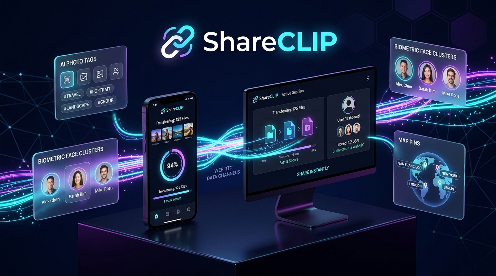
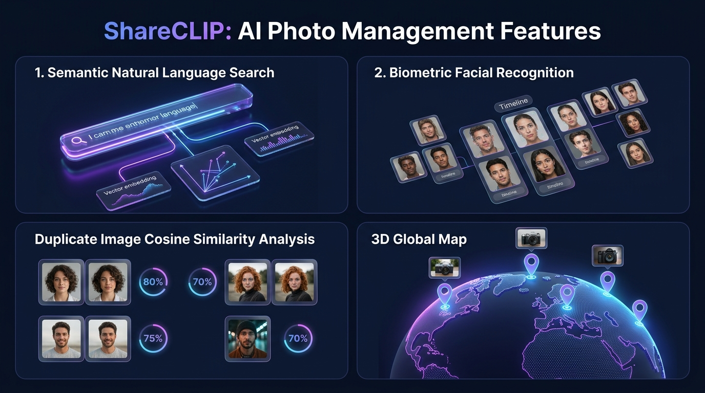
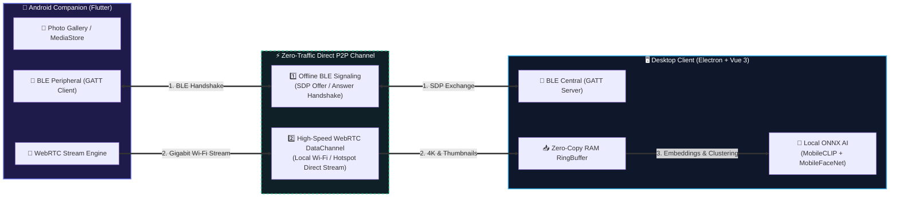
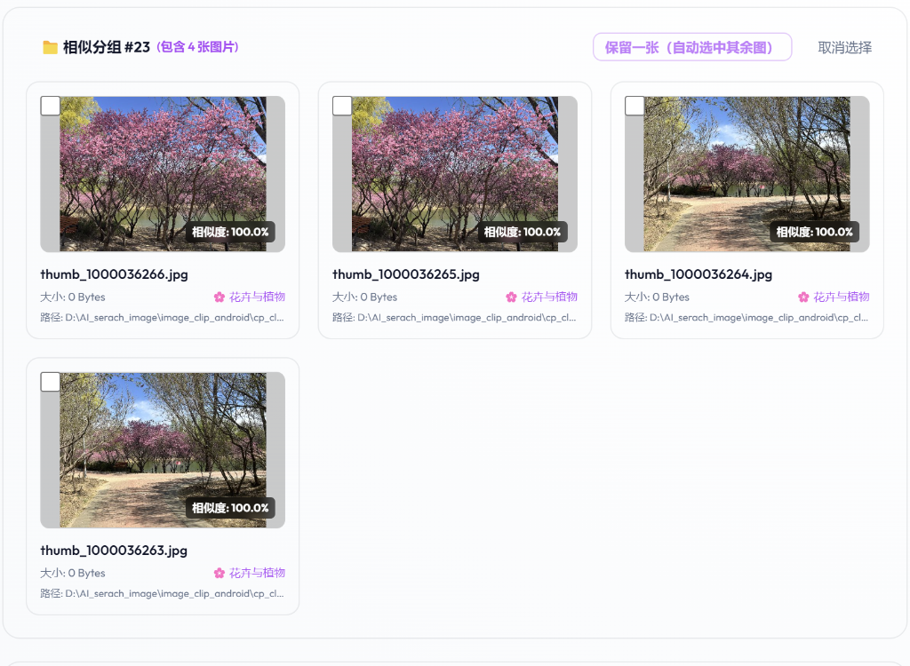
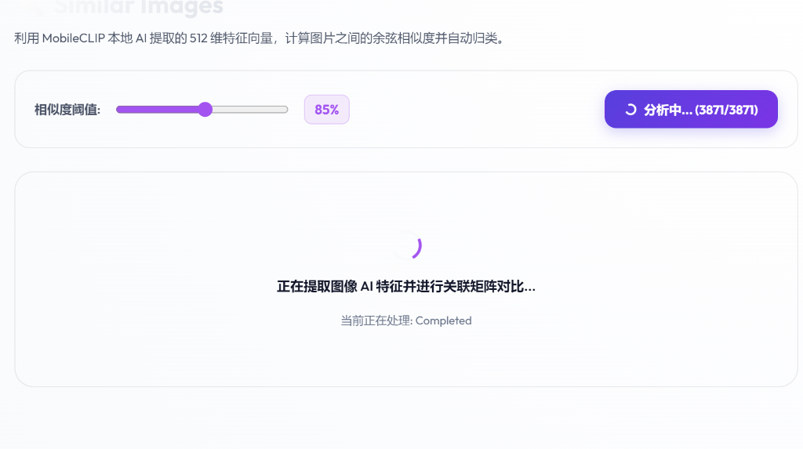
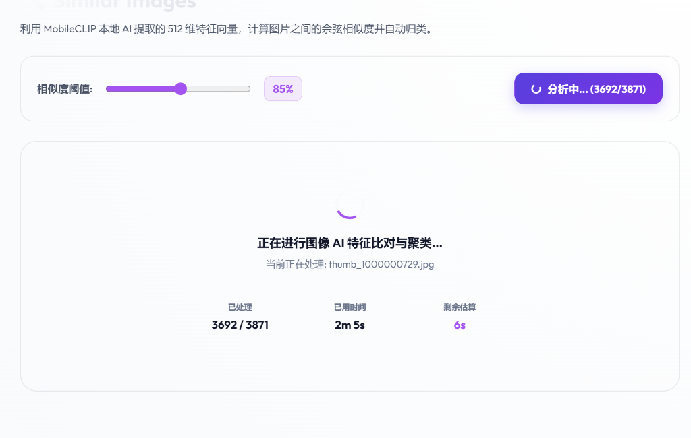
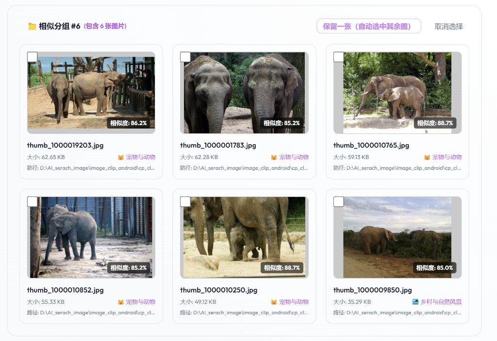
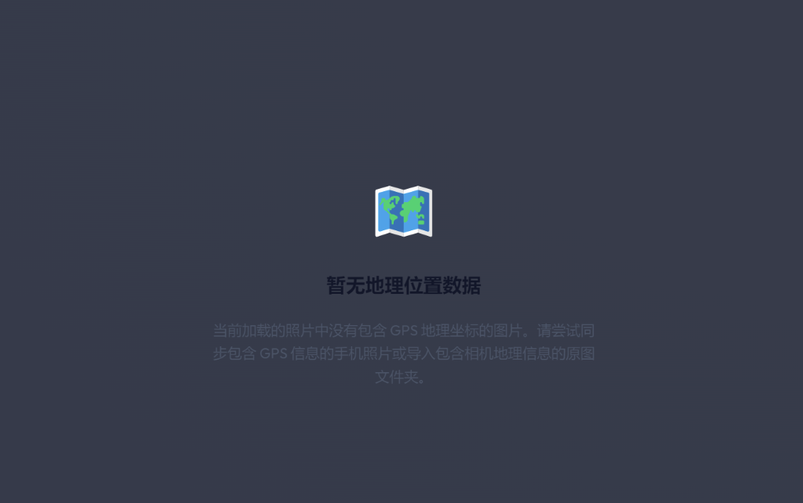
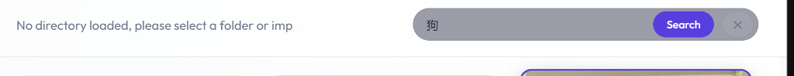

<div align="center">

  

  <br/><br/>

  # 📱 ShareCLIP (AIShare-Grabber)
  ### Next-Gen Local AI Photo Management & P2P Cross-Device Wireless Syncing Ecosystem

  <p align="center">
    <b>Zero-Cloud • 100% Private • Local MobileCLIP AI • P2P WebRTC Direct Link • SIMD Face Clustering</b>
  </p>

  <p align="center">
    <a href="https://github.com/NovaMindLab/AIShare-Grabber/releases"></a>
    <a href="https://flutter.dev"></a>
    <a href="https://www.electronjs.org"></a>
    <a href="https://onnxruntime.ai/"></a>
    <a href="https://webrtc.org/"></a>
    <a href="https://leafletjs.com/"></a>
    <a href="https://webassembly.org/"></a>
    <a href="https://github.com/NovaMindLab/AIShare-Grabber/blob/main/LICENSE"></a>
  </p>

  <p align="center">
    <a href="#-key-features"><b>✨ Features</b></a> •
    <a href="#-ai-photo-management-ecosystem"><b>🧠 AI Architecture</b></a> •
    <a href="#-p2p-transmission-pipeline"><b>⚡ Protocol</b></a> •
    <a href="#-product-screenshots"><b>📸 Screenshots</b></a> •
    <a href="#-getting-started"><b>🚀 Quick Start</b></a> •
    <a href="#-中文详细介绍"><b>🇨🇳 中文说明</b></a>
  </p>

  <p align="center">
    🌐 <b>Official Landing Portal</b>: <a href="https://novamindlab.github.io/AIShare-Grabber/">https://novamindlab.github.io/AIShare-Grabber/</a>
  </p>

</div>

---

## 💡 What is ShareCLIP?

**ShareCLIP (AIShare-Grabber)** is a privacy-first, lightning-fast cross-device photo management solution connecting your mobile devices and desktop workstations without cables, cloud subscriptions, or cellular data.

- **Zero-Cloud & 100% Private**: Your original photos, location data, and biometric face embeddings never touch any remote cloud server.
- **Offline Wireless Pairing**: Instant device discovery via Bluetooth Low Energy (BLE GATT) or LAN UDP broadcast, auto-negotiating high-speed **WebRTC P2P DataChannels** over local Wi-Fi.
- **On-Device Multi-Modal AI**: Powered by **MobileCLIP-S0** and **Buffalo_SC** models running locally on CPU/GPU via ONNX Runtime and WebAssembly SIMD acceleration.

---

## 🧠 AI Photo Management Ecosystem

<div align="center">
  
</div>

---

## ✨ Key Features

| Feature | Description |
|---|---|
| ⚡ **Offline P2P High-Speed Sync** | Zero cellular data or internet needed. Automatically coordinates WebRTC SDP packets via BLE/UDP, transmitting photos in chunked 32KB packets over local Wi-Fi at gigabit speeds with reactive backpressure control. |
| 🔍 **Semantic Natural Language Search** | Describe what you are looking for in plain language (*e.g., "sunset at beach", "dog playing on grass", "receipt document"*). MobileCLIP extracts 512-D vector embeddings for zero-shot text-to-image semantic matching. |
| 👥 **Biometric Face Recognition & Timeline** | Employs SCRFD face detection and MobileFaceNet 512-D feature extraction accelerated by **WASM SIMD 128-bit vectorization** and **SharedArrayBuffer zero-copy RAM sharing**, grouping thousands of photos into personal albums in seconds. |
| 🖼️ **Immersive Full-Screen Lightbox** | Instant 0ms thumbnail preview with on-demand **4K RAW original photo streaming** from mobile. Supports previous/next navigation (`←`/`→`), zoom/rotate, and folder revealing. |
| 🧹 **Smart Similarity & Cross-Device Deletion** | Calculates cosine similarity across your entire photo library using Leader Centroid clustering. Supports one-click duplicate cleanup with synchronized deletion from both PC cache and Android system gallery. |
| 🗺️ **EXIF GPS Footprint Map** | Extracts GPS coordinates (`ACCESS_MEDIA_LOCATION`), plotting your life travel footprints on an interactive Leaflet world map with smooth dynamic clustering. |
| 🚀 **Local Wi-Fi Hotspot Fallback** | Includes built-in soft-AP hotspot creation for restrictive environments (e.g., isolated public Wi-Fi or campus networks) for guaranteed direct device-to-device streaming. |
| 🌐 **20+ Global Languages (i18n)** | Fully localized UI across Android, Desktop PC, and Web landing page for seamless international usage. |

---

## ⚡ Direct-Link P2P Signaling & Transmission Pipeline



---

## 📸 Product Screenshots

<table width="100%">
  <tr>
    <td width="50%" align="center">
      <b>🗺️ Interactive Footprint Map (PC)</b><br/>
      
    </td>
    <td width="50%" align="center">
      <b>🔍 AI Duplicate Image Deduplication (PC)</b><br/>
      
    </td>
  </tr>
  <tr>
    <td width="50%" align="center">
      <b>🖼️ Image Gallery & Auto AI Classification</b><br/>
      
    </td>
    <td width="50%" align="center">
      <b>📱 Cross-Device Connection Dashboard</b><br/>
      
    </td>
  </tr>
  <tr>
    <td width="50%" align="center">
      <b>⚙️ Custom Download Paths Settings</b><br/>
      
    </td>
    <td width="50%" align="center">
      <b>🔑 Mobile Granular Permissions Guide</b><br/>
      
    </td>
  </tr>
</table>

---

## 🛠️ Monorepo Architecture

```
AIShare-Grabber/
├── 📱 android/          # Flutter Android Companion App (BLE GATT + WebRTC DataChannel)
├── 🖥️ cp_clip/          # Desktop Host App (Electron 30, Vue 3, ONNX Runtime, SQLite, Sharp)
│   ├── src/workers/    # Dedicated Node Worker Pool (Search, SIMD WASM clustering, Inference)
│   └── models/         # Quantized MobileCLIP-S0 & Buffalo_SC ONNX AI models
├── 🌐 web/              # Official Vue 3 + Vite Landing Portal
├── 📖 wiki/             # Architecture, protocol specs, and developer documentation
└── 📂 docs/images/      # Product graphics, diagrams, and hero assets
```

---

## 🚀 Getting Started

### 📱 1. Android Client

```bash
# Prerequisites: Flutter SDK >= 3.11.1 & Android SDK
cd android
flutter pub get
flutter run
```

### 🖥️ 2. Desktop PC Client

```bash
# Prerequisites: Node.js >= v20, Python >= 3.10
cd cp_clip
npm install

# Run in Development Mode
npm run dev

# Package as Portable Desktop Release
npm run dist
```

### 🌐 3. Official Web Portal

```bash
cd web
npm install
npm run dev
```

---

## 🇨🇳 中文详细介绍

### 🌟 核心理念
**ShareCLIP (AIShare-Grabber)** 是一款专为重视隐私与效率的用户打造的 **跨端无网照片同步与本地 AI 智能管理系统**。无需数据线、无需公网服务器中转、不消耗手机移动流量，手机与电脑之间依靠近场蓝牙（BLE）秒速握手，并通过局域网 **WebRTC DataChannel 直连** 实现千兆级极速传输。

### 🚀 六大核心技术亮点
1. **纯本地离线 AI 大脑**：集成 MobileCLIP 512 维多模态向量特征提取与 Buffalo_SC 人脸识别，支持自然语言搜图（如“海边日落”、“在草地上奔跑的金毛”）与人脸人物智能聚类，所有计算 100% 在 PC 本地运行，绝无隐私泄露风险。
2. **渐进式全屏相册大图浏览器**：0ms 瞬间打开缩略图，手机在线时按需自动拉取 4K RAW 超清原图并平滑热替换，支持键盘左右键快速切图与自由缩放。
3. **智能相似图去重与双端同步删除**：利用余弦相似度质心聚类算法毫秒级定位重复与相似抓拍，支持在电脑端一键勾选清理，并联动通过 WebRTC 信令同步从手机相册中安全移除。
4. **旅行足迹地图**：自动解析 EXIF 中的 GPS 地理信息，在世界地图上动态聚类绘制您的旅行足迹轨迹。
5. **WASM SIMD 128位与零拷贝内存加速**：采用 `SharedArrayBuffer` 物理内存共享与 WebAssembly SIMD 加速数学向量运算，数万张图片特征比对瞬时完成。
6. **断网热点直连模式**：即使身处没有路由器的户外或隔离网络环境，电脑可一键建立直连热点，保障数据传输永不中断。

---

## 📄 License & Privacy Guarantee

- **Privacy Guarantee**: ShareCLIP is architected under a strict **Zero-Trust & Zero-Telemetry** principle. None of your photos, geolocation tags, or face biometric vectors ever leave your local machines.
- **License**: Released under the [Apache License 2.0](https://github.com/NovaMindLab/AIShare-Grabber/blob/main/LICENSE).

Developed with ❤️ by the **NovaMindLab** team. For deep protocol specifications, check out the [Developer Wiki](file:///d:/AI_serach_image/image_clip_android/wiki/README.md).
