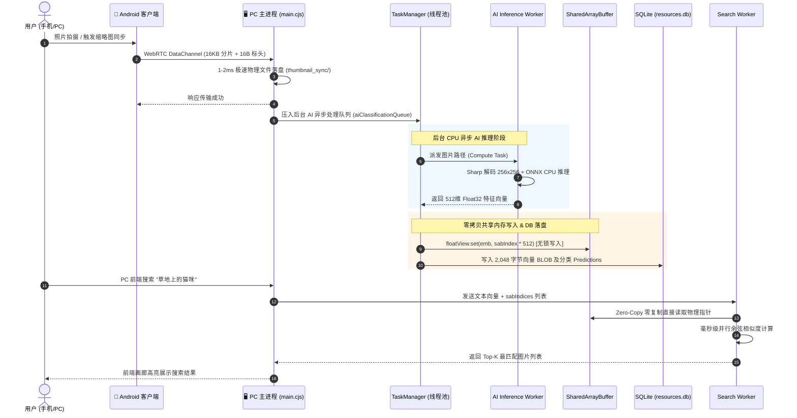

# 01_总体架构与设计方案 (Executive Summary & Architecture)

## 一、 项目背景与设计目标

随着移动设备拍摄能力大幅提升，用户本地照片库呈现爆发式增长。传统云相册存在**隐私泄露风险**、**高昂的云端存储/GPU算力成本**以及**弱网环境下同步缓慢**等痛点。

**ShareCLIP PC 端**作为整个多端协同生态的“大脑与存储枢纽”，旨在打造一款 **100% 本地化、零云端成本、高并发且适配低端硬件** 的智能相册管理与跨端同步系统。

### 核心设计原则：
1. **零 Trust & 绝对隐私**：所有图像、元数据及 AI 神经网络向量计算均在本地完成，无任何网络 API 上传。
2. **极小算力开销 (Low-End Friendly)**：针对低配置办公电脑、无独立显卡 (Integrated GPU) 环境深度优化的 CPU 纯软算执行模式。
3. **极速跨端传输**：通过 BLE 离线局域网信令与 WebRTC 点对点 (P2P) 直连，实现毫秒级响应。
4. **高并发与 UI 无卡顿**：采用主进程通信、解耦 AI 推理队列与 Worker 线程池，保障主界面永远维持 60 FPS 顺滑响应。

---

## 二、 整体系统全景架构图

系统采用 Electron 30 + Vue 3 架构，底层通过 Node.js Worker 线程池实现 AI 特征抽取与向量检索的完全解耦。

```mermaid
flowchart TD
    subgraph 1. 跨端 P2P 通信与数据接收层
        Mobile[📱 Android 手机端] -->|1. BLE GATT 离线信令 SDP| BLE[BLE Helper / C++ Node]
        Mobile -->|2. WebRTC DataChannel P2P| Network[SCTP / UDP 网络接收模块]
        Network -->|3. 16KB 分片包重组| MainNet[Main 进程: 传输监听器]
    end

    subgraph 2. Electron 主进程 (Main Process & Core Controller)
        MainNet -->|1-2ms 极速落盘| Storage[物理磁盘: thumbnail_sync /]
        MainNet -->|解耦压入| AIQueue[AI 分类后台待处理队列]
        
        AIQueue -->|TaskManager 调度| WorkerPool[Worker 线程池管理器]
        
        StorageDB[(SQLite 数据库: resources.db)] <-->|读写元数据/2KB BLOB| MainNet
    end

    subgraph 3. 后台 Worker 算力引擎线程池
        WorkerPool -->|派发任务| InferWorker[ONNX Inference Worker 线程]
        InferWorker -->|Sharp 归一化 + CPU 软算| ONNX[MobileCLIP ONNX 模型]
        ONNX -->|返回 512维 Float32 向量| WorkerPool

        WorkerPool -->|无锁写入| SAB[("SharedArrayBuffer 共享内存池 (40MB~200MB)")]
        
        WorkerPool -->|派发搜索/聚类| SearchWorker[Search & Cluster Worker 线程]
        SAB ==>|Zero-Copy 零内存复制读取| SearchWorker
    end

    subgraph 4. 前端渲染层 (Vue 3 Glassmorphism UI)
        MainNet -->|IPC 广播| VueUI[Vue 3 前端视图 / Pinia]
        SearchWorker -->|Top-K 结果| VueUI
        VueUI -->|地图点位| Leaflet[Leaflet 🗺️ 足迹地图]
    end
```

---

## 三、 主进程与 Worker 线程解耦架构

为了避免神经网络推理（密集矩阵乘法）阻塞 Node.js 主事件循环 (Event Loop)，导致 WebRTC 心跳断开或 UI 卡顿，系统设计了严格的**多线程隔离范式**：

```
+-----------------------------------------------------------------------+
|                         Electron Main Process                         |
|  - UI 窗口调度 & IPC 桥接                                              |
|  - WebRTC 数据通道监听 & 文件快速落盘 (1-2ms)                           |
|  - TaskManager 单点写入器                                              |
+-----------------------------------------------------------------------+
        |                                                 ^
        | 派发推理任务 (路径)                              | 返回 512维 向量
        v                                                 |
+-----------------------------------------------------------------------+
|                    Inference Worker Pool (1~2 Threads)                |
|  - Sharp 图像解码与归一化 (256x256 RGB Float32)                        |
|  - ONNX Runtime CPU 模式独立推理                                        |
+-----------------------------------------------------------------------+
        |
        +----------------------------+
                                     | 写入向量
                                     v
+-----------------------------------------------------------------------+
|                     SharedArrayBuffer 共享内存                         |
|  - 40MB~200MB 物理共享内存                                             |
|  - 100% 无锁 (Lock-Free) 结构                                         |
+-----------------------------------------------------------------------+
                                     ^
                                     | Zero-Copy 零拷贝读取
+-----------------------------------------------------------------------+
|                     Search Worker (1 Thread)                          |
|  - 50,000+ 向量并行余弦相似度计算                                      |
|  - Leader Centroid 快速聚类去重                                        |
+-----------------------------------------------------------------------+
```

---

## 四、 核心组件职责划分表

| 组件模块 | 代码路径 | 核心职责 |
| :--- | :--- | :--- |
| **主入口与生命周期** | [`main.cjs`](file:///d:/AI_serach_image/image_clip_android/cp_clip/main.cjs) | 窗口创建、禁用 GPU 硬件加速、SQLite 数据库挂载、AI 任务队列调度、IPC 通信桥接。 |
| **线程池管理器** | [`src/workers/task-manager.cjs`](file:///d:/AI_serach_image/image_clip_android/cp_clip/src/workers/task-manager.cjs) | 硬件配置嗅探、自适应分配 `SharedArrayBuffer` 容量、管理 Worker 线程生命周期与休眠。 |
| **AI 推理 Worker** | [`src/workers/inference.worker.cjs`](file:///d:/AI_serach_image/image_clip_android/cp_clip/src/workers/inference.worker.cjs) | 使用 `sharp` 调整尺寸归一化，调用 `onnxruntime-node` CPU 引擎完成 MobileCLIP 图像编码。 |
| **向量搜索 Worker** | [`src/workers/search.worker.cjs`](file:///d:/AI_serach_image/image_clip_android/cp_clip/src/workers/search.worker.cjs) | 直接挂载 `SharedArrayBuffer`，执行零拷贝点积与余弦相似度矩阵计算。 |
| **分词器与编码** | [`tokenizer.cjs`](file:///d:/AI_serach_image/image_clip_android/cp_clip/tokenizer.cjs) | 实现 CLIP BPE (Byte-Pair Encoding) 分词，将自然语言输入转换为可供文本模型推理的 Token。 |
| **前端交互层** | [`src/App.vue`](file:///d:/AI_serach_image/image_clip_android/cp_clip/src/App.vue) | 玻璃拟态 UI 渲染、WebRTC 握手逻辑、画廊展示、足迹地图聚类与设置项控制。 |

---

## 五、 端到端核心处理时序图

下图展示了从手机拍摄照片，到通过 WebRTC 传输至 PC、落盘、后台入队 AI 识别，最后在 PC 端呈现搜索结果的完整全流程：


