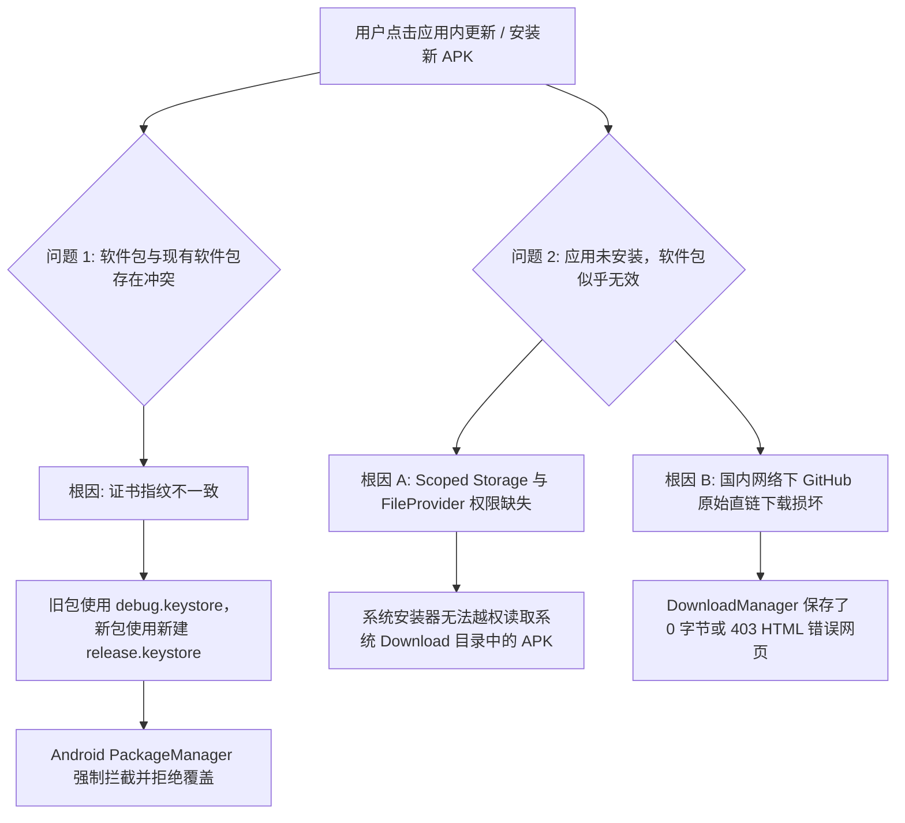
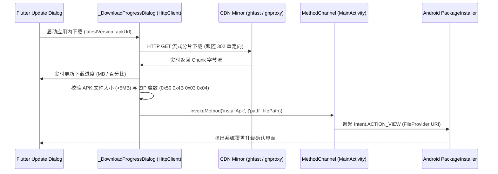

# Android 端应用内更新与 APK 签名兼容架构白皮书

本文档系统整理了 ShareCLIP Android 客户端在应用内更新、APK 覆盖升级、Android 安全沙盒（Scoped Storage）与签名证书一致性方面的完整技术方案与排错指南。

---

## 1. 核心问题复盘与根因分析

在 Android 客户端迭代过程中，覆盖升级与应用内更新主要遭遇了两大核心阻塞问题：



---

## 2. 签名证书一致性方案 (解决签名冲突)

### 2.1 冲突原理 (`INSTALL_FAILED_UPDATE_INCOMPATIBLE`)
Android 系统在执行应用覆盖升级时，会强校验已安装应用与待安装 APK 的签名公钥（Certificate Fingerprint）。若证书指纹不匹配，系统会判定为跨签名覆盖（潜在劫持风险），抛出 `INSTALL_FAILED_UPDATE_INCOMPATIBLE`，手机界面提示 **“软件包与现有软件包存在冲突，无法安装”**。

### 2.2 解决方案与证书固化
将工程的发布签名正式固化在仓库目录 `android/android/app/debug.keystore`，在 `build.gradle.kts` 中明确绑定，确保每一次打包均使用完全相同的证书指纹：

- **SHA-256 指纹**：`90:C5:76:21:06:67:77:20:73:73:7F:9A:98:C9:4E:3C:EC:9D:8C:BA:ED:9F:44:63:C7:DA:E5:86:4C:0A:61:E8`
- **SHA-1 指纹**：`5D:E9:8A:D6:1B:13:BE:2E:91:B2:DA:58:2D:B6:53:05:16:2A:10:73`

```kotlin
// android/android/app/build.gradle.kts
signingConfigs {
    getByName("debug") {
        storeFile = file("debug.keystore")
        storePassword = "android"
        keyAlias = "androiddebugkey"
        keyPassword = "android"
    }
}

buildTypes {
    release {
        signingConfig = signingConfigs.getByName("debug")
        isMinifyEnabled = false
        isShrinkResources = false
    }
}
```

---

## 3. 安装解析与沙盒存储架构 (解决软件包无效)

### 3.1 权限与 `FileProvider` 配置
自 Android 7.0 (API 24) 引入私有目录限制以及 Android 10+ (API 29+) 引入 Scoped Storage 分区存储后，直接使用 `file://` 或 `content://downloads/...` 会被系统安装器拦截。必须通过 `FileProvider` 暴露带临时读取权限的 Content URI。

#### `AndroidManifest.xml`
```xml
<manifest ...>
    <uses-permission android:name="android.permission.REQUEST_INSTALL_PACKAGES" />

    <application ...>
        <provider
            android:name="androidx.core.content.FileProvider"
            android:authorities="${applicationId}.fileprovider"
            android:exported="false"
            android:grantUriPermissions="true">
            <meta-data
                android:name="android.support.FILE_PROVIDER_PATHS"
                android:resource="@xml/file_paths" />
        </provider>
    </application>
</manifest>
```

#### `res/xml/file_paths.xml`
```xml
<?xml version="1.0" encoding="utf-8"?>
<paths xmlns:android="http://schemas.android.com/apk/res/android">
    <external-path name="external_download" path="Download" />
    <external-path name="external_root" path="." />
    <external-files-path name="external_files" path="." />
    <external-cache-path name="external_cache" path="." />
    <files-path name="internal_files" path="." />
    <cache-path name="internal_cache" path="." />
</paths>
```

### 3.2 未知来源权限检测与调起
在 `MainActivity.kt` 中封装原生安装函数，如果用户尚未授予该应用“安装未知应用”权限，自动引导打开系统授权设置页：

```kotlin
private fun installApkAtPath(filePath: String): Boolean {
    return try {
        // 1. Android 8.0+ 未知应用安装权限校验与跳转引导
        if (Build.VERSION.SDK_INT >= Build.VERSION_CODES.O) {
            if (!context.packageManager.canRequestPackageInstalls()) {
                val permIntent = Intent(
                    Settings.ACTION_MANAGE_UNKNOWN_APP_SOURCES, 
                    Uri.parse("package:${context.packageName}")
                ).apply {
                    addFlags(Intent.FLAG_ACTIVITY_NEW_TASK)
                }
                context.startActivity(permIntent)
                return false
            }
        }

        // 2. 校验文件存在性与大小
        val apkFile = File(filePath)
        if (apkFile.exists() && apkFile.length() > 0) {
            // 3. 生成安全的 FileProvider Content URI
            val contentUri = FileProvider.getUriForFile(context, "${context.packageName}.fileprovider", apkFile)
            val installIntent = Intent(Intent.ACTION_VIEW).apply {
                setDataAndType(contentUri, "application/vnd.android.package-archive")
                addFlags(Intent.FLAG_ACTIVITY_NEW_TASK)
                addFlags(Intent.FLAG_GRANT_READ_URI_PERMISSION)
            }
            context.startActivity(installIntent)
            true
        } else {
            false
        }
    } catch (e: Exception) {
        e.printStackTrace()
        false
    }
}
```

---

## 4. 应用内多镜像加速与字节完整性校验

### 4.1 下载流程设计
为了避免国内网络直接请求 `github.com` 或 `objects.githubusercontent.com` 出现超时、丢包或返回 HTML 错误页，应用在 Flutter 层实现了多镜像智能故障转移下载流水线：



### 4.2 镜像加速候选链
1. 镜像一：`https://ghfast.top/${apkUrl}` (全国 CDN 边缘节点)
2. 镜像二：`https://ghproxy.net/${apkUrl}` (备用中继镜像)
3. 原始源：`${apkUrl}` (GitHub Releases 原生地址)

### 4.3 核心代码实现 (`lib/main.dart`)
```dart
// 校验 APK 文件的 ZIP 魔数 (PK\x03\x04)
final fileSize = await targetFile.length();
if (fileSize > 5 * 1024 * 1024) {
  final header = await targetFile.openRead(0, 4).first;
  if (header.length >= 4 &&
      header[0] == 0x50 &&
      header[1] == 0x4B &&
      header[2] == 0x03 &&
      header[3] == 0x04) {
    success = true;
    break;
  }
}
```

---

## 5. 常见错误排查速查表

| 错误表现 | 底层原因 | 解决方案 |
| :--- | :--- | :--- |
| **软件包与现有软件包存在冲突** | 安装包签名与手机上已安装的 App 证书不一致 | 确保统一使用 `debug.keystore` 签名打包 |
| **软件包似乎无效 (Parse Error)** | 1. 下载未完成，保存了 403 HTML 网页<br>2. 安装器无权限读取文件 | 1. 采用 `_DownloadProgressDialog` 校验魔数<br>2. 接入 `FileProvider` |
| **点击更新无任何反应** | 缺少未知应用安装权限 | 通过 `canRequestPackageInstalls` 自动跳转授权页 |
| **国内下载极慢或卡死在 0%** | 直连 GitHub Releases 资产域名受阻 | 自动启用 `ghfast.top` / `ghproxy.net` 镜像加速 |
