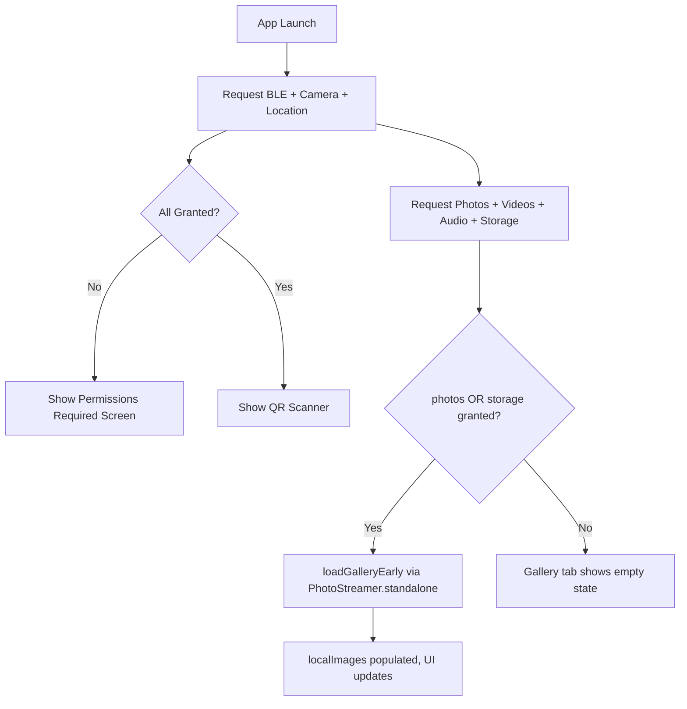

# Android Permissions Configuration

This document describes all Android permissions used by ShareCLIP, their purpose, and the two-stage runtime request flow.

---

## 📋 AndroidManifest.xml Declarations

All permissions must be declared statically in [`AndroidManifest.xml`](file:///d:/AI_serach_image/image_clip_android/android/android/app/src/main/AndroidManifest.xml) in addition to being requested at runtime.

| Permission | Min SDK | Max SDK | Purpose |
|---|---|---|---|
| `INTERNET` | — | — | WebRTC STUN/TURN signaling |
| `CAMERA` | — | — | QR code scanner for connection |
| `BLUETOOTH` | — | 30 | Classic BLE (Android ≤10) |
| `BLUETOOTH_ADMIN` | — | 30 | Classic BLE admin (Android ≤10) |
| `BLUETOOTH_SCAN` | 31 | — | BLE device scanning (Android 12+) |
| `BLUETOOTH_CONNECT` | 31 | — | BLE GATT connection (Android 12+) |
| `ACCESS_FINE_LOCATION` | — | — | Required by BLE scanning on older APIs |
| `ACCESS_COARSE_LOCATION` | — | — | Required by BLE scanning on older APIs |
| `READ_MEDIA_IMAGES` | 33 | — | Read photos from MediaStore (Android 13+) |
| `READ_MEDIA_VIDEO` | 33 | — | Read videos from MediaStore (Android 13+) |
| `READ_MEDIA_AUDIO` | 33 | — | Read audio files from MediaStore (Android 13+) |
| `READ_EXTERNAL_STORAGE` | — | 32 | Legacy storage read (Android ≤12 fallback) |

---

## 🔄 Two-Stage Runtime Request Flow

Runtime permissions are requested in [`lib/main.dart`](file:///d:/AI_serach_image/image_clip_android/android/lib/main.dart) via `_checkAndRequestPermissions()`.

### Stage 1 — BLE & Camera

Requested immediately on app launch:

```dart
await [
  Permission.camera,
  Permission.bluetoothScan,
  Permission.bluetoothConnect,
  Permission.location,
].request();
```

If all granted → `viewModel.setPermissionsGranted(true)` → app transitions to QR scanner screen.

### Stage 2 — Media Gallery

Requested sequentially after Stage 1, using granular permissions for Android 13+ with a legacy fallback:

```dart
await [
  Permission.photos,   // → READ_MEDIA_IMAGES (Android 13+)
  Permission.videos,   // → READ_MEDIA_VIDEO  (Android 13+)
  Permission.audio,    // → READ_MEDIA_AUDIO  (Android 13+)
  Permission.storage,  // → READ_EXTERNAL_STORAGE (Android ≤12)
].request();
```

If either `Permission.photos` or `Permission.storage` is granted → `viewModel.loadGalleryEarly()` is called to pre-load the gallery without requiring a WebRTC connection.



---

## ⚠️ Common Issues & Fixes

### Gallery shows empty even after granting permissions

**Root Cause**: On Android 13+, the OS requires all three granular media permissions (`READ_MEDIA_IMAGES`, `READ_MEDIA_VIDEO`, `READ_MEDIA_AUDIO`) to be declared in `AndroidManifest.xml`. If any are missing, the OS silently denies MediaStore access even when the user taps "Allow" in the dialog.

**Fix applied**: Added `READ_MEDIA_VIDEO` and `READ_MEDIA_AUDIO` declarations to the manifest (previously only `READ_MEDIA_IMAGES` was present).

### Gallery only visible after connecting to PC

**Root Cause**: The original `_loadLocalGallery()` was only triggered inside `_onDataChannelStateChanged()`, which fires only after a WebRTC connection is established. `PhotoStreamer` required a `WebRtcSyncEngine` instance to construct.

**Fix applied**:
1. Added `PhotoStreamer.standalone()` named constructor — no `syncEngine` dependency, usable for gallery scanning only.
2. Added `loadGalleryEarly()` in `SyncViewModel` which uses `PhotoStreamer.standalone()`.
3. Called `loadGalleryEarly()` immediately after media permissions are granted in `main.dart`.

---

## 🔬 Diagnostic Debug Logging

`photo_streamer.dart` includes step-by-step log output visible in `adb logcat` or Flutter debug console:

```
[Streamer] Requesting PhotoManager permissions...
[Streamer] PhotoManager permission state: PermissionState.authorized
[Streamer] Fetching asset path list...
[Streamer] Asset paths count: 3
[Streamer] Recent album asset count: 847
```

If permission is denied by the OS, you'll see:
```
[Streamer] Photo permissions rejected
```

If an exception is thrown:
```
[Streamer] Error loading gallery assets: <error>
[Streamer] Stacktrace: <stack>
```
