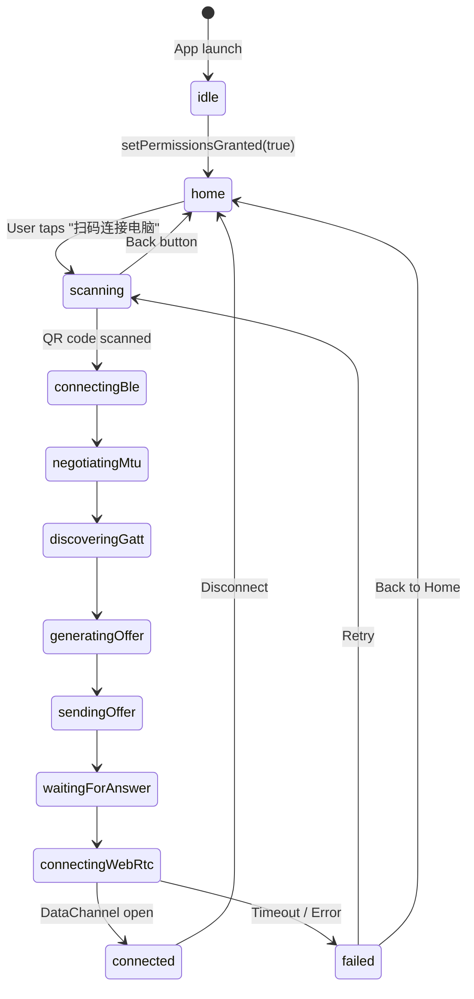

# ShareCLIP Android Client Documentation

Welcome to the **ShareCLIP Android Client** documentation. This module is built using Flutter (Dart) and connects to the PC client over a local network.

---

## 🏗️ Architectural Overview
The Android app acts as a local "near-field data companion" to the desktop app. After launching, the user lands on a **Home Screen** showing their local gallery. They tap the **"扫码连接电脑"** button to open the QR scanner and establish a WebRTC connection to the PC. Once connected, the full Transfer Console is shown.

```
+------------------+         (BLE Scan / Connect)        +------------------+
|                  | ----------------------------------> |                  |
|   Android App    |                                     |   Desktop App    |
|   (GATT Client)  | <---------------------------------- |   (GATT Server)  |
|                  |      (BLE Notify: Answer & ICE)     |                  |
+------------------+                                     +------------------+
         |                                                        |
         |                   =================                    |
         +=================># WebRTC Tunnel # <==================+
                              (Direct Data Link)
```

## 📂 Source Code Structure
All source code files are structured in the `./android/lib` directory:

*   [lib/main.dart](file:///d:/AI_serach_image/image_clip_android/android/lib/main.dart): App entry point, theme declaration, and two-stage runtime permission request flow. On startup, requests BLE + Camera + Location first, then separately requests granular media permissions (`READ_MEDIA_IMAGES`, `READ_MEDIA_VIDEO`, `READ_MEDIA_AUDIO`, `READ_EXTERNAL_STORAGE` fallback for Android ≤12). After media permissions are granted, `loadGalleryEarly()` is called immediately so the gallery is visible before any connection is made. The `MultiProvider` at root level also provides the `LocalizationService` alongside `SyncViewModel`.
*   [lib/models/qr_payload.dart](file:///d:/AI_serach_image/image_clip_android/android/lib/models/qr_payload.dart): JSON deserializer model for scanned connection QR codes.
*   [lib/services/ble_signaling_client.dart](file:///d:/AI_serach_image/image_clip_android/android/lib/services/ble_signaling_client.dart): BLE scanner and GATT client manager. Performs SDP fragmentation and notification reassembly.
*   [lib/services/webrtc_sync_engine.dart](file:///d:/AI_serach_image/image_clip_android/android/lib/services/webrtc_sync_engine.dart): Sets up `RTCPeerConnection` and handles local Offer SDP creation, Answer parsing, ICE candidates, and `RTCDataChannel` creation.
*   [lib/services/localization_service.dart](file:///d:/AI_serach_image/image_clip_android/android/lib/services/localization_service.dart): `ChangeNotifier`-based localization manager. Exposes 20 languages keyed by IETF code (e.g. `en`, `zh`, `fr`). Persists selection using `SharedPreferences`. Defaults to `en` (English) on first launch. Call `t.get('key')` from any widget after obtaining it via `Provider.of<LocalizationService>(context)`. See [i18n documentation](file:///d:/AI_serach_image/image_clip_android/wiki/i18n.md) for the full string key reference.
*   [lib/services/photo_streamer.dart](file:///d:/AI_serach_image/image_clip_android/android/lib/services/photo_streamer.dart): Handles gallery scanning and file streaming. Supports two constructors: `PhotoStreamer({required syncEngine})` for full transfer mode, and `PhotoStreamer.standalone()` for gallery-only scanning without a WebRTC connection. Features `streamImage` (native downscale/compression) and `streamFile` (generic audio, video, documents). All `syncEngine` calls are null-guarded with `!` since they are only invoked when connected.
*   [lib/viewmodels/sync_viewmodel.dart](file:///d:/AI_serach_image/image_clip_android/android/lib/viewmodels/sync_viewmodel.dart): `ChangeNotifier` state coordinator. Exposes `loadGalleryEarly()` (pre-connection gallery scan via `PhotoStreamer.standalone()`), `syncAllSelected()` (unified queue sender for both gallery assets and picker files), and `pickFiles(type)` for file_picker integration.
*   [lib/views/qr_scanner_view.dart](file:///d:/AI_serach_image/image_clip_android/android/lib/views/qr_scanner_view.dart): Camera preview view featuring animated neon scanning frames. The instruction banner text is localized via `LocalizationService`.
*   [lib/views/transfer_console_view.dart](file:///d:/AI_serach_image/image_clip_android/android/lib/views/transfer_console_view.dart): Redesigned File Sync Dashboard. Features 4 sliding category tabs (📸 Media, 🎵 Music, 📄 Docs, 📥 Queue). Media tab shows a native 3-column photo/video grid with duration overlays and checkmark selection. Music/Docs tabs support file picker with per-item delete. Queue tab aggregates all selected assets. A sticky bottom bar shows the transmit button with total item count. All labels, empty states, and tab names are fully localized.

## 🗺️ Navigation Flow

The app uses a single `AppState` enum to drive all screen transitions via `AnimatedSwitcher`:



**Key states:**
| State | Screen |
|---|---|
| `idle` | Splash loading spinner |
| `home` | **Home screen** — gallery grid + "扫码连接" button |
| `scanning` | QR camera scanner |
| `connectingBle` → `connectingWebRtc` | Progress spinner with cancel button |
| `connected` | Full 4-tab Transfer Console Dashboard |
| `failed` | Error screen with Retry / Back to Home |

## 📡 Protocols
For detailed connection specifications, see:
*   [BLE Signaling Protocol](file:///d:/AI_serach_image/image_clip_android/wiki/android/BLE_Signaling.md)
*   [WebRTC Channel Protocol](file:///d:/AI_serach_image/image_clip_android/wiki/android/WebRTC_Protocol.md)
*   [Permissions Configuration](file:///d:/AI_serach_image/image_clip_android/wiki/android/Permissions.md)
*   [Transfer Console Dashboard UI](file:///d:/AI_serach_image/image_clip_android/wiki/android/UI_Dashboard.md)
*   [Internationalization (i18n) — 20 Languages](file:///d:/AI_serach_image/image_clip_android/wiki/i18n.md)

