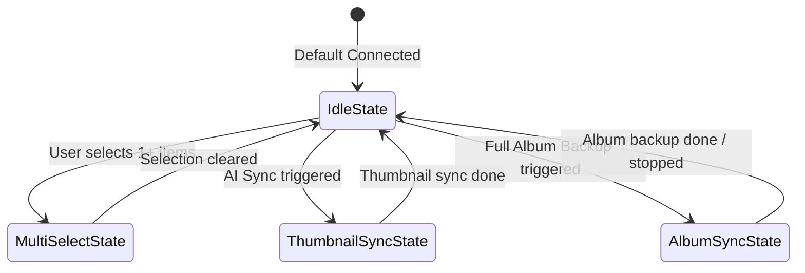

# Android Transfer Console Dashboard UI & Sync Architecture

This document describes the modern file sync dashboard (`transfer_console_view.dart`), including its full-screen media gallery layout, dynamic Floating Action Button (FAB) state machine, and modal Bottom Sheet Sync Center.

---

## 🎨 Overall Layout & Screen Space Optimization

The Transfer Console (`AppState.connected`) is an immersive dark UI optimized for maximum media viewing area:

```
+-----------------------------------------------------------+
|              Top Status Header (Connection info)          |
+-----------------------------------------------------------+
|       Active Transfer Progress Bar (if actively sending)  |  ← Only visible during active transmission
+-----------------------------------------------------------+
|       [📸 Media]   [🎵 Music]   [📄 Docs]   [📥 Queue]    |  ← TabBar (sliding category selector)
+-----------------------------------------------------------+
|  [照片 (128)]  |  [视频 (14)]                             |  ← Compact sub-segmented pill
| --------------------------------------------------------- |
|                                                           |
|                                                           |
|             100% Full-Screen Media Grid                   |  ← 3-column photo/video browsing
|             (No cluttered top sync banners)               |
|                                                           |
|                                                           |
|                                     +-------------------+ |
|                                     | ⚡ AI & 相册同步  | |  ← Bottom-Right Dynamic FAB
|                                     +-------------------+ |
+-----------------------------------------------------------+
```

### 💡 Screen Space Reclamation
- **Eliminated Bulky Top Banners**: Previous versions placed two full-width rows (`Sync All to AI` and `Sync Album to PC`) directly above the photo grid, consuming ~120px of vertical space and pushing gallery thumbnails off the fold.
- **Sub-segmented Pill**: Replaced with a slim 32px pill switcher (`Photos` vs `Videos`).
- **Slim Progress Line**: When an active sync is running in the background, a non-intrusive 3px `LinearProgressIndicator` appears at the top, leaving the grid unobstructed.

---

## 🔘 Dynamic Floating Action Button (FAB) State Machine

The bottom-right corner houses an intelligent, multi-state Floating Action Button that adapts dynamically:



| State | Condition | Visual Representation | Action on Tap |
|---|---|---|---|
| **1. Idle** | `totalCount == 0 && !isSyncing` | Purple glowing pill: `⚡ AI & 相册同步` (`AI & Album Sync`) | Opens the **Multi-Option Sync Modal Bottom Sheet** |
| **2. Multi-Selected** | `totalCount > 0` | Dual composite buttons: `[ ⚡ ]` (mini menu) + `[ 发送 (N) ]` (primary send) | `[ ⚡ ]` opens sync modal; `[ 发送 (N) ]` triggers batch transmission |
| **3. AI Syncing** | `isThumbnailSyncing == true` | Animated spinner + live counter: `⚡ AI同步中 45/120` | Opens sync modal to view detailed progress |
| **4. Album Backup** | `isAlbumSyncing == true` | Emerald cloud badge: `📦 备份中 12/80` (or `⏸️ 备份暂停`) | Opens sync modal with pause/resume and stop controls |

---

## 📱 Multi-Option Sync Modal (Bottom Sheet)

Tapping the FAB opens a dark glassmorphism modal bottom sheet (`_showSyncBottomSheet`):

```
+-----------------------------------------------------------+
|                         ━ (Drag Bar)                      |
|  ⚡ 多端极速数据同步 (Cross-Device Data Sync)          ✕ Close  |
+-----------------------------------------------------------+
|  ┌─────────────────────────────────────────────────────┐  |
|  │ 🤖 AI 智能相册分类 (MobileCLIP)                     │  |
|  │ 仅发送高清缩略图到 PC 本地 AI 引擎进行零样本语义分类与人脸聚类。 │  |
|  │ [ 🚀 同步全部图片到 AI / 同步选中(N)张到 AI ]       │  |
|  └─────────────────────────────────────────────────────┘  |
|                                                           |
|  ┌─────────────────────────────────────────────────────┐  |
|  │ 📦 电脑端全量相册备份 (Full Backup)                 │  |
|  │ 无损传输相册原图原片至电脑本地硬盘，自动建立日期归档与断点续传。│  |
|  │ [ 📥 开始全量备份相册到电脑 / 继续同步相册 ]        │  |
|  │ (同步中显示: [ ⏸️ 暂停 ]  [ ⏹️ 停止 ] 控制按钮)       │  |
|  └─────────────────────────────────────────────────────┘  |
+-----------------------------------------------------------+
```

### 1. 🤖 AI 智能缩略图同步 (MobileCLIP AI Sync)
* **Goal**: Millisecond-level zero-shot category prediction and face clustering on desktop AI engine with near-zero battery/network consumption.
* **Payload**: High-speed 400×400 compressed JPEG thumbnails.
* **Behavior**:
  * If items are checked in gallery: `同步选中 (N) 张图片到 AI` (`Sync Selected (N) to AI`).
  * If no items checked: `同步全部图片到 AI 进行分类` (`Sync All Images to AI`).
  * Real-time progress bar with `thumbnailSyncDone / thumbnailSyncTotal`.

### 2. 📦 电脑端全量相册备份 (Full Album PC Backup)
* **Goal**: Lossless original master copy archive directly into PC disk directory (`AppData/ShareCLIP/Album_Sync/YYYY-MM-DD/`).
* **Payload**: Full uncompressed binary stream (`AssetEntity.originFile`).
* **Controls**:
  * `Pause / Resume`: `pauseAlbumSync()` / `resumeAlbumSync()` pauses transmission queue without losing index.
  * `Stop`: `stopAlbumSync()` cancels active transfers and releases DataChannel bandwidth.
  * `Incremental Sync`: Remembers `lastAlbumSyncDate` to avoid re-uploading existing photos.

---

## 📑 Tab Descriptions

### 📸 Media Tab (Default)
* Displays native media assets with 3-column `AssetEntityImage`.
* Duration badge for videos (e.g. `01:45`).
* Checkmark toggle selection (`✓`).
* Inline transfer badges: `⏳ Pending` → `🔄 Transferring` → `✅ Completed` / `❌ Failed`.

### 🎵 Music Tab
* Queries device MediaStore audio tracks.
* Track title, duration, and multi-selection checkmarks.

### 📄 Docs Tab
* Unrestricted document picker via `file_picker`.
* Lists custom files with size formatting and item deletion.

### 📥 Queue Tab
* Aggregated summary of all selected assets from Media, Music, and Docs.
* Instant one-tap deselect and total item tally.

---

## 🎨 Design Tokens

| Token | Value | Usage |
|---|---|---|
| Background | `#070A12` | Main scaffold dark slate |
| Surface | `#0F172A` | Cards, tab containers, bottom sheet background |
| Surface Elevated | `#1E293B` | Sheet cards, button backgrounds |
| Accent Purple | `#8B5CF6` | AI Sync, selection border, FAB primary |
| Accent Emerald | `#10B981` | Album backup, connection active pulse |
| Danger Red | `#EF4444` | Disconnect, stop backup, delete buttons |
| Text Primary | `#FFFFFF` | Headings, active labels |
| Text Muted | `#94A3B8` / `#64748B` | Subtitles, descriptions, counters |

