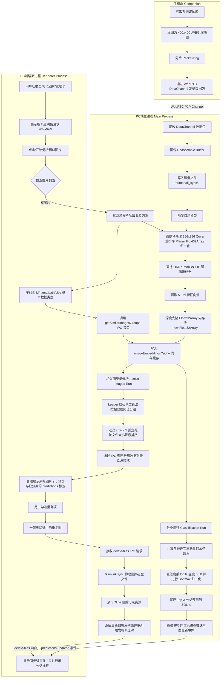

# ShareCLIP 核心 AI 算法文档 (Core AI Algorithms)

本 Wiki 详细记录了 ShareCLIP 项目在 PC 桌面端实现的多模态 AI 图像算法架构，包含特征提取、数据预处理、零样本图像分类、相似图片聚类算法以及内存生命周期管理的优化细节。

---

## 🧭 算法架构概览

ShareCLIP 的核心 AI 能力完全运行在 PC 客户端本地（100% 离线），基于微软的 ONNX Runtime (Node.js 绑定) 引擎。主要包含两大独立运行但在底层共享特征向量的算法模块：

1. **零样本分类算法 (Zero-Shot Classification)**：自动分析手机同步过来的图片属于什么类别（如：人像、花卉、美食、风景等），并将分类概率存入 SQLite 数据库。
2. **相似图片聚类 (Image Similarity Clustering)**：分析并自动归类图片库中高度相似或完全重复的图片，辅助用户进行物理清理。



---

## 1. 图像特征提取与预处理 (Image Embedding & Preprocessing)

### 1.1 图像预处理规范
MobileCLIP S0 模型的图像输入要求为 `256 × 256` 像素、RGB 3通道的 Planar 格式。
> [!IMPORTANT]
> **预处理标准化差异**：MobileCLIP 与传统的 ImageNet 模型不同，**不需要**进行 ImageNet 的均值（Mean）和标准差（Std）标准化。仅需将像素缩放到 `[0.0, 1.0]` 范围内。

* **尺寸缩放**：采用 `sharp` 库的 `.resize(256, 256, { fit: 'cover', position: 'center' })` 进行裁剪 and 居中对齐。
* **Planar 重排**：将交错的 RGBRGB... 字节流重新排布为 Planar (R 通道区、G 通道区、B 通道区) 的 `Float32Array`：
  ```javascript
  const float32Data = new Float32Array(3 * 256 * 256);
  const imageSize = 256 * 256;
  for (let i = 0; i < imageSize; i++) {
    float32Data[i] = data[i * 3] / 255.0;                      // R channel
    float32Data[imageSize + i] = data[i * 3 + 1] / 255.0;      // G channel
    float32Data[2 * imageSize + i] = data[i * 3 + 2] / 255.0;  // B channel
  }
  ```

### 1.2 ⚠️ 关键 Bug 修复：ONNX 内存分配器重用问题
在 ONNX Runtime 中，运行会话 `ortSession.run()` 返回的 TypedArray (`outputs[outputName].data`) 指向的是引擎内部的 native 内存缓冲区。
* **问题表现**：如果在推理循环中直接缓存该引用，下一次 `ortSession.run` 执行时，引擎会**直接修改并重用同一块内存地址**，导致之前缓存的所有向量值均被覆盖为最后一张图的特征值，计算出来的相似度全部退化为 `100.0%`。
* **修复方法**：在存入缓存前，必须将数据深度克隆到 V8 独立的堆内存中：
  ```javascript
  const imageEmbedding = new Float32Array(outputs[outputName].data); // 内存块深度克隆
  imageEmbeddingsCache[imagePath] = imageEmbedding;
  ```

---

## 2. 零样本图像分类 (Zero-Shot Classification)

零样本分类利用了多模态对比学习的特性。我们预先提取了候选类别的文本特征向量（Text Embeddings），并将图像特征与这些文本特征做点积。

### 2.1 余弦相似度 (Cosine Similarity)
由于特征提取向量已经过 L2 归一化，余弦相似度计算简化为向量的内积（Dot Product）：
$$\text{Similarity}(A, B) = \sum_{i=1}^{512} A_i B_i$$

### 2.2 置信度 Softmax 归一化
为了防止分类的置信度过于扁平，我们引入了 **Logits 温度参数 ($T = 60.0$)**，放大差异后再应用 Softmax：
$$P(\text{Category}_k) = \frac{e^{\text{Similarity}_k \cdot T}}{\sum_j e^{\text{Similarity}_j \cdot T}}$$
系统保存概率值最高的前 3 个类别，并持久化写入 SQLite 数据库的 `predictions` 字段中。

### 2.3 零样本图像语义搜索 (Zero-Shot Semantic Search)
系统支持使用自然语言（如中英文）对所有图片进行语义搜索。
* **搜索比对流程**：
  1. 用户输入查询关键词（如“狗”）。
  2. 使用 BPE Tokenizer 将查询文本转化为 Token IDs。
  3. 将 Token IDs 输入 **MobileCLIP Text Encoder ONNX 文本编码器**，输出该查询的 512 维文本向量并进行 L2 归一化。
  4. 计算该文本向量与内存缓存中所有图片向量 `imageEmbeddingsCache` 的余弦相似度。
  5. 将所有图片按照相似度得分（Score）进行降序重排，在 UI 上按匹配度高低呈现给用户。

* **⚠️ 关键 Bug 修复：分词器多字节/中文支持 Bug**：
  * **问题**：早期的 BPE 分词器 (`tokenizer.cjs`) 仅在 UTF-16 字符级别查找 ASCII 码映射，遇到多字节中文字符时由于码值 $>255$ 导致 `byteEncoder` 查找失败返回 `undefined`，引起 `BigInt64Array` 转化异常而导致搜索失效。
  * **修复**：对文本分词算法进行重构，提取文本分词时先强制将字符串编码为 UTF-8 Byte 缓冲区，再将 Byte 映射到 BPE 字典中：
    ```javascript
    const tokenBytes = Buffer.from(token, 'utf-8');
    const byteString = [...tokenBytes].map(b => this.byteEncoder[b]).join("");
    ```
    使分词器完全具备跨语种（含中英文、韩日文等）自然语言文本编码与语义搜索的能力。

---

## 3. 相似图片聚类算法 (Image Similarity Clustering)

相似图计算与分类计算物理分离，但共享底层的 `imageEmbeddingsCache` 缓存。在用户点击“相似图分析”按钮时触发。

### 3.1 链式效应与 Leader 聚类
> [!WARNING]
> **链式效应 (Chaining Effect)**：若使用连通图（Single-Linkage）进行聚类，A 与 B 相似，B 与 C 相似... Y 与 Z 相似，会把完全不相似 A 和 Z 聚类到同一个“巨无霸”分组中（产生包含上百张图的混杂组）。

为了规避链式效应，ShareCLIP 采用 **Leader (Centroid) 聚类算法**：
1. **核心代表图 (Leader)**：每个分组的第一个元素作为该组的质心/Leader。
2. **入组检查**：新图片在遍历已有分组时，计算其与该组 **Leader 图像的直接相似度**。如果最大相似度 $\ge \text{threshold}$，则将其编入该组；否则，该图片作为 Leader 自立门户创建新组。
3. **阈值控制**：用户可以通过滑块动态调整相似度阈值（建议 $85\% - 95\%$）。

### 3.2 算法实现
```javascript
const clusterGroups = []; // [ [leader_idx, idx1, idx2...], [leader_idx2, ...] ]

for (let i = 0; i < n; i++) {
  const embI = embeddings[i];
  let bestGroupIdx = -1;
  let bestSim = -1;

  // 寻找与其最匹配的已有 Leader
  for (let g = 0; g < clusterGroups.length; g++) {
    const leaderIdx = clusterGroups[g][0];
    const sim = cosineSimilarity(embI, embeddings[leaderIdx]);
    if (sim > bestSim) {
      bestSim = sim;
      bestGroupIdx = g;
    }
  }

  // 必须直接与 Leader 相似才可入组，否则自立为 Leader
  if (bestSim >= threshold) {
    clusterGroups[bestGroupIdx].push(i);
  } else {
    clusterGroups.push([i]);
  }
}
```

---

## 4. 物理删除与数据一致性

当用户在相似图分组中选定多余的重复图片，并点击“删除选中的重复图”时：
1. **磁盘文件同步删除**：使用 `fs.unlinkSync(filePath)` 从磁盘物理擦除文件。
2. **数据库记录剔除**：在 SQLite 数据库中执行 `DELETE FROM resources WHERE id = ? OR path = ?`，确保数据库索引与磁盘文件状态保持绝对的一致性。
3. **主界面状态反应式更新**：渲染进程收到返回结果后重置 `images.value` 并自动触发当前 tab 内图片的重新聚类比对，实现无缝连贯的交互体验。

---

## 5. 性能优化与持久化存储 (Performance Optimization & Persistence)

为了进一步缩短从零开始计算特征向量的耗时（如 3800+ 张图片），ShareCLIP 引入了两项重大的工程性能优化：

### 5.1 🚀 限制级并发池 (Bounded Concurrency Pool)
在进行大批量图片特征提取时，如果采用传统的单线程 `for` 循环同步等待，会导致 CPU 的多核计算资源空闲。如果采用无限制的 `Promise.all` 并发，则会瞬间耗尽系统内存造成 Crash。
* **并发限制器 (Limit Concurrency = 4)**：ShareCLIP 在主进程的提取循环中实现了一个并发度限制为 `4` 的异步池。它保持最多 4 个 `sharp` 图像解码和 4 个 `ortSession.run` 推理实例同时并行工作。
* **收益**：最大程度压榨了多核 CPU 的并行计算潜力，并且完美避开了内存溢出，使得首次冷启动计算速度提升了 **3 到 4 倍**。

### 5.2 💾 向量持久化存储 (SQLite Embedding BLOB Persistence)
为了防止软件重启后导致已提取的特征全部丢失（需要从头重新算起），系统将计算出的 512 维特征向量写入了设备本地的 SQLite 数据库：
* **结构扩展**：在 `resources` 数据库表中增加了 `embedding` 二进制大对象（`BLOB`）字段。
* **序列化保存**：计算好的 `Float32Array` 特征向量通过底层零拷贝转换为 Node.js Buffer 直接写入数据库：
  ```javascript
  const embBuf = Buffer.from(emb.buffer, emb.byteOffset, emb.byteLength);
  ```
* **开机预载入**：每次软件启动、设备数据库握手成功时，主进程在 `init-device-sync` 阶段批量预读取所有记录，解析并注入到内存中的 `imageEmbeddingsCache` 缓存。
* **收益**：只要图片提取过一次，哪怕**重启电脑/软件，第二次分析 3800+ 张图片也是瞬时（0秒）完成**。
