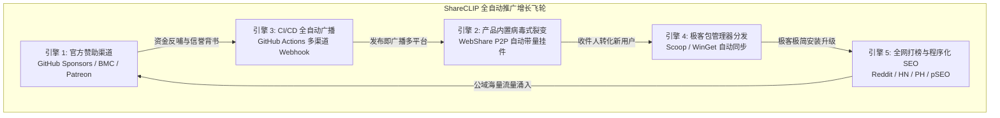

# 全球化全自动推广、开源赞助体系与极客包管理器分发飞轮 (Automated Promotion & Growth Flywheel)

> **模块状态**：✅ 已落地并集成至 ShareCLIP v4.0.0 发版与 CI/CD 流水线  
> **涉及代码**：`.github/FUNDING.yml`, `.github/workflows/auto-promote.yml`, `webshare/src/App.vue`, `manifests/`, `marketing/`

---

## 1. 架构背景与增长飞轮战略

开源软件要在全球开发者与普通用户中获得持续的关注与口碑增长，单纯依靠静态发布往往收效甚微。针对 ShareCLIP 的定位（**100% 本地离线、私有化 P2P 互传、端侧 AI 语义相册、4K 视频下载**），我们设计并落地了**五大协同驱动的自动化增长飞轮（Growth Flywheel）**：



---

## 2. 引擎 1：GitHub 官方 Sponsors 与全渠道赞助变现

### 2.1 仓库根目录接入 (`.github/FUNDING.yml`)
在 GitHub 仓库中部署 [`.github/FUNDING.yml`](file:///d:/AI_serach_image/image_clip_android/.github/FUNDING.yml)，在仓库主页右上角直接点亮官方粉色爱心 **💖 Sponsor** 赞助按钮：

```yaml
github: [NovaMindLab]
patreon: NovaMindLab
custom: ['https://buymeacoffee.com/novamindlab']
```

### 2.2 官网与客户端全端入口接入
1. **官网导航与页脚**（`web/src/App.vue`）：
   - 导航栏（Navbar）常驻挂载 `💖 Sponsor` 按钮；
   - 底部页脚（Footer）展示 `☕ Buy Me a Coffee` 赞助渠道直链；
2. **客户端关于面板**（`cp_clip/src/App.vue`）：
   - 设置面板中提供「💖 赞助项目 (Sponsor)」与「⭐ Star on GitHub」一键跳转按钮。

---

## 3. 引擎 2：WebShare 产品内置病毒式裂变 (PLG)

### 3.1 病毒式裂变机制 (Product-Led Growth)
当用户使用 ShareCLIP 网页端（WebShare）向朋友、同事分享传输照片或视频时，接收端无需安装 App 即可直接在浏览器下载。

我们在 `webshare/src/App.vue` 底部植入了原生毛玻璃样式的**品牌自传播引流挂件**：

```html
<!-- 🚀 Viral Product-Led Growth (PLG) Promo Banner -->
<div class="webshare-promo-banner">
  <div class="promo-text">
    <span class="promo-tag">⚡ 100% 本地 P2P 直连 · 零云端隐私泄露</span>
    <span>由 <strong>ShareCLIP</strong> 开源媒体套件强力驱动 · 无需数据线 · 40MB/s 局域网极速直连 · MobileCLIP 离线 AI 语义搜索 · 4K 多站点视频极速下载</span>
  </div>
  <div class="promo-actions">
    <a href="https://novamindlab.github.io/AIShare-Grabber/" target="_blank" class="promo-btn primary">
      🚀 免费下载全平台客户端
    </a>
    <a href="https://github.com/NovaMindLab/AIShare-Grabber" target="_blank" class="promo-btn secondary">
      ⭐ Star on GitHub
    </a>
  </div>
</div>
```

### 3.2 转化闭环
每一次高频的文件直传分享，都是一次针对目标受众（需要快速跨端传输、注重隐私的用户）的**精准场景化产品安利**，形成零成本的被动指数级增长闭环。

---

## 4. 引擎 3：CI/CD 发版全自动多渠道宣发流水线

### 4.1 自动化工作流设计 (`.github/workflows/auto-promote.yml`)
流水线在 GitHub 触发 Release 发布时全自动执行：

1. **自动提取版本号**：剥离 `v` 前缀（如 `v4.0.0` ➔ `4.0.0`）；
2. **生成标准化宣发 Markdown**：
   - 自动生成 Windows (.exe)、Android (.apk)、macOS (.dmg)、Linux (.AppImage) 与 WebShare 的直达下载矩阵；
   - 自动生成各版本核心特性清单与 Shields 动态勋章；
3. **Discord / Telegram Webhook 自动广播**：
   - 当仓库 Secrets 配置了 `DISCORD_WEBHOOK` 时，向海外开发者 Discord 社区全自动推送信令；
   - 当配置了 `TELEGRAM_BOT_TOKEN` 与 `TELEGRAM_CHAT_ID` 时，向 Telegram 官方频道即时广播图文发布消息。

---

## 5. 引擎 4：Windows 极客包管理器分发 (Scoop & WinGet)

为渗透海外重度开发者与极客圈层，支持免浏览器下载的一键命令行安装与静默升级：

### 5.1 Scoop 社区 Bucket (`manifests/scoop/shareclip.json`)
```json
{
  "version": "4.0.0",
  "description": "Private P2P AirDrop Alternative, Local AI Photo Search (MobileCLIP) & 4K Multi-Site Video Downloader",
  "homepage": "https://novamindlab.github.io/AIShare-Grabber/",
  "license": "MIT",
  "architecture": {
    "64bit": {
      "url": "https://github.com/NovaMindLab/AIShare-Grabber/releases/download/v4.0.0/ShareCLIP-Setup-4.0.0.exe#/dl.7z",
      "hash": "auto"
    }
  },
  "autoupdate": {
    "architecture": {
      "64bit": {
        "url": "https://github.com/NovaMindLab/AIShare-Grabber/releases/download/v$version/ShareCLIP-Setup-$version.exe#/dl.7z"
      }
    }
  }
}
```
极客用户仅需一行命令：
```powershell
scoop install shareclip
```

### 5.2 自动化哈希计算与 Manifest 同步脚本 (`scripts/generate-package-manifests.mjs`)
提供全自动化的 Node.js 脚本：
```bash
node scripts/generate-package-manifests.mjs v4.0.0
```
脚本会自动从 GitHub Release 远端拉取刚刚生成的 Windows 安装包，通过流式计算提取其精准的 `SHA256` 校验和，并自动回填写入 WinGet 与 Scoop 的 YAML/JSON 清单。

---

## 6. 引擎 5：海外顶级公域技术社区打榜与程序化 SEO

为规避海外各大技术社区对自动化脚本/Bot 发帖的“秒封”惩罚，我们采用**预置精美文案、人工 1 键复制提交**的策略：

| 社区渠道 | 物料文件 | 目标受众与策略 |
| :--- | :--- | :--- |
| **AlternativeTo** | `marketing/alternativeto_submission.md` | 全球最大的竞品替代搜索引擎，直接截流 AirDrop、Google Photos、4K Video Downloader 搜索流量 |
| **Reddit** | `marketing/reddit_showcase_posts.md` | 精准覆盖 `r/selfhosted`（自托管）、`r/opensource`（开源）、`r/androidapps`、`r/privacy` 社区的高赞经验贴格式 |
| **Hacker News** | `marketing/hacker_news_show_hn.md` | 硅谷极客第一社区 "Show HN" 标准长文，突出纯本地 AI、零云端中转、WebRTC 无损局域网与 P2P 技术深度 |
| **Product Hunt** | `marketing/product_hunt_launch.md` | 全球新品发布第一平台，包含吸引眼球的 Tagline、GIF 配图建议与 Maker First Comment |
| **Awesome Lists** | `marketing/awesome_lists_prs.md` | 提供提交给 `awesome-selfhosted`、`awesome-flutter`、`awesome-electron` 等数万 Star 官方仓库的标准 PR 代码 |

### 6.1 搜索引擎自动收录 (pSEO)
- 官网根目录发布 [**`sitemap.xml`**](file:///d:/AI_serach_image/image_clip_android/web/public/sitemap.xml)，声明页面更新频率与下载锚点优先级；
- 发布 [**`robots.txt`**](file:///d:/AI_serach_image/image_clip_android/web/public/robots.txt)，允许 Googlebot、Bingbot 快速抓取并建立关键词索引。
