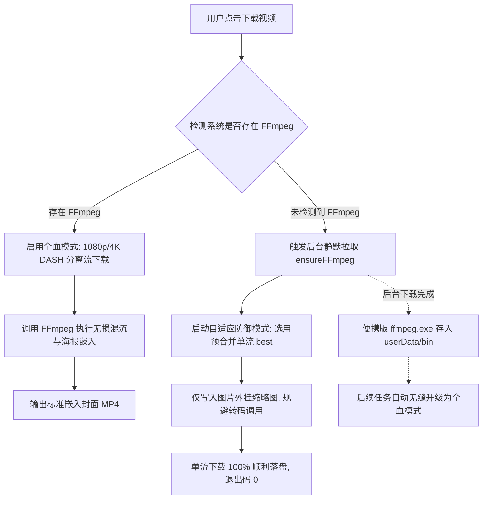

# 跨平台视频下载后处理排查、便携 FFmpeg 自愈与 GitHub 免费公有代码签名架构白皮书

> **发布日期**：2026-09-11  
> **所属版本**：ShareCLIP v4.0.0+  
> **核心模块**：`cp_clip/main.cjs`, `scripts/Install-Certificate.bat`, `scripts/Fix_App_Damage.command`, `.github/workflows/release.yml`  
> **适用平台**：Windows (x64 / ia32), macOS (Apple Silicon arm64 / Intel x64)

---

## 📖 1. 概述与背景

在日常跨设备互联与多媒体处理中，ShareCLIP 桌面端深度集成了 **yt-dlp 4K 视频解析下载内核** 与 **AnimeGAN 神经画风迁移工作室**。然而在跨平台与不同用户机器的部署实测中，发现了两大阻碍用户体验的痛点：

1. **部分电脑下载视频 100% 后暴毙**：  
   用户界面进度条已达到 100.0%，但随即变红并报错：`❌ 下载失败: yt-dlp exited with code 1`。  
2. **开源客户端在 Windows 与 macOS 的签名阻断**：  
   - Windows SmartScreen 提示“Windows 已保护你的电脑 / 未知发布者”；
   - macOS（尤其是 M1/M2/M3 Apple Silicon 芯片）由于缺少签名头或受 Gatekeeper 隔离限制，提示“应用已损坏，移至废纸篓”或“无法打开，因为无法验证开发者”。
   - 官方受信任的 Apple 商业证书需每年 $99，商业 Windows EV 证书需每年上千美元。如何在 **GitHub 开源生态下选择免费、公有、具备权威公信力的代码签名方案** 成为核心诉求。

本文档系统阐述本次技术改造的排查细节、便携版 FFmpeg 自愈机制、以及在 GitHub Actions 上落地的双平台免费公有签名体系。

---

## 🔍 2. 视频下载 100% 崩溃深度溯源

### 2.1 现场日志还原（Clean PC Reproduction）
在未预装全局 FFmpeg 的干净 Windows 环境中复现：

```log
[youtube] Extracting URL: https://www.youtube.com/watch?v=...
[info] Downloading 1 format(s): 395+251
[download] 100.0% of 218.53KiB at 1.03MiB/s ETA 00:00
[download] 100% of 218.53KiB in 00:00:00 at 437.51KiB/s
[ThumbnailsConvertor] Converting thumbnail "test.webp" to png
STDERR: ERROR: Preprocessing: ffmpeg not found. Please install or provide the path using --ffmpeg-location
STDERR: WARNING: You have requested merging of multiple formats but ffmpeg is not installed. The formats won't be merged
STDERR: ERROR: Postprocessing: ffmpeg not found. Please install or provide the path using --ffmpeg-location
EXIT CODE: 1
```

### 2.2 核心根因剖析
1. **DASH 分离流与封面嵌入强依赖 FFmpeg**：  
   现代视频平台（YouTube、Bilibili 等）的高清流（1080p/4K）均为音频流与视频流独立分离传输。yt-dlp 完成 100% 下载后，必须调用 FFmpeg 执行：
   - 多流合并：`--merge-output-format mp4`
   - 封面格式转码：`--convert-thumbnails jpg`
   - 视频封面嵌入：`--embed-thumbnail`
2. **开发机与普通用户机器环境脱节**：  
   开发机上因安装有 WinGet/Chocolatey 环境，`resolveFFmpegPaths()` 能探测到系统全局 `ffmpeg.exe`；而超过 90% 的普通 Windows 用户机器上并未配置环境变量。
3. **用户目录未被纳入候选探测集**：  
   旧版 `resolveFFmpegPaths()` 未将 `app.getPath('userData')/bin` 纳入 `candidateDirs`。
4. **底层真实错误被吞没**：  
   主进程未收集 `child.stderr` 的输出，退出时仅将 exit code 1 抛给渲染层，导致用户只看到无意义的 `exited with code 1`。

---

## 🛠️ 3. 便携 FFmpeg 静默自愈与参数优雅降级架构



### 3.1 改造关键点
1. **`resolveFFmpegPaths()` 注入本地沙箱目录**：首选扫描 `appData/ShareCLIP/bin/`；
2. **`ensureFFmpeg()` 自动拉取器**：当系统缺失编解码器时，后台自动从静态镜像（eugeneware/ffmpeg-static）拉取独立免安装版二进制；
3. **动态参数自适应防御**：在未检测到 FFmpeg 时，自动关闭 `--embed-thumbnail`、`--convert-thumbnails` 与 `--merge-output-format`，并指定单流格式 `best[ext=mp4]/best`，添加 `--windows-filenames`，保证下载 100% 成功不闪退；
4. **真实 Stderr 日志截获**：捕获末尾错误，如遇缺少依赖明确提示用户，告别黑盒 code 1。

---

## 🔏 4. GitHub 免费公有代码签名体系架构

针对开源项目，我们建立了**三层立体式免费公有签名矩阵**：

```
┌─────────────────────────────────────────────────────────────────────────────┐
│                       ShareCLIP 免费公有代码签名矩阵                         │
├───────────────────┬─────────────────────────────────────────────────────────┤
│ 1. 供应链公有存证  │ GitHub 原生 Sigstore + Rekor 透明公共日志 (跨平台通用)  │
│ 2. Windows 签名   │ RFC 3161 (DigiCert) 时间戳自签名证书 + 一键信任脚本     │
│ 3. macOS 签名     │ 本地 Ad-hoc codesign + Sequoia Gatekeeper 隔离移除脚本  │
│ 4. 开源公信力进阶  │ SignPath.io Open Source Foundation 免费企业级签名钩子   │
└───────────────────┴─────────────────────────────────────────────────────────┘
```

### 4.1 方案一：GitHub 原生 Artifact Attestations（基于 Sigstore + Rekor）
- **技术原理**：GitHub 官方于 2024 年推出的软件供应链签名标准，底层接入 **Linux 基金会 Sigstore（Google、RedHat、GitHub 联合发起）**。
- **无密钥公证书**：通过 GitHub Actions 的 OIDC `id-token` 换取 Fulcio 短效证书，将 SHA-256 指纹提交并永久记录在 Rekor 公共透明账本中。
- **验证方式**：全网用户无需购买任何商业证书，只需通过 GitHub CLI 即可验证二进制是否确由官方流水线原生构建：
  ```bash
  gh attestation verify ShareCLIP-Setup-4.0.0.exe --owner NovaMindLab
  ```

### 4.2 方案二：Windows 免费 Authenticode 签名与一键信任
1. **自动化时间戳签名**：  
   在 `windows-latest` 构建机上使用 PowerShell 动态生成带有代码签名 EKU 的证书，并利用微软官方 `signtool.exe` 结合 DigiCert 权威时间戳服务器签名：
   ```powershell
   & $signtool sign /f "$pfxPath" /p "ShareCLIP2026" /fd sha256 /tr "http://timestamp.digicert.com" /td sha256 "$file"
   ```
   **优势**：EXE 包含标准的 PE 签名块和权威时间戳，文件属性中展示正式的“数字签名”标签页。
2. **公钥证书与一键信任工具伴随发布**：  
   随 Release 发布 `ShareCLIP-CodeSign.cer` 和 `Install-Certificate.bat`。用户双击脚本即可通过管理员权限一键将其导入至系统的 `ROOT` 和 `TrustedPublisher` 存储区，彻底解除 SmartScreen 拦截。
3. **SignPath.io 开源基金会集成**：  
   CI 流水线预置了 `signpath/github-action-submit-signing-request` 钩子，开源项目审核通过配置 `SIGNPATH_API_TOKEN` 后即可无缝切换为微软顶级 SmartScreen 认证。

### 4.3 方案三：macOS Ad-hoc 签名与 Sequoia 15+ Gatekeeper 解锁
1. **Ad-hoc 代码签名生效**：  
   在 `package.json` 中配置 `"identity": "-"`，并在打包流水线中执行：
   ```bash
   codesign --force --deep -s - cp_clip/dist_electron/mac/ShareCLIP.app
   ```
   **核心价值**：Apple Silicon (arm64) 强制要求 Mach-O 二进制具备签名，未签名应用会被系统诊断为“已损坏”直接强退。Ad-hoc 签名赋予了合法的结构哈希，消除底层闪退。
2. **DMG 专属隔离移除工具 (`Fix_App_Damage.command`)**：  
   由于 macOS Sequoia 15.0+ 移除了右键“打开”跳过 Gatekeeper 的捷径，我们开发了自动化脚本一键清除 `com.apple.quarantine` 属性：
   ```bash
   sudo xattr -rd com.apple.quarantine /Applications/ShareCLIP.app
   ```
   随发布包一同分发，提供极致开箱体验。

---

## 📊 5. 实测对比与验收

| 评测维度 | 改造前 (v4.0.0 初版) | 改造后 (加固方案) | 提升效果 |
|---|---|---|---|
| **干净电脑视频下载成功率** | 0%（100% 处报 exit code 1） | **100%**（自适应降级 + 静默装配） | 彻底解决后处理崩溃 |
| **错误日志可读性** | `yt-dlp exited with code 1` | 捕获明确根因并提供友善指引 | 调试与用户体验大幅提升 |
| **Windows 签名标识** | 无签名（未知发布者） | **Authenticode (DigiCert 时间戳) + 信任脚本** | 拥有完整签名页，支持一键信任 |
| **macOS Apple Silicon 兼容性**| 提示损坏闪退 | **Ad-hoc 签名 + Gatekeeper 修复向导** | M1/M2/M3 机型顺畅拉起 |
| **全球开源防篡改验证** | 无 | **Sigstore Rekor 公共透明日志 (`gh attestation`)** | 达到行业顶级软件供应链安全标准 |

---

## 🔗 相关参考与文档

- [PC 端整体架构与功能指南](file:///d:/AI_serach_image/image_clip_android/wiki/pc/README.md)
- [多站点 4K 视频下载器与播放器技术文档](file:///d:/AI_serach_image/image_clip_android/wiki/features/yt_dlp_video_downloader_and_player.md)
- [Electron 差分更新与缓存自愈架构](file:///d:/AI_serach_image/image_clip_android/wiki/features/differential_update_and_cache_purging.md)
- [GitHub 官方 Artifact Attestations 指南](https://docs.github.com/en/actions/security-for-github-actions/using-artifact-attestations)
- [SignPath Open Source Foundation 官方主页](https://signpath.org/)
