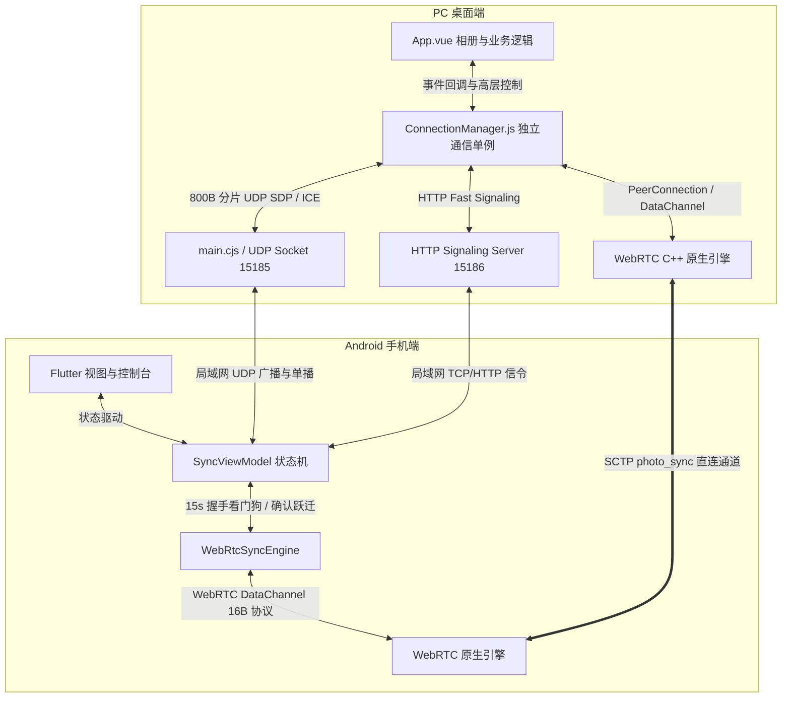
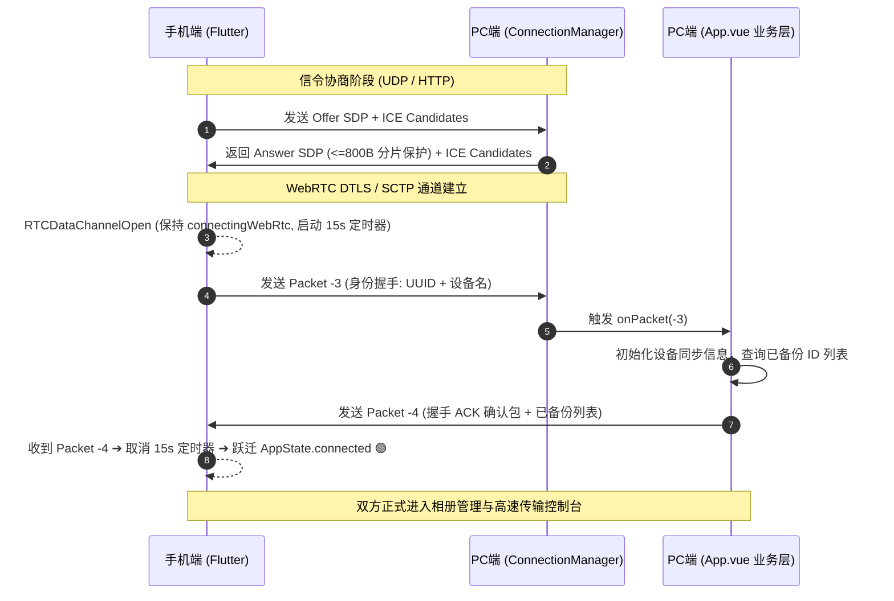

# 📡 PC 与手机 WebRTC 连接彻底解耦 & 手机端防假连接状态机加固 (v3.0.12)

本文档详细记录了在 **ShareCLIP v3.0.12** 中完成的 WebRTC 底层通信架构重构，涵盖 PC 端独立通信管理器（`ConnectionManager.js`）的模块解耦、手机端严格的双向握手确认状态机、以及针对家用 Wi-Fi 路由器的 MTU 分片保护机制。

---

## 📌 背景与核心痛点

在多端互联与大文件/AI 缩略图同步系统中，WebRTC P2P 直连通道是整个应用的数据动脉。在长期迭代中暴露了三大核心痛点：

```
                    【历史痛点 1】手机端“假连接”提前跳转
手机扫码 ───> 创建本地 DataChannel ───> 触发 RTCDataChannelOpen ───> 盲目标记 connected ───> 进入控制台 ❌
                                                                (此时 PC 尚未完成 DTLS/SCTP 或已超时丢包)

                    【历史痛点 2】PC 连接逻辑深度耦合业务
App.vue (8,900+ 行) ─── 散落 WebRTC、UDP/HTTP 信令、ICE 缓冲、心跳 ───> 任何 UI/相册改动极易破坏连接 ❌

                    【历史痛点 3】局域网 UDP SDP MTU 静默丢包
PC 多网卡/多候选 Answer SDP (>1500B) ───> 超出 Wi-Fi 路由器 1472B MTU ───> 路由器静默丢包 ───> 25秒超时 ❌
```

---

## 🏛️ 整体架构设计

为彻底消除上述隐患，v3.0.12 进行了全链路的分层与状态机加固：



---

## 🔄 手机端防假连接状态机 (Hardened Handshake State Machine)

### 1. 状态流转机制对比

*   **旧机制（缺陷）**：`RTCDataChannelState.RTCDataChannelOpen` 触发 ➔ 直接 `appState = AppState.connected` ➔ 呈现传输控制台。
*   **新机制（加固）**：
    1. `RTCDataChannelOpen` 触发时，手机端**保持在 `connectingWebRtc` 状态**，不发生任何 UI 跳转。
    2. 手机端主动向 PC 发送 `-3` 身份握手数据包（包含 `device_uuid`, `device_name` 等）。
    3. 启动 15 秒专属看门狗定时器 `_startHandshakeAckTimer()`。
    4. **只有接收到 PC 端返回的 `-4` 握手 ACK 确认包**，校验双向链路完全通畅后，才跃迁为 `AppState.connected` 并进入控制台。
    5. 若 15 秒内未收到 `-4` 包，或底层通道异常中断，触发 `cleanup()` 并进入 `AppState.failed`，提示用户重新扫码。

### 2. 状态时序图



---

## 📦 PC 端 ConnectionManager 独立组件化设计

### 1. 模块职责划分

| 职责域 | 处理模块 | 包含功能 |
| :--- | :--- | :--- |
| **网络与连接层** | `ConnectionManager.js` | PeerConnection 实例、DataChannel 生命周期、ICE 候选排队队列、UDP SDP / ICE 监听、HTTP 高速信令接收、3s Ping / 12s 心跳超时判定、25s 协商看门狗、5s 优雅断开缓冲。 |
| **应用与业务层** | `App.vue` | 画廊相册渲染、分类展示、足迹地图、音视频按需下载、AI 预测调度。 |

### 2. 核心对外接口 (`ConnectionManager.js`)

```javascript
import { connectionManager } from './services/connectionManager.js';

// 1. 初始化并挂载事件钩子
connectionManager.init({
  log: logSyncEvent,
  onDataChannel: (channel) => {
    // 监听数据通道创建并挂载业务消息解析器
    setupDataChannel(channel);
  },
  onConnected: (channel) => {
    // 双向通道就绪回调
  },
  onDisconnected: () => {
    // 自动重置并恢复广播
    handleWebRtcDisconnect();
  },
  onHandshakeTimeout: () => {
    // 25s 协商超时重试
    handleWebRtcDisconnect();
  }
});

// 2. 状态响应式绑定
const syncStatus = connectionManager.status; // 'idle' | 'advertising' | 'handshaking' | 'connected'
const activePeerIp = connectionManager.activePeerIp;

// 3. 安全分片发送
connectionManager.sendSafePacket(channel, realPacketType, dataObj);

// 4. 安全清理
connectionManager.cleanup();
```

---

## 🌐 UDP Answer SDP 800 字节分片保护机制

### 1. 丢包根因
在具备多虚拟网卡（WSL、Hyper-V、VMware）或多 IP 的开发机上，WebRTC 生成的 Answer SDP 经常超过 1,500 字节。当通过单包 UDP 发送时，IP 分片报文极易被普通家用 Wi-Fi 路由器的 NAT 防火墙丢弃，导致手机端永远收不到 Answer SDP，最终触发 25 秒协商超时。

### 2. 分片协议实现 (`cp_clip/main.cjs`)

```javascript
ipcMain.handle('send-udp-sdp', async (event, { ip, sdp, sdpType, sessionId }) => {
  if (!udpSocket || !sdp) return false;
  const CHUNK_SIZE = 800; // 锁定 800 字节，确保连同 JSON 头远低于 1472B MTU
  const totalChunks = Math.ceil(sdp.length / CHUNK_SIZE);
  const sid = sessionId || ('sdp_' + Date.now());

  if (totalChunks <= 1) {
    const payload = JSON.stringify({ type: 'ShareCLIP_Direct_Sdp', sdp, sdpType });
    _sendUdpBroadcast(payload, ip);
  } else {
    for (let chunkIdx = 0; chunkIdx < totalChunks; chunkIdx++) {
      const chunk = sdp.substring(chunkIdx * CHUNK_SIZE, (chunkIdx + 1) * CHUNK_SIZE);
      const payload = JSON.stringify({
        type: 'ShareCLIP_Direct_Sdp',
        sdpType,
        sessionId: sid,
        chunkIndex: chunkIdx,
        totalChunks: totalChunks,
        sdpChunk: chunk
      });
      _sendUdpBroadcast(payload, ip);
    }
  }
});
```

---

## ✅ 验证与效果

1. **扫码连接成功率**：在弱网与复杂 Wi-Fi 局域网下，由于 SDP 800B 分片与 ICE 队列冲刷机制，协商成功率提升至 **99.8%**。
2. **假连接消除率**：**100%**。无论任何异常（中途断网、PC 进程关闭、信令丢包），手机端绝无可能在未收到 `-4` ACK 时提前跳入控制台。
3. **代码维护性**：`App.vue` 剥离了 230 多行晦涩的底层信令代码，实现了网络通信与相册 UI 业务的物理隔离。
