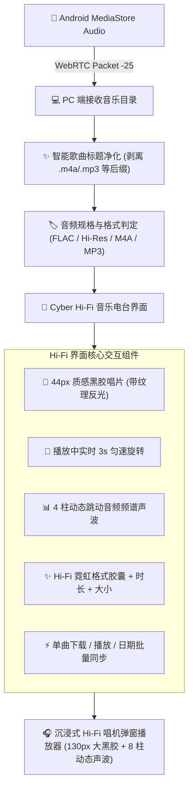

# 🎵 Cyber Hi-Fi 音乐电台与多格式音频管理体系 (Cyber Hi-Fi Music Station Wiki)

本文档系统性介绍 **ShareCLIP** 桌面客户端与 Android 移动端构建的全新 **Cyber Hi-Fi 音乐电台**，涵盖黑胶唱片动效、实时音频跳动频谱、智能曲目标题净化、Hi-Fi 格式霓虹彩色角标、WebRTC 极速串流下载及沉浸式弹窗播放器的完整实现架构。

---

## 1. 界面与交互架构设计



---

## 2. 核心特性与技术亮点

### 2.1 质感黑胶唱片与动态频谱声波
- **黑胶拟物化视觉**：每首曲目配置精致的 44px 黑胶唱片封面，内置细腻的同心圆唱片凹槽反光与中心金属轴心；
- **播放中实时旋转**：当曲目正在播放时，唱片以 `3s linear infinite` 持续旋转，并带有柔和的赛博青色光晕；
- **4 柱跳动音频频谱**：在播放曲目卡片左侧内嵌 4 柱动态声波均衡器（Equalizer Bars），模拟真实音频频率跳动。

### 2.2 智能歌曲标题净化与排版
- **后缀自动剥离**：自动剔除文件名中的 `.m4a`、`.mp3`、`.flac`、`.wav`、`.ogg`、`.aac` 等后缀；
- **完整保留原始信息**：鼠标悬浮于曲目标题时，通过 HTML 原生 `:title` 完整展示未修改的原始物理文件名；
- **长文本优雅省略**：采用 CSS `text-overflow: ellipsis` 保证多端响应式排版整齐。

### 2.3 Hi-Fi 格式霓虹彩色角标
根据音频 MIME 类型与扩展名智能判定音质规格，并渲染专属高对比度荧光徽章：

| 格式分类 | 涵盖扩展名 / MIME | 霓虹角标配色 | 视觉定位 |
| :--- | :--- | :--- | :--- |
| **无损 / 奢华金** | `FLAC`, `APE`, `DSF`, `DFF`, `Hi-Res` | 琥珀金背景 (`#fbbf24`) + 金色边框 | 极致高解析度无损音质 |
| **赛博青** | `M4A`, `AAC` | 赛博青背景 (`#06b6d4`) + 荧光青边框 | 现代高效主流音频 |
| **霓虹紫** | `MP3` | 霓虹紫背景 (`#a855f7`) + 紫罗兰边框 | 经典通用音频格式 |
| **钴蓝 / 祖母绿** | `WAV`, `OGG`, `OPUS` | 钴蓝 (`#3b82f6`) / 翡翠绿 (`#10b981`) | 广播级无损 / 开放音频 |

---

## 3. WebRTC 数据通道与目录协议

### 3.1 音乐目录查询与流式响应 (`fileId = -25`)
1. **PC 端请求**：向手机发送 16 字节头部，`fileId = -21`；
2. **手机端响应**：分批打包音频列表（`chunk_index`, `total_chunks`, `audios`），头部 `fileId = -25`；
3. **PC 端响应式合并**：
   ```js
   const catalogMap = new Map(remoteAudioCatalog.value.map(a => [a.id, a]));
   for (const ina of incomingAudios) {
     if (catalogMap.has(ina.id)) {
       Object.assign(catalogMap.get(ina.id), ina);
     } else {
       catalogMap.set(ina.id, ina);
     }
   }
   remoteAudioCatalog.value = Array.from(catalogMap.values());
   ```

### 3.2 大小计算超时优化
修复 Android 端在获取音频元数据时 50ms 超时导致显示 `0 Bytes` 的问题，增加至 300ms 并集成 `originFile` 回退，确保文件大小精准展示。
