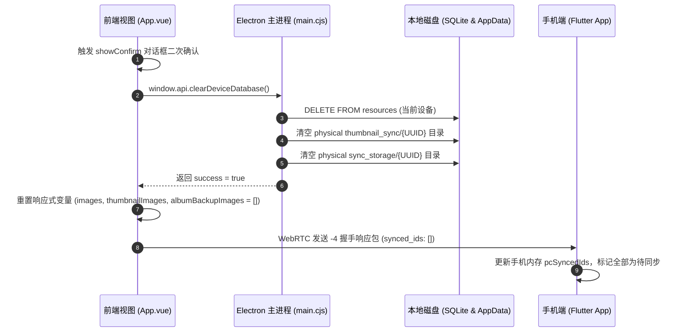

# 📱 手机连接面板全域国际化与专属缓存清空机制 (Connected View i18n & Device Cache Management)

## 1. 概述与背景

在 **ShareCLIP** 跨端生态中，「连接手机」面板是用户日常建立 WebRTC P2P 高速通道、管理 AI 缩略图分类与全量相册备份的核心枢纽。随着系统功能的不断扩展，连接成功后的控制台集成了包括系统容量监控、AI 计算控制台、相册物理备份中心以及双向 P2P 传输沙盒等多个高级模块。

针对以往版本存在的两项核心痛点：
1. **中英混杂与国际化遗漏**：部分深度业务组件（如设备状态卡片、AI 耗时统计仪表盘、相册同步状态、P2P 传输状态等）存在中文硬编码，在英文或繁体中文语言环境下出现界面语言割裂。
2. **缺乏针对当前连接设备的独立缓存清空操作**：用户若希望释放特定手机占用的磁盘空间或重置同步索引，只能使用全局重置或手动清理文件。

本项目在 **v2.1.10** 中完成了对**手机连接面板的全域国际化重构**，并全新引入了**当前连接设备独立缓存清空与同步状态重置体系**。

---

## 2. 核心架构与设计

### 2.1 手机连接面板全域国际化体系 (i18n Namespace)

在 [`cp_clip/src/locales.js`](file:///d:/AI_serach_image/image_clip_android/cp_clip/src/locales.js) 的 `link` 命名空间下，全面规范并补齐了覆盖所有业务卡片的双语字典：

```mermaid
graph TD
    A[用户切换语言 (currentLocale)] --> B[Vue Computed 't' 响应式绑定]
    B --> C[Card 1: 设备与存储监控 (deviceStatus / storageUsed / unnamedDevice)]
    B --> D[Card 2: AI 智能处理 (aiManagement / thumbnailSync / latencyMeters)]
    B --> E[Card 3: 相册物理备份 (albumSyncTitle / pause / resume / checkMissing)]
    B --> F[Card 4: P2P 直连通道 (p2pTunnelTitle / gattReady / emptyStates / chatMessages)]
```

#### 关键国际化键位映射表：

| 模块 | 键位 (Key) | 英文 (en) | 简体中文 (zh) | 繁体中文 (zh-TW) |
|---|---|---|---|---|
| **设备卡片** | `deviceStatus` | Device Status | 设备状态 | 裝置狀態 |
| | `storageUsed` | Storage Used | 已使用存储 | 已使用容量 |
| | `clearPhoneCacheBtn` | Clear Current Phone Cache | 清空当前手机缓存 | 清除目前裝置快取 |
| **AI 控制台** | `aiManagement` | Management & Sync (AI Engine) | 管理与同步 (AI 智能处理) | 管理與同步 (AI 智慧運算) |
| | `singleLatency` | Single | 单张 | 單張 |
| | `avgLatency` | Avg | 平均 | 平均 |
| | `totalTimeSpent` | Total Time Spent | 总计花费时间 | 總計耗時 |
| | `estRemaining` | Est. Remaining | 预计剩余 | 預計剩餘 |
| **相册备份** | `albumSyncTitle` | Album Physical Backup to PC | 相册备份到PC (物理备份) | 相簿備份至電腦 (實體備份) |
| | `albumSyncedText` | Synced: {done} / {total} | 已同步: {done} / {total} | 已同步: {done} / {total} |
| | `albumRemainingText` | {count} remaining | 剩余: {count} 张 | 剩餘: {count} 張 |
| **P2P 通道** | `p2pTunnelTitle` | P2P Direct Tunnel (WebRTC) | P2P 极速直连通道 (WebRTC Tunnel) | P2P 極速直連通道 (WebRTC Tunnel) |
| | `gattChannelReady` | GATT channel ready | GATT 信道就绪 | GATT 信道就緒 |
| | `chatReadyTitle` | Bidirectional Data Flow Ready | 数据双向传输就绪 | 雙向資料傳輸就緒 |
| | `sendLocalFileBtn` | Select local files to send to phone | 选择本地文件发送到手机 (支持任意格式拖放) | 選擇本機檔案傳送至行動裝置 |

---

### 2.2 独立设备缓存清空与状态同步机制 (Device Cache Clear)

用户点击「🗑️ 清空当前手机缓存」后，系统采用**前后台联动 + 协议级通知**的双重保障机制：



#### 技术实现亮点：
1. **精准隔离，不波及全局**：仅针对当前连接手机的 `activeDeviceUuid` 对应的物理目录和 SQLite 数据库记录进行清理，不影响用户导入的本地文件夹或其他设备。
2. **轻量通知，拒绝死循环重载**：仅通过 `-4` 握手数据包更新手机端的已同步 ID 列表为空 (`synced_ids: []`)，**不会**强制触发全量重新传输，彻底将主动权交还给用户。

---

## 3. 跨版本稳定性加固（视频流传输防卡死）

在本次迭代中，同步强化了底层 `PhotoStreamer` 的传输弹性：
- **`originBytes` 15秒超时保护**：防止 Android 11+ Scoped Storage 大视频二进制读取时引发的底层 Binder 假死。
- **`latlngAsync()` 5秒超时保护**：杜绝 MediaStore 在读取视频 EXIF GPS 时可能发生的锁死。
- **WebRTC 背压循环超时防卫**：在 `_streamFileInternal` 与 `_streamBytesInternal` 中，将流量控制等待循环上限设置为 15 秒（1000次重试），彻底消除进度卡在 0% 的现象。
