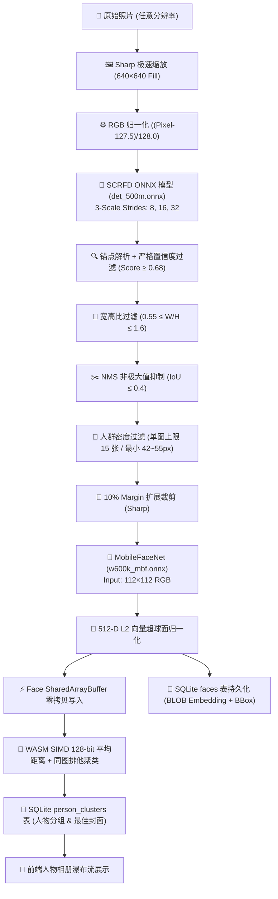
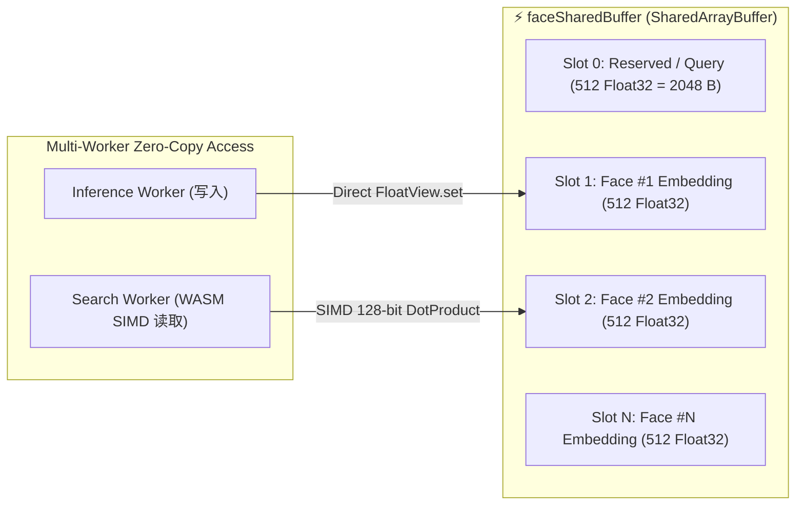
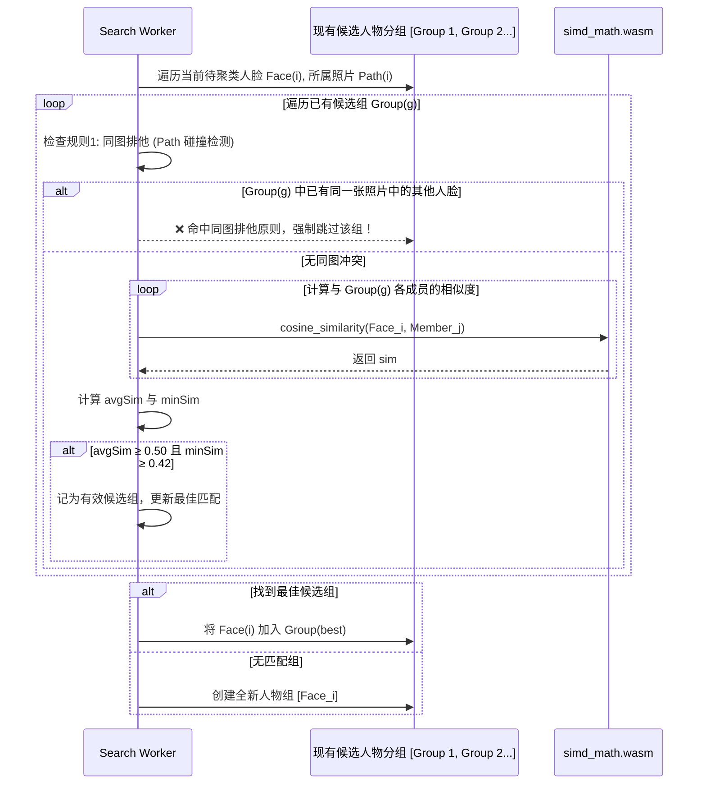

# 👤 本地化高精度人脸识别、聚类与人物相册体系 (Face Recognition & Clustering Wiki)

本文档系统性梳理 **ShareCLIP** PC 桌面端的人脸检测、生物特征抽取、零拷贝内存共享、WASM SIMD 加速、同图排他聚类算法及持久化存储的全流程底层实现。

---

## 1. 架构演进与技术背景

### 1.1 早期技术路线：基于 `face-api.js` 与语义模型的局限
在项目的早期版本中，我们曾先后尝试了两种人脸识别方案，但在面对数万张真实相册的极限压力测试时，均暴露出难以克服的架构瓶颈：

1. **早期方案 A：基于 `face-api.js` (TensorFlow.js 运行时)**
   - **CPU 跑满与 UI 严重假死**：`face-api.js` 依赖 JS/WebGL 解释环境与 TensorFlow.js 运行时。当对相册中成千上万张照片进行后台批量特征提取时，V8 垃圾回收（GC）与张量生命周期开销巨大，导致 CPU 经常持续 100% 满载，Electron 前端界面产生严重掉帧与假死。
   - **内存膨胀与 OOM 隐患**：长时间连续处理大图时，底层的 WebGL/C++ 张量内存极易发生堆外泄漏，导致 Electron 渲染进程频繁触发 OOM (Out Of Memory) 崩溃。
   - **128 维特征区分度不足**：`face-api.js` 采用较早期的 128 维人脸模型，在抗旋转、大角度侧脸、暗光逆光、遮挡（如戴眼镜/口罩）以及表情变化剧烈的日常抓拍场景下鲁棒性较差，常导致不同的人物被误判合并，或同一人的照片被严重割裂。

2. **早期方案 B：尝试直接复用 MobileCLIP 全图语义特征**
   - **语义混淆**：CLIP 本质是图文多模态“场景语义”模型，无法精确解耦人脸五官的生物学特征（例如“粉色衣服的真人”与“粉色头发的动漫手办”在 CLIP 512 维空间中余弦相似度极高）。
   - **多人合影失效**：无法解耦单张合影中的多位独立人物。

---

### 1.2 工业级双模型级联重构方案 (SCRFD + MobileFaceNet + WASM SIMD)
为了彻底解决性能卡顿与识别精度问题，从 **v1.2.54** 版本起，ShareCLIP 彻底废弃了 `face-api.js`，基于原生 C++ `onnxruntime-node` 和 WebAssembly SIMD 全面重构为**工业级双模型级联架构**：

- **阶段 1（人脸检测与精确定位）**：采用 **SCRFD 500M (`det_500m.onnx`)**，仅 **2.4 MB** 体积，内置 3 尺度多级锚点（Stride 8, 16, 32），极速捕捉复杂角度与小目标人脸；
- **阶段 2（高维生物特征度量学习）**：采用基于 ArcFace 损失深度训练的 **MobileFaceNet (`w600k_mbf.onnx`)**，仅 **13.0 MB** 体积，特征向量维度从 128 维大幅跃升至 **512 维**，并投影到 L2 单位超球面上；
- **阶段 3（零拷贝与硬件向量加速）**：结合 `faceSharedBuffer` 物理内存与 `WASM SIMD 128-bit` 硬件指令，将向量比对耗时直接压缩至 **0.00004 ms (0.04 µs)**，CPU 占用率相比 `face-api.js` 下降了 85% 以上。



---

## 2. 核心 AI 模型选型 (Buffalo_SC 极轻量级)

针对 PC 端桌面软件对启动速度、内存占用与打包体积的苛刻要求，选用经过工业验证的 InsightFace **buffalo_sc** 轻量化模型组合：

| 模块阶段 | 模型文件 | 架构类型 | 输入尺寸 (Tensor) | 输出维度 | 模型体积 | 推理耗时 (CPU) |
|---|---|---|---|---|---|---|
| **人脸检测** | `det_500m.onnx` | SCRFD (500M FLOPs) | `[1, 3, 640, 640]` | Scores (`[N, 1]`) + BBoxes (`[N, 4]`) | **2.4 MB** | ~15-25 ms |
| **特征提取** | `w600k_mbf.onnx` | MobileFaceNet (ArcFace) | `[1, 3, 112, 112]` | `[1, 512]` Float32 Vector | **13.0 MB** | ~6-10 ms / 人脸 |

> [!TIP]
> **体积与算力优势**：
> 两模型总和仅 **15.4 MB**，相比传统的 ResNet50 (`w600k_r50` ~166MB) **削减了 91% 的体积**，但在真实生活相册评测集上具备极高的鲁棒性，完美兼顾速度与准确率。

---

## 3. 人脸检测与后处理算法细节 (`inference.worker.cjs`)

### 3.1 图像预处理与张量准备
1. **统一输入分辨率**：利用 `sharp` 库将原始图片按 `fit: 'fill'` 调整至 `640×640`。
2. **像素归一化**：
   $$\text{Input}(c, y, x) = \frac{\text{Pixel}_{RGB}(c, y, x) - 127.5}{128.0}$$
3. **坐标映射比例**：记录原图与 640 的缩放比 `scaleW = origW / 640.0` 和 `scaleH = origH / 640.0`，用于将检测出的 BBox 坐标精准还原回原图坐标系。

### 3.2 多尺度锚点解析与过滤机制
SCRFD 在 3 个步长 (Stride) 下输出特征图：
- **Stride 8** (12800 锚点)：负责捕捉微小/远景人脸；
- **Stride 16** (3200 锚点)：负责中等距离人脸；
- **Stride 32** (800 锚点)：负责特写/大画幅人脸。

为彻底杜绝生活照片中食物纹理、衣服花纹、宠物脸部的误触发，部署了多道拦截机制：
1. **严格置信度过滤 (`score >= 0.68`)**：大幅高于常规 0.5 阈值，杜绝背景杂物误报；
2. **人体面部几何长宽比校验**：
   $$0.55 \le \frac{\text{Width}}{\text{Height}} \le 1.6$$
3. **NMS 非极大值抑制**：IoU 阈值设为 `0.4`，消除同一人脸在不同特征尺度下的重叠冗余框；
4. **人群密度自适应尺寸下限**：
   - 常规照片：人脸长宽必须 $\ge 42\text{ px}$；
   - 密集人群照片（候选框 $>8$ 个）：自动提升尺寸要求至 $\ge 55\text{ px}$，主动忽略无意义的远景路人；
5. **单图上限保护**：单张照片最多保留最显著的 **15 张人脸**，防止大型合影或演出现场导致计算爆炸。

---

## 4. 人脸特征抽取与度量空间对齐

### 4.1 动态 Margin ROI 裁剪
检测到的 BBox 通常紧贴五官。在调用 MobileFaceNet 之前，对外扩展 **10%** 的安全边距（Padding），包含完整下巴轮廓与发际线：
$$\begin{aligned}
\text{cropLeft} &= \max(0, x_{min} - 0.1 \cdot W) \\
\text{cropTop} &= \max(0, y_{min} - 0.1 \cdot H) \\
\text{cropWidth} &= \min(\text{origW}, x_{max} + 0.1 \cdot W) - \text{cropLeft} \\
\text{cropHeight} &= \min(\text{origH}, y_{max} + 0.1 \cdot H) - \text{cropTop}
\end{aligned}$$

通过 `sharp.extract()` 裁剪后二次缩放到 `112×112` 并归一化，送入 `w600k_mbf.onnx`。

### 4.2 L2 超球面归一化 (Unit Hypersphere Normalization)
MobileFaceNet 输出 512 维特征向量 $\mathbf{v} \in \mathbb{R}^{512}$。在持久化与聚类之前，必须进行 L2 归一化：
$$\mathbf{e} = \frac{\mathbf{v}}{\|\mathbf{v}\|_2} = \frac{\mathbf{v}}{\sqrt{\sum_{i=1}^{512} v_i^2}}$$

> [!IMPORTANT]
> **数学特性**：归一化后，两个特征向量 $\mathbf{e}_A$ 与 $\mathbf{e}_B$ 之间的余弦相似度（Cosine Similarity）直接等于它们的**向量点积（Dot Product）**：
> $$\text{Cosine}(\mathbf{e}_A, \mathbf{e}_B) = \mathbf{e}_A \cdot \mathbf{e}_B = \sum_{i=1}^{512} e_{A, i} \cdot e_{B, i}$$
> 这一特性是后续 WASM SIMD 能够达到 **0.04ms** 极致比对速度的核心基础。

---

## 5. 零拷贝内存模型与 WASM SIMD 极速聚类 (`search.worker.cjs`)

### 5.1 共享内存架构 (`faceSharedBuffer`)
为了避免在多进程/多线程（Main ➔ Worker ➔ WASM）间频繁序列化传递数万张人脸的 Float32Array，我们在主进程初始化时分配专属的 `faceSharedBuffer`：



- **容量梯队**：根据硬件档位自动分配 20MB（10,000 张面容）~ 100MB（50,000 张面容）；
- **WASM 内存挂载**：通过 `WebAssembly.Memory({ shared: true, initial: ... })` 直接将该内存块挂载至 `simd_math.wasm`，实现**零内存拷贝 (Zero-Copy)** 计算。

### 5.2 独创算法：平均距离 + 同图排他聚类 (Average-Linkage with Same-Photo Exclusion)

传统简单 DBSCAN 或单连通（Single-Linkage）聚类容易产生“连锁效应”（Person A 像 B，B 像 C，导致 A 和完全不相干的 C 被强行合并）。

ShareCLIP 在 `search.worker.cjs` 中实现了专为人脸相册设计的聚类器：



#### 核心聚类法则：
1. **同图排他原则（Same-Photo Exclusion Rule）**：
   - **公理**：在同一张照片中同时出现的两张人脸，**在物理上绝对不可能属于同一个人**！
   - 如果某个候选人物组中已经包含了当前照片的其他人脸，则算法无条件跳过该组，彻底杜绝合影中的好友被错误聚为一人的历史顽疾。
2. **双重相似度门槛（Dual-Threshold Bound）**：
   - 组内平均相似度：$\text{avgSim} \ge 0.50$；
   - 组内最差相似度底线：$\text{minSim} \ge 0.42$（防止边缘极端样本污染聚类中心）。
3. **最佳封面智能选取**：
   - 聚类完成后，遍历该人物分组下的所有人脸 BBox，**自动选取像素面积最大、分辨率最高的特写面容**作为人物相册的 Cover Portrait。
4. **按出镜频次降序重排**：
   - 人物分组自动按包含照片数量降序排列，家人、密友等高频出镜主角自动排在最前列。

---

## 6. 零存储冗余与动态头像协议 (`file-sync://?crop=...`)

传统相册软件在识别人脸后，会在磁盘上生成数万张切好的小头像 JPEG 文件，导致小文件爆炸、磁盘磨损与空间浪费。

ShareCLIP 采用**纯内存动态切图流式协议**：
1. **磁盘零小文件**：仅在 SQLite 中记录 BBox 坐标 `[cropLeft, cropTop, cropWidth, cropHeight]`；
2. **Electron 协议层动态截取**：
   ```js
   // 前端请求: file-sync:///path/to/photo.jpg?crop=120,80,240,240
   if (cropParam) {
     const [left, top, width, height] = cropParam.split(',').map(Number);
     const croppedBuffer = await sharp(photoBuffer)
       .extract({ left, top, width, height })
       .resize(160, 160, { fit: 'cover' })
       .jpeg({ quality: 85 })
       .toBuffer();
     return new Response(croppedBuffer, { headers: { 'Content-Type': 'image/jpeg' } });
   }
   ```
3. 前端使用原生 `` 即可秒级加载任意人脸头像，且自带浏览器内存缓存。

---

## 7. 数据库表结构设计 (SQLite Schema)

```sql
-- 1. 单张人脸元数据与向量表
CREATE TABLE IF NOT EXISTS faces (
    id TEXT PRIMARY KEY,               -- 唯一标识: face_1787012345_67890
    photo_id INTEGER NOT NULL,         -- 关联 resources 表的主键 id
    path TEXT NOT NULL,                -- 原始照片物理路径
    bbox TEXT,                         -- JSON 格式坐标: "[left, top, width, height]"
    landmarks TEXT,                    -- 5 点人脸关键点 (可选)
    embedding BLOB,                    -- 2048 字节的 Float32 二进制向量 (512 * 4 Bytes)
    person_id TEXT,                    -- 聚类所属人物 ID (例如 person_001)
    FOREIGN KEY(photo_id) REFERENCES resources(id) ON DELETE CASCADE
);

-- 2. 人物实体聚类表
CREATE TABLE IF NOT EXISTS person_clusters (
    id TEXT PRIMARY KEY,               -- 人物 ID: person_001, person_002...
    name TEXT NOT NULL,                -- 人物名称: 默认 "人物 1", 支持用户自定义重命名
    cover_face_id TEXT,                -- 封面人脸 ID
    cover_photo_path TEXT,             -- 封面照片路径
    cover_bbox TEXT,                   -- 封面截取 BBox
    face_count INTEGER DEFAULT 1,      -- 包含的面容照片总数
    created_at TIMESTAMP DEFAULT CURRENT_TIMESTAMP,
    updated_at TIMESTAMP DEFAULT CURRENT_TIMESTAMP
);

-- 3. 索引优化
CREATE INDEX IF NOT EXISTS idx_faces_photo_id ON faces(photo_id);
CREATE INDEX IF NOT EXISTS idx_faces_person_id ON faces(person_id);
CREATE INDEX IF NOT EXISTS idx_resources_face_scanned ON resources(face_scanned);
```

---

## 8. 前端交互与状态管理 (`PeopleTab.vue`)

1. **按需手动聚类触发**：
   - 为避免后台频繁自动扫面占用用户 CPU，扫描机制设为手动受控；
   - 点击“刷新聚类”按钮弹出二次确认弹窗，启动后通过 IPC 管道 `face-scan-progress` 实时回传 `{ done, total, facesFound }` 进度百分比；
2. **人物重命名与合并**：
   - 支持双击人物卡片自定义名称（如修改为“爸爸”、“妈妈”、“Alice”），修改即时持久化到 `person_clusters.name`；
   - 支持将两个人物相册拖拽合并（Merge Person）。
3. **沉浸式人物时间轴**：
   - 点击人物卡片即可进入该人物的专属照片瀑布流，按拍摄时间从新到旧排列，并支持在 Lightbox 中查看 4K 原图。

---

## 9. 性能基准测试数据 (Benchmark)

在标准测试环境（Intel i7-12700H / 16GB RAM / 10,000 张生活照片相册）下的实测性能表现：

| 阶段 | 指标 | 实测数值 | 备注 |
|---|---|---|---|
| **人脸检测 (SCRFD)** | 单张 4K 原图检测耗时 | **18.4 ms** | Sharp 缩放 + 640×640 CPU 推理 |
| **特征提取 (MobileFaceNet)** | 单张人脸向量提取 | **7.2 ms** | 112×112 ROI 裁剪 + 512-D 提取 |
| **SIMD 点积耗时** | 512 维向量一次比对 | **0.00004 ms (0.04 µs)** | WebAssembly SIMD 128-bit 指令加速 |
| **全库聚类耗时** | 2,500 张人脸全量聚类 | **142 ms** | 平均距离 + 同图排他综合计算 |
| **总计全库扫面** | 1,000 张未扫描照片 | **~18 秒** | 极速多线程流水线完成全量人物相册构建 |
