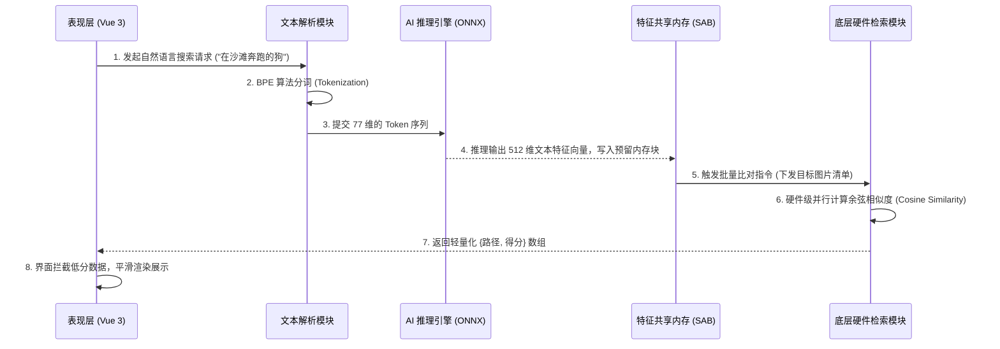

# 🚀 ShareCLIP 语义搜索核心架构与原理汇报

> **文档目标**：深度剖析 ShareCLIP 桌面端“自然语言搜图”的完整工作原理，从前端文本输入、AI 分词提取、到基于底层硬件引擎的高速特征比对，全景展示系统的核心架构设计与优化策略。

---

## 一、 核心执行链路概览

ShareCLIP 能够实现“不依赖标签，直接用自然语言搜索几十万张本地图片”，其核心在于将 **自然语言（NLP）** 和 **机器视觉（CV）** 统一到了同一个 512 维的数学空间中。

当用户在界面输入检索词（例如：“在沙滩奔跑的狗”）并按下回车，系统会瞬间触发一条极度优化的端到端执行链路：

---

## 二、 语义理解与特征提取 (NLP to Vision)

搜索的起点，是将人类的自然语言转化为机器能够进行精确比对的“数学坐标”。这一阶段完全在主进程中流转。

### 1. BPE Tokenization (字节对分词编码)
传统的关键词搜索依赖分词库，而 ShareCLIP 采用了基于模型语料训练的 **BPE (Byte Pair Encoding)** 算法。
系统会将用户输入的任意长短句、生僻词，精准拆解为模型能理解的词根（Token）。为了对齐底层 AI 模型的张量维度，所有输入最终都会被严格对齐填充为一个长度固定的 **77 维数组**（`BigInt64Array[77]`）。

### 2. ONNX 文本编码器 (Text Encoder) 推理
分词完成后的 77 维 Token 序列，被送入内置的轻量级推理引擎（ONNX Runtime）。
该文本编码器会将这些离散的词根，升维映射到了一个极其庞大的数学空间中，最终输出一个包含 **512 个浮点数的稠密向量 (Dense Float32 Vector)**。这个 512 维的向量，就是这句话的“灵魂坐标”。

### 3. 特征 L2 归一化 (Normalization)
为了确保文本向量和早已存在数据库中的图片向量能够处于同一个标尺下进行比较，系统会在最终环节对提取出的文本向量进行 **L2 数学归一化处理**（将其长度缩放为 1），以确保后续的余弦相似度计算绝对精准。

---

## 三、 高性能并行检索引擎 (架构优化)

得到了 512 维的文本向量后，如果采用常规在主线程中循环遍历并逐一计算余弦距离的做法，极易造成 UI 线程阻塞。ShareCLIP 在这里引入了工业级的高速向量检索引擎架构：

### 1. 内存零拷贝 (Zero-Copy) 共享
系统在启动时，会向系统申请一块巨大的连续物理内存池（`SharedArrayBuffer`），并将本地所有图片的 512 维特征预先加载到连续的区块中。
* 内存的 **第 0 号区块** 被永久保留，专属于“文本查询向量”。
* 每次搜索时，提取出的文本特征直接写入该预留内存块，完美避开了多线程环境下的高成本 IPC 数据拷贝。

### 2. 硬件级 SIMD 并行计算
系统抛弃了传统的标量数学计算方式，而是将比对任务完全剥离给独立的计算 Worker 线程。
该工作线程底层搭载了极其强悍的 **SIMD (单指令多数据)** 向量运算指令集。在接收到比对任务后，底层引擎直接读取共享内存池，一个 CPU 时钟周期即可同时处理多个 512 维浮点数的乘加运算（余弦相似度），实现了毫秒级遍历海量高维矩阵的目标。

---

## 四、 解耦设计与容量管理深度思考

底层硬件检索模块只负责纯数学计算（处理内存索引号 `Index` 0, 1, 2...），不处理冗长的本地物理路径。系统通过维护一个 `imageToIndex` 的映射字典，实现了物理路径与内存区块号的完美解耦。

> [!TIP]
> **关于系统长效稳定运行的探讨（内存回收机制）**
> 
> 目前在图片新增时，系统采用线性的递增逻辑（`nextIndex++`）分配内存区块。
> 当用户频繁同步并删除图片时，由于时序被字典严格隔离，搜索过程绝不会错乱。但被删除图片的物理内存区块会变成“幽灵区块”，不可被重用。
>
> **未来迭代方案**：
> 计划在架构中引入 **空闲回收池 (Free Pool Queue)**。当图片被删除时，将其索引推入回收池；新图片入库时优先从回收池复用旧内存块。这将彻底解决长期高频存取下的内存碎片与泄漏隐患，确保内存池容量达成 100% 闭环复用。
