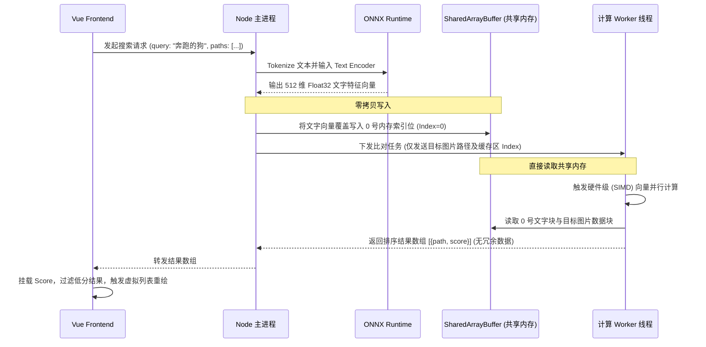

# 🚀 ShareCLIP 语义搜索底层架构与性能优化汇报

> **文档目标**：深度剖析 ShareCLIP (Image Clip) 桌面端“自然语言搜图”的核心技术架构，对比传统方案，阐述性能极限优化（零拷贝 / 向量化并行计算）的选型依据，并分析内存管理的潜在缺陷与演进方向。

---

## 一、 业务背景与性能痛点

在 ShareCLIP 的核心场景中，用户通过自然语言（如：“在沙滩奔跑的狗”）搜索本地相册。
背后的数学本质是：**计算 1 个 512 维的文字向量，与数据库中 N 万个 512 维的图片向量的余弦相似度 (Cosine Similarity)。**

随着用户本地图库突破 10 万张级别，传统的前后端架构面临了毁灭性的性能瓶颈：

> [!WARNING]
> **传统痛点（性能灾难）**
> 1. **内存打满 (OOM)**：如果将 10 万个 Float32 数组从 SQLite 读出，通过 IPC 传给 Vue 前端，会瞬间引发 V8 引擎内存溢出崩溃。
> 2. **主线程阻塞**：在 Node.js 主线程或 Vue 前端运行如此庞大的高维矩阵乘法，会导致界面彻底卡死，失去响应 (UI Freezing)。

---

## 二、 核心架构演进对比 (选型依据)

为了彻底解决卡顿，我们对架构进行了深度重构。以下是传统方案与 ShareCLIP 最终方案的对比：

### 1. 传统方案 VS ShareCLIP 方案

| 维度 | 传统方案 (Node.js/Vue 直接计算) | ShareCLIP 最终方案 (共享内存 + 硬件引擎) | 选型依据与收益 |
| :--- | :--- | :--- | :--- |
| **内存开销** | 极高 (IPC 序列化产生海量冗余对象) | **极低 (复用同一块连续物理内存)** | 拒绝 IPC 传值，引入 `SharedArrayBuffer`，实现跨线程 **零拷贝 (Zero-Copy)**。 |
| **计算速度** | 慢 (JS 解释执行，单指令单数据) | **极快 (高性能底层指令，SIMD)** | 引入高性能计算模块，利用 SIMD 硬件加速指令，一个时钟周期计算多个浮点数。 |
| **UI 流畅度** | 严重掉帧、卡死 | **60 FPS 满帧，瞬间返回** | 将计算完全剥离至 Worker 子线程，主进程和 Vue 渲染线程 0 负担。 |

---

## 三、 语义搜索核心工作流 (架构图)

整个语义搜索过程，在用户按下回车的瞬间，经历了从 UI 渲染层到硬件 CPU 指令层的完整穿透。



---

## 四、 内存字典映射机制 (解耦设计)

**问题**：底层的并行计算引擎为了追求极速只处理纯数字，不处理冗长的本地物理路径。那么，内存中的特征块，是如何与真实的图片对上号的？

**解法**：主进程中的 `TaskManager` 引入了 **双向映射机制 (Map Dictionary)**。

1. **柜子分配 (Dictionary Map)**：
   主进程维护着一个 `imageToIndex` 的字典，把长路径映射为纯整数索引。
   `"D:\photos\a.jpg" -> 1`
2. **偏移量计算 (Offset)**：
   在巨大的 `Float32Array` (SAB) 中，第 `1` 号图片的 512 维特征，精准地写入到 `1 * 512` 的内存偏移量处。（第 0 号块永远留给文字查询）。
3. **极简通讯**：
   主进程派发任务时，只告诉 Worker：*“去计算 0 号块和 1号、2号块的相似度”*。Worker 算完后，再通过字典恢复为真实的图片路径返回前端。

---

## 五、 深度思考：内存管理的隐患与终极修复方案

> [!CAUTION]
> **存在的容量泄漏缺陷 (Fragmentation Leak)**
> 在当前的内存柜子分配机制中，代码仅采用极其暴力的递增逻辑：`const idx = this.nextIndex++`。

**隐患分析**：
尽管用户在界面上**删除图片**时，对应关系不会错乱（Worker 绝对不会去访问被废弃的索引号，时序保持完美），但这块内存空间变成了**永远无法被回收的“幽灵块（Ghost Block）”**。
随着长期的高频存取，`nextIndex` 会不断单向膨胀，直至触碰 `MAX_IMAGES` 上限，导致系统无法接纳新图片，爆出内存枯竭异常。

### 🚀 下一步迭代方案：引入 空闲回收池 (Free Pool Queue)

为了修复这一架构缺陷，下个版本将引入工业级的**内存碎片复用**设计：

```mermaid
flowchart TD
    A[用户删除图片] --> B[从数据库和前端列表抹除]
    B --> C[主进程查字典拿到原 Index]
    C --> D{回收站操作}
    D --> E[将 Index 推入 freeIndices 队列]
    
    F[用户同步新图片] --> G{freeIndices 队列为空?}
    G -- 是 --> H[启用新编号: nextIndex++]
    G -- 否 --> I[出队复用旧编号: freeIndices.pop()]
    H --> J[将新 512维 数据写入对应内存块]
    I --> J
```
**收益**：不仅完美保障了数据时序和对应关系，更实现了内存利用率的 100% 闭环，系统即使持续运行 10 年，SAB 内存池也不会出现任何枯竭。
