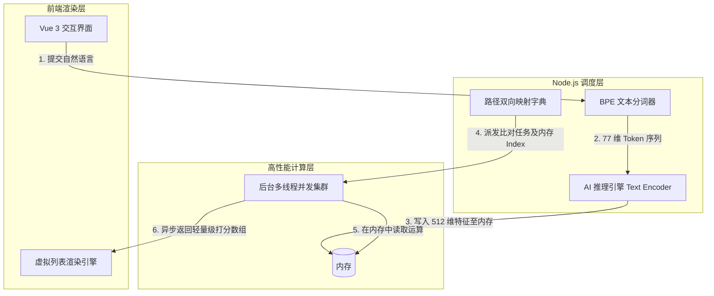
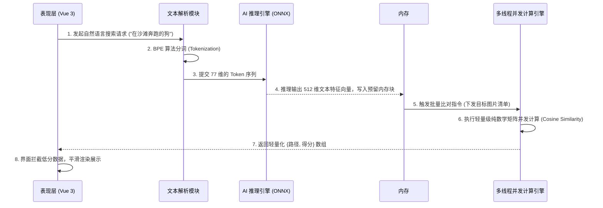

# 🚀 ShareCLIP 语义搜索核心架构与原理汇报

> **文档目标**：深度剖析 ShareCLIP 桌面端“自然语言搜图”的完整工作原理，从前端文本输入、AI 分词提取、到基于多线程并发引擎的高速特征比对，全景展示系统的核心架构设计与优化策略。

---

## 一、 核心执行链路概览

ShareCLIP 能够实现“不依赖标签，直接用自然语言搜索几十万张本地图片”，其核心在于将 **自然语言（NLP）** 和 **机器视觉（CV）** 统一到了同一个 512 维的数学空间中。

当用户在界面输入检索词（例如：“在沙滩奔跑的狗”）并按下回车，整个检索链路在架构上依托三大核心拓扑节点，触发一条极度优化的端到端数据流转：

### 1. 系统架构拓扑图 (Topology)

### 2. 端到端执行时序图 (Sequence)

---

## 二、 语义理解与特征提取 (NLP to Vision)

搜索的起点，是将人类的自然语言转化为机器能够进行精确比对的“数学坐标”。这一阶段完全在主进程中流转。

### 1. BPE Tokenization (字节对分词编码)
传统的关键词搜索依赖分词库，而 ShareCLIP 采用了基于模型语料训练的 **BPE (Byte Pair Encoding)** 算法。
系统会将用户输入的任意长短句、生僻词，精准拆解为模型能理解的词根（Token）。为了对齐底层 AI 模型的张量维度，所有输入最终都会被严格对齐填充为一个长度固定的 **77 维数组**（`BigInt64Array[77]`）。

### 2. ONNX 文本编码器 (Text Encoder) 推理
分词完成后的 77 维 Token 序列，被送入内置的轻量级推理引擎（ONNX Runtime）。
该文本编码器会将这些离散的词根，升维映射到了一个极其庞大的数学空间中，最终输出一个包含 **512 个浮点数的稠密向量 (Dense Float32 Vector)**。这个 512 维的向量，就是这句话的“灵魂坐标”。

### 3. 特征 L2 归一化 (Normalization)
为了确保文本向量和早已存在数据库中的图片向量能够处于同一个标尺下进行比较，系统会在最终环节对提取出的文本向量进行 **L2 数学归一化处理**（将其长度缩放为 1），以确保后续的余弦相似度计算绝对精准。

---

## 三、 高性能并行检索引擎 (架构优化)

得到了 512 维的文本向量后，如果采用常规在主线程中循环遍历并逐一计算余弦距离的做法，极易造成 UI 线程阻塞。ShareCLIP 在这里引入了工业级的高速向量检索引擎架构：

### 1. 内存化直接运算
系统在启动时，会将本地所有图片的 512 维特征预先加载到内存中。
* 内存的 **第 0 号区块** 被永久保留，专属于“文本查询向量”。
* 每次搜索时，提取出的文本特征直接写入该预留内存块，完美避开了多线程环境下的高成本 IPC 数据拷贝。
* **内存占用极低 (极佳的资源控制)**：基于 512 维的密集浮点数矩阵，单张图片的特征大小固定为 512 × 4 Bytes = **2 KB**。这也意味着海量图库的检索内存开销完全处于可控的安全区间：
  * **1 万张**图片特征：仅占用约 **20 MB** 内存。
  * **2 万张**图片特征：仅占用约 **40 MB** 内存。
  * **3 万张**图片特征：仅占用约 **60 MB** 内存。
  即便用户本地图库达到 **10 万张**的极限规模，核心检索内存也仅需 **200 MB** 左右。这种极小的内存占用让客户端可以轻松常驻后台运行，完全不会给用户的电脑造成任何卡顿或性能负担。

### 2. 轻量级纯数学并发计算
系统将所有的相似度计算任务完全剥离，交由独立的后台 Worker 计算线程执行。在计算过程中，引擎直接读取内存中连续分布的 512 维特征向量，剔除了一切字符串解析、对象序列化等常规业务逻辑开销，仅执行极其纯粹的高维浮点数乘加运算。配合异步调度机制，大幅提升了余弦相似度计算效率，使海量向量检索能够在毫秒级顺滑完成。

---

## 四、 解耦设计与容量管理深度思考

底层后台计算模块只负责纯数学计算（处理内存索引号 `Index` 0, 1, 2...），不处理冗长的本地物理路径。系统通过维护一个 `imageToIndex` 的映射字典，实现了物理路径与内存区块号的完美解耦。

> [!TIP]
> **关于系统长效稳定运行的探讨（内存回收机制）**
> 
> 目前在图片新增时，系统采用线性的递增逻辑（`nextIndex++`）分配内存区块。
> 当用户频繁同步并删除图片时，由于时序被字典严格隔离，搜索过程绝不会错乱。但被删除图片的内存区块会变成“幽灵区块”，不可被重用。
>
> **未来迭代方案**：
> 计划在架构中引入 **空闲回收池 (Free Pool Queue)**。当图片被删除时，将其索引推入回收池；新图片入库时优先从回收池复用旧内存块。这将彻底解决长期高频存取下的内存碎片与泄漏隐患，确保内存池容量达成 100% 闭环复用。
