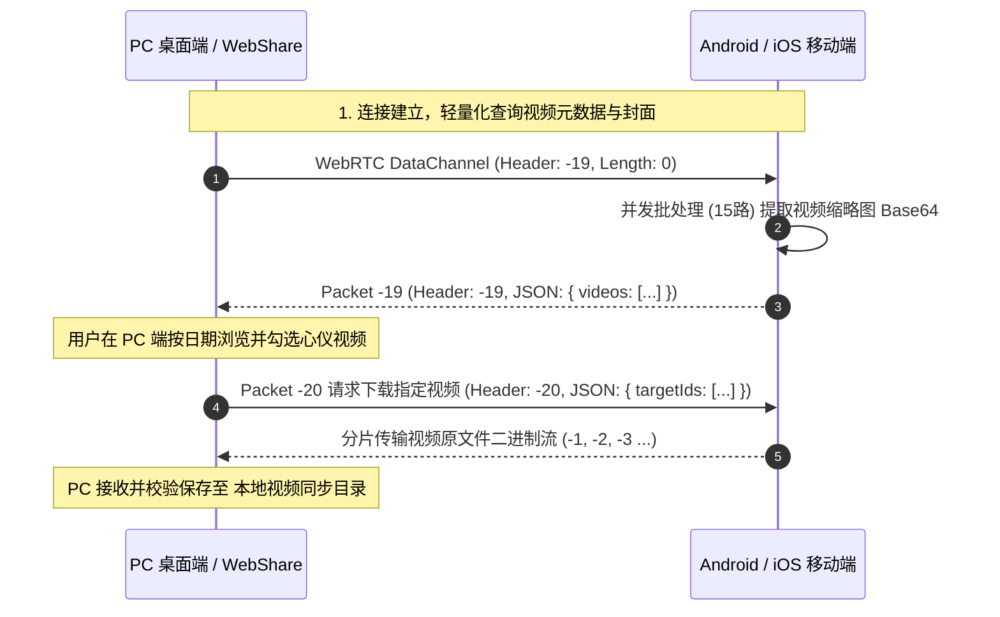

# 🎥 远程视频同步、多选按需下载与时间线虚拟列表架构设计

---

## 1. 概述与核心需求

在以往版本中，跨端视频同步存在以下痛点：
1. **全量强制下载引发网络拥堵**：连接后直接触发所有大容量视频的下载，占用巨大的局域网带宽与 PC 磁盘空间。
2. **缺少封面预览**：手机视频列表未回传缩略图，导致用户在未下载前无法辨识视频内容。
3. **海量 DOM 节点导致滚动卡顿**：当用户手机与电脑存在数百上千个视频/照片时，传统 `v-for` 同时渲染上千个带有 `<video>` 或 `` 标签的 DOM 节点，造成内存激增与严重掉帧。

为此，我们在 **v1.2.95 ~ v1.2.98** 中构建了**轻量级视频目录检索**、**手机端/PC 端双重封面保障引擎**、**多选按需批量下载体系**与**高性能时间线虚拟列表（Virtual Timeline）**。

---

## 2. 视频协议设计与轻量化目录交互

### 2.1 协议数据包格式



### 2.2 协议标头定长结构 (16 Bytes)

| 字节偏移 (Offset) | 类型 (Type) | 含义 (Meaning) |
|---|---|---|
| `0 ~ 3` (Int32) | `fileId` | 协议类型：`-19` (视频目录元数据查询/回传)，`-20` (指定视频下载请求) |
| `4 ~ 7` (Int32) | `chunkIndex` | 块序号（首包为 `0`） |
| `8 ~ 11` (Int32) | `totalChunks` | 总块数（目录请求中记录视频条目总数） |
| `12 ~ 15` (Int32) | `payloadLength` | JSON 载荷字节数 |
| `16 ~ ...` | Binary/UTF-8 | JSON 字符串内容 |

---

## 3. 视频封面双重保障机制

为了保证用户在任何网络条件与文件状态下均能看到高品质视频封面，设计了**手机原生提取 + PC 离屏 Canvas 帧捕获**的双层链路：

```
                       ┌────────────────────────┐
                       │  视频封面显示双重保障  │
                       └───────────┬────────────┘
                                   │
         ┌─────────────────────────┴─────────────────────────┐
         ▼                                                   ▼
【手机端待下载视频】                                 【电脑端已备份视频】
手机原生 MediaStore 并发提取                         优先读取手机缩略图，
16:9 高清缩略图随列表直发                          若无则触发 PC 离屏 Canvas
                                                  自动截取视频第 0.5s 精彩帧
```

### 3.1 手机端 15 路并发批处理提取 (Android)
在 [`android/lib/viewmodels/sync_viewmodel.dart`](file:///d:/AI_serach_image/image_clip_android/android/lib/viewmodels/sync_viewmodel.dart) 中：
- 采用 `localVideos.sublist(i, end)` 将扫描到的视频切分为每批 15 个。
- 利用 `Future.wait` 并发调用底层 `v.thumbnailDataWithSize(const ThumbnailSize(200, 120), quality: 50)`。
- 生成 Base64 缩略图并打包进目录响应包中，250+ 视频封面在 300ms 内全量提取完毕。

### 3.2 PC 端离屏 Canvas 视频帧捕获与缓存引擎
在 [`cp_clip/src/App.vue`](file:///d:/AI_serach_image/image_clip_android/cp_clip/src/App.vue) 与组件中：
- 当视频已在本地存在但缺少封面缩略图时，触发 `generateVideoPoster(item)`。
- 创建无头 `<video>` 实例，设置 `currentTime = Math.min(1.0, duration * 0.1)`（有效避开开头的全黑过渡帧）。
- 在 `onseeked` 回调中绘制至离屏 `<canvas>` 并导出 `data:image/jpeg;base64,...`。
- 存入内存 `videoPosterCache` Map 缓存中，秒级即时展示。

---

## 4. 高性能时间线虚拟列表 (VirtualTimeline.vue)

### 4.1 核心挑战与架构重构

传统瀑布流与分组列表在面对 `1000+` 资源时，存在以下瓶颈：
- DOM 树包含数千个复杂卡片节点，内存占用突破 300MB+。
- 滚动时浏览器持续触发大面积 Layout & Paint，FPS 掉至 15~20 帧。

### 4.2 扁平化虚拟行算法 (Flattened Virtual Rows)

在 [`cp_clip/src/components/VirtualTimeline.vue`](file:///d:/AI_serach_image/image_clip_android/cp_clip/src/components/VirtualTimeline.vue) 中：

1. **容器宽度动态感知**：通过 `ResizeObserver` 实时监听父容器宽度 `containerWidth`。
2. **自适应栅格列数计算**：
   $$\text{columns} = \max\left(1, \left\lfloor \frac{\text{containerWidth} + \text{gap}}{\text{minItemWidth} + \text{gap}} \right\rfloor\right)$$
3. **数据结构扁平化转换**：
   - 将按日期分组的数据 `filteredVideoGroupsByDate` 转换为一维虚拟行数组：
     - **日期标题行（Header Row）**：高度固定为 `48px`。
     - **视频卡片行（Cards Row）**：包含 `columns` 个视频卡片，高度按 16:9.5 宽高比 + 底部文字动态计算：
       $$\text{cardRowHeight} = \text{round}\left(\frac{\text{itemWidth}}{1.684} + 58\right)$$
4. **虚拟视口滑动窗口渲染**：
   - 接入 `@vueuse/core` 的 `useVirtualList`，设置 `overscan: 5`。
   - DOM 树中无论有多少数据，**始终仅挂载当前可见视口范围内的 ~8 至 12 行（约 30 个卡片节点）**。
   - 内存恒定 $O(1)$，无论滚动到第 1 个还是第 5000 个视频，全程稳定 60/120 FPS 满帧！

---

## 5. 交互设计与功能矩阵

### 5.1 视图分栏切换
- **`[ 🎞️ 全部视频 ]`**：合并浏览手机与电脑的所有视频，按拍摄日期从新到旧时间线聚合。
- **`[ 💾 电脑已备份 ]`**：专属查看已下载到电脑的视频，支持双击/点击全屏播放及定位本地路径。
- **`[ 📱 手机待下载 ]`**：专属查看手机上未备份的视频，便于集中挑选与批量下载。

### 5.2 多选与批量操作
- **单个卡片多选**：右上角半透明圆形 Checkbox，一键勾选/反选。
- **日期组一键全选**：组标题右侧「☑️ 勾选此日期 (N)」与「⚡ 同步此日期」。
- **全局一键全选**：顶部控制栏「☑️ 全选待同步 (N)」。
- **悬浮吸底操作栏**：勾选任意视频后，底部弹出半透明毛玻璃悬浮操作条：
  - 显示当前已勾选个数与预估总容量（如 `已勾选 12 个视频 (共 450.20 MB)`）。
  - 提供 `[ ✕ 取消勾选 ]` 与发光高亮 `[ ⬇️ 立即下载 (12) ]`。

---

## 6. v2.1.8 影院级卡片与海报流式直发优化

### 6.1 16:9 影院级卡片视觉重构
- **16:9 影院宽屏画幅**：重构视频海报容器为标准 16:9 画幅，配合 `14px` 圆角磨砂玻璃质感，悬浮时平滑微浮（`-4px`）与缩放；
- **赛博暗夜光效兜底**：当视频海报尚未加载完成或缺失时，显示赛博蓝紫网格渐变背景 + 胶卷光效水印（`ShareCLIP 1080P`），告别单调纯黑/Emoji 占位；
- **磨砂玻璃时长角标**：右下角常驻高对比度磨砂玻璃药丸角标（如 `05:26`）；
- **操作按钮**：已备份视频提供「🎨 动漫化」与「▶️ 播放」双入口；待同步视频提供「⬇️ 极速下载」。

### 6.2 手机端 15 路即时流式回传与 0 Bytes 修复
- **即时流式直发**：手机端（`sync_viewmodel.dart`）扫描到视频后，按 15 个视频为一批**即时提取 240×240 封面并立即发送**至数据通道，PC 端首批视频海报在 1 秒内即可实时展示；
- **大小查询超时修复**：将查询 `v.file` 大小超时由 50ms 放宽至 300ms 并加入 `originFile` 回退，彻底根除生活视频显示 `0 Bytes` 问题；
- **PC 目录响应式 Map 合并**：在 `fileId === -19` 接收时采用 `Map` 按 ID 原地更新 `thumb` / `size` 属性，保证封面与元数据实时响应式更新。
