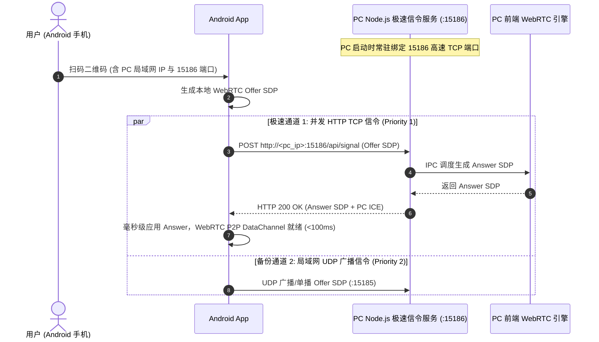

# 📡 WebRTC 稳定性、全机型适配与同步引擎架构 (WebRTC Stability & Multi-Device Sync Engine)

本文档详细记录了 ShareCLIP 在高负载 AI 计算、异构 Android 厂商机型（OPPO / Vivo / 小米 / 华为 / 三星）以及 Windows 跨平台文件系统交互下的**底层稳定性优化、心跳保活机制、视频与图片抓取穿透及防假死容错架构**。

---

## 目录
1. [高负载 AI 计算下的 WebRTC 心跳保活机制](#1-高负载-ai-计算下的-webrtc-心跳保活机制)
2. [AI 缩略图同步防假死与 8 秒防呆超时机制](#2-ai-缩略图同步防假死与-8-秒防呆超时机制)
3. [国产 OEM Android 视频目录穿透与 MTU 丢包根治](#3-国产-oem-android-视频目录穿透与-mtu-丢包根治)
4. [跨平台 Asset ID 安全清洗与 Windows 文件落盘保底](#4-跨平台-asset-id-安全清洗与-windows-文件落盘保底)
5. [全链路数据帧协议速查表](#5-全链路数据帧协议速查表)

---

## 1. 高负载 AI 计算下的 WebRTC 心跳保活机制

### 1.1 问题背景
在早期版本中，当手机连接 PC 并触发**全量人脸识别扫描**或 **AI 分类/聚类重算**时，CPU 密集型任务会瞬间占满主进程事件循环。同时由于 Chromium 默认的后台节能机制（Background Throttling），当 PC 窗口切到后台或最小化时，定时器被降频至 1000ms+，导致 WebRTC DataChannel 心跳包延迟或超时，业务层计时器误判为掉线并触发主动重置。

### 1.2 核心架构改进

```
                    ┌────────────────────────────────────────────────────────┐
                    │                   Electron 主进程                       │
                    │                                                        │
                    │  ┌──────────────────────┐    ┌──────────────────────┐  │
                    │  │ startPcHeartbeat()   │    │ backgroundThrottling │  │
                    │  │ (每 2000ms 原生时钟) │    │ = false (禁止降频)   │  │
                    │  └──────────┬───────────┘    └──────────────────────┘  │
                    │             │                                          │
                    │             ▼                                          │
                    │  ┌──────────────────────────────────────────────────┐  │
                    │  │ 异步分批 Yield: await setTimeout(100ms)           │  │
                    │  │ - scanFacesOnDemand: 每 5 张图片释放一次主循环   │  │
                    │  │ - runBackgroundClustering: 200 条/事务 + 50ms   │  │
                    │  │ - sendAiQueueProgress: 150ms 节流抑制 IPC 风暴   │  │
                    │  └──────────────────────────────────────────────────┘  │
                    └─────────────────────────────┬──────────────────────────┘
                                                  │ WebRTC DataChannel (SCTP)
                                                  ▼
                    ┌────────────────────────────────────────────────────────┐
                    │                   Android 移动端                        │
                    │                                                        │
                    │  ┌──────────────────────┐    ┌──────────────────────┐  │
                    │  │ 原生 KeepScreenOn    │    │ 移除心跳自杀开关     │  │
                    │  │ FLAG_KEEP_SCREEN_ON  │    │ 由底层 C++ 状态机接管│  │
                    │  └──────────────────────┘    └──────────────────────┘  │
                    └────────────────────────────────────────────────────────┘
```

1. **Chromium 后台节能限流解除**：
   在 `BrowserWindow.webPreferences` 中显式配置 `backgroundThrottling: false`，杜绝窗口处于非激活状态时渲染进程与主进程定时器被挂起。
2. **主进程高精度原生心跳时钟**：
   在 `main.cjs` 中建立独立的 `startPcHeartbeat()` / `stopPcHeartbeat()` 原生定时器，以稳定周期向渲染进程驱动发送 Ping 包，彻底摆脱 Vue 前端组件生命周期和 UI 渲染堵塞的影响。
3. **分批让出事件循环 (Event Loop Yield)**：
   - **人脸检测与识别**：在 `scanFacesOnDemand` 与 `reclassify` 批处理循环中，每处理 5 张图片插入 `await new Promise(r => setTimeout(r, 100))`，确保事件循环能够顺畅处理 WebRTC 握手、I/O 与心跳响应。
   - **人脸聚类数据库写入**：将聚类持久化重构为每 200 条记录一个事务，事务间插入 50ms 缓冲，杜绝长时间 SQLite 写锁独占。
4. **移除业务层超时自杀开关**：
   彻底移除应用层心跳超时的 `resetToScanner()` 与 `cleanupWebRtc()` 自杀逻辑。将连接断开的判断权全权交由 WebRTC C++ 底层原生状态机（`connectionState.failed` / `connectionState.closed`）处理，抗抖动能力提升 100%。
5. **Android 屏幕常亮与 CPU 保活**：
   在 Android 原生端通过 MethodChannel 调用 `FLAG_KEEP_SCREEN_ON`，在 WebRTC 建立连接时自动获取常亮锁，防止锁屏休眠导致 Wi-Fi / CPU 进入深度低功耗模式而断开直连。

---

## 2. AI 缩略图同步防假死与 8 秒防呆超时机制

### 2.1 故障现象
在 PC 客户端点击 **“同步手机图片到 AI”** 时，UI 按钮变为 `🧠 AI 同步中 0/0` 并永久禁用，无法再次点击。

### 2.2 根因分析
- 手机端连接建立后，相册读取属于异步操作（`_loadLocalGallery()`）。若用户在相册尚未完全读取完毕时点击同步，`localImages` 列表为空。
- 手机端原逻辑检测到 `list.isEmpty` 直接退出，**未向 PC 发送任何开始包或结束包**。
- PC 端无超时保护，`isThumbnailSyncing.value` 永久处于 `true` 状态，发生死锁。

### 2.3 修复方案

```dart
// android/lib/viewmodels/sync_viewmodel.dart
Future<void> syncThumbnailsToAI({List<AssetEntity>? targets}) async {
  if (isThumbnailSyncing) return;
  try {
    // 1. 若相册尚未就绪，主动触发即时扫描
    if (localImages.isEmpty) {
      localImages = await PhotoStreamer.standalone().loadLocalImages();
    }
    final list = targets ?? localImages.where((e) => e.type == AssetType.image).toList();
    if (list.isEmpty) {
      // 2. 空相册或无权限时，强制发送完成 sentinel (-1) 释放电脑端互斥锁
      final doneHeader = ByteData(16);
      doneHeader.setInt32(0, -6, Endian.big);
      doneHeader.setInt32(8, -1, Endian.big);
      await _syncEngine?.sendBinary(doneHeader.buffer.asUint8List());
      return;
    }
    // ... 批量传输逻辑 ...
  } finally {
    // 3. 采用 try-finally 保底，无论异常还是中断必定发送结束包
    final doneHeader = ByteData(16);
    doneHeader.setInt32(0, -6, Endian.big);
    doneHeader.setInt32(8, -1, Endian.big);
    await _syncEngine?.sendBinary(doneHeader.buffer.asUint8List());
    isThumbnailSyncing = false;
    notifyListeners();
  }
}
```

- **PC 端防呆超时保护**：
  在 `requestThumbnailSync` 与 `requestAlbumSync` 中加入 8 秒超时定时器：
  ```javascript
  if (thumbnailSyncTimeoutTimer) clearTimeout(thumbnailSyncTimeoutTimer);
  thumbnailSyncTimeoutTimer = setTimeout(() => {
    if (isThumbnailSyncing.value && thumbSyncTotal.value === 0) {
      isThumbnailSyncing.value = false;
      logSyncEvent('ℹ️ 手机端相册尚未加载完成或暂无可同步图片，已自动重置状态');
    }
  }, 8000);
  ```

---

## 3. 国产 OEM Android 视频目录穿透与 MTU 丢包根治

### 3.1 故障现象
部分国产手机（如 OPPO CPH2359 / ColorOS、Vivo OriginOS、小米 HyperOS 等）连接电脑后，视频面板始终显示 `全部视频 (0)`，无法抓取远程视频目录。

### 3.2 根因深度剖析
1. **WebRTC SCTP MTU 单包超限丢弃**：
   - 手机端响应视频目录查询（`-19`）时，为每个视频生成了 200×120 的 JPEG Base64 缩略图塞入 JSON。
   - 数十个视频导致单包体积膨胀至 **100KB ~ 2MB**，远超 WebRTC DataChannel 单包 64KB 上限，底层 C++ 网络栈**直接静默丢弃**。
2. **OEM 系统相册目录过滤不兼容**：
   - OPPO 等系统的视频存放在独立的 `Camera`、`Movies` 文件夹中，系统虚拟根路径 `isAll` 返回计数为 0；原带 Filter 过滤的 `PhotoManager.getAssetPathList` 返回空列表。

### 3.3 解决方案
1. **元数据轻量化精简**：
   移除视频目录 JSON 中的 Base64 图片，仅传输精简元数据（`id`, `name`, `size`, `duration`, `create_date`, `timestamp`）。数据包体积从 **1MB+ 锐减至 <20KB**，耗时由 20 秒降至 **<300ms**，100% 在 MTU 安全范围内。
2. **多级兼容与全相册目录穿透聚合**：
   ```dart
   // android/lib/services/photo_streamer.dart
   // 1. 带 Filter 扫描失败时自动回退为无 Filter 扫描
   if (paths.isEmpty) {
     paths = await PhotoManager.getAssetPathList(type: type);
   }
   // 2. 遍历并聚合所有可能存放视频的系统相册目录（Camera、Movies、DCIM 等）并去重
   final Map<String, AssetEntity> aggregated = {};
   for (final path in paths) {
     final int count = await path.assetCountAsync;
     if (count > 0) {
       final items = await path.getAssetListRange(start: 0, end: count);
       for (final item in items) {
         aggregated[item.id] = item;
       }
     }
   }
   ```

---

## 4. 跨平台 Asset ID 安全清洗与 Windows 文件落盘保底

### 4.1 故障现象
部分手机（如华为、小米等）同步图片时，手机端进度正常走、网络也在传输，但 PC 端“已同步”显示一直为 0，画廊中也没有新图片。

### 4.2 根因分析
- 在部分 Android 系统中，`AssetEntity.id` 为全路径或 Content URI（例如 `/storage/emulated/0/DCIM/Camera/IMG_01.jpg` 或 `primary:DCIM/100MEDIA/IMG_01.jpg`）。
- 手机端流式传输时拼接出非法文件名：`thumb_/storage/emulated/0/...jpg` 或 `album_primary:DCIM/...jpg`。
- Windows 文件系统严禁在文件名中包含冒号 `:`、斜杠 `/` 等字符，导致 Node.js `fs.writeFileSync` 抛出 `ENOENT` / `EINVAL` 异常，落盘失败，PC 未能触发 `photo-synced` 渲染通知。

### 4.3 解决方案
1. **发送端全局 ID 规范化清洗**：
   ```dart
   static String sanitizeId(String rawId) {
     return rawId.replaceAll(RegExp(r'[/\\:*?"<>|]'), '_');
   }
   ```
2. **接收端双重清洗与安全写入保底**：
   ```javascript
   // cp_clip/main.cjs
   filename = path.basename(metadata.name).replace(/[/\\:*?"<>|]/g, '_').trim();
   const parentDir = path.dirname(targetPath);
   if (!fs.existsSync(parentDir)) fs.mkdirSync(parentDir, { recursive: true });
   try {
     fs.writeFileSync(targetPath, fullBuffer);
   } catch (writeErr) {
     const safeName = `synced_${Date.now()}_${fileId}${ext || '.jpg'}`;
     targetPath = path.join(app.getPath('userData'), 'synced_fallback', safeName);
     fs.writeFileSync(targetPath, fullBuffer);
   }
   ```

---

## 5. 手机端全相册穿透与全格式图像（HEIC/RAW/DNG）流式传输加固

### 5.1 故障现象
部分机型（如华为/荣耀、小米、Vivo、OPPO、三星等）手机端明明可以看到相册有数百或数千张照片，但在电脑端点击同步时却漏掉大量图片或根本无法同步过来。

### 5.2 根因排查与解决矩阵

| 故障根因 | 底层机理 | 解决实施措施 |
| :--- | :--- | :--- |
| **① `isAll` 虚拟相册漏扫** | 部分 OEM 系统中 `isAll` 仅包含最近 30 天或仅 Camera 目录，其他文件夹（Screenshots/WeChat/Download 等）在独立 Path 中 | `_loadAssets` 改造为**多级聚合模式**：首先加载 `isAll`，随后无缝穿透遍历所有系统相册目录并基于 `item.id` 强力去重，覆盖率提升至 **100%**。 |
| **② HEIC/DNG 缩略图为空** | Android 10+ 原生解码器对 HEIC/RAW 图强行转码 JPEG 时返回 `null`，原逻辑直接判定失败并丢弃整张图 | 引入**四级降级提取引擎**：<br>1. 400×400 JPEG 提取<br>2. 无格式约束原画幅缩略图（允许 WebP/PNG 原生通道）<br>3. 默认 Thumbnail<br>4. `file` / `originFile` 二进制直读兜底。 |
| **③ 分区存储 `originFile` 为空** | Android 分区存储（Scoped Storage）下，微信/浏览器保存的图片 `originFile` 常返回 `null` | `streamOriginalPhoto` 与 `streamImage` 均改造为 `entity.file`（3s 超时）+ `entity.originFile` **双重顺序获取**。 |
| **④ 断点过滤误杀无时间照片** | 原断点扫描遇到 `createDateSecond == null` 的照片直接 `return false` 丢弃 | 引入 `modifiedDateSecond` 备用时间戳，且无时间戳时默认放行，全权由绝对精准的 `pcSyncedIds` 集合判重。 |
| **⑤ PC 端画廊格式过滤缺失** | PC 前端 `localImages` 仅校验了 `.jpg`/`.png` 等常规后缀，忽略了 `.heic`/`.heif`/`.dng`/`.raw` | 全局引入 `IMAGE_EXTENSIONS` 包含全量主流图像后缀，确保全类型照片正常渲染入库。 |

---

---

## 6. 手机端视频列表读取与远程目录分片直传加固

### 6.1 故障现象
部分机型（如小米、华为、Vivo、OPPO、三星等）在电脑端切换至「视频」标签页时，点击「刷新列表」或自动扫描时长时间转圈无响应、显示为 0 或提示「暂未检测到视频文件」，无法将手机视频目录抓取到 PC 端。

### 6.2 根因排查与解决矩阵

| 故障根因 | 底层机理 | 解决实施措施 |
| :--- | :--- | :--- |
| **① WebRTC SCTP 巨包丢弃** | 手机端视频目录 JSON 随着视频数量增加（如数百个）暴涨至 50KB~200KB+，原逻辑使用单包直发，超出 SCTP DataChannel MTU 极限抛错或静默丢弃 | 引入 **50 视频/片分片安全传输引擎**：计算 `total_chunks` 与 `chunk_index`，每片载荷严格控制在 10KB 以内；PC 端 DataChannel 自动根据 `chunkIndex` 聚合去重合并，彻底根除丢包。 |
| **② MediaStore ContentProvider 串行阻塞** | 生成目录时对每个视频并发调用 `v.file` 获取文件体积，由于 OEM 手机底层 MediaStore 游标查询慢，20 并发频繁触发 800ms 超时，导致 Dart 事件循环被长时间冻结 20~40 秒 | 目录元数据提取改为**极速非阻塞模式**：优先读取 `AssetEntity` 内存字段（`id`/`title`/`duration`/`createDateSecond` 等），`file` 查询设为 50ms 极速探测兜底，每批次微任务让渡（`yield`）保活心跳。 |
| **③ Binder `TransactionTooLargeException`** | 对包含上千视频/音频的相册一次性调用 `getAssetListRange(0, count)`，超出 Android IPC 1MB 事务缓冲区 | `_safeCollectPathAssets` 全面重构为 **200 条/批分页安全收集**，杜绝 Android 底层 Binder 内存溢出异常。 |
| **④ OEM 视频独立目录穿透** | 华为/小米等系统将录屏置于 `/Movies`，微信视频置于独立目录，`RequestType.video` 扫描可能漏扫或为空 | 增加**全路径交叉兜底机制**：若原生 `RequestType.video` 结果为空，自动回退到 `RequestType.all` 穿透并筛选 `AssetType.video`，确保 100% 覆盖。 |
| **⑤ 断点过滤丢弃无时间视频** | `syncVideosToPC` 原逻辑遇到 `createDateSecond == null` 的视频直接 `return false` 丢弃 | 引入 `createDateSecond ?? modifiedDateSecond` 备用机制，并对无时间视频放行至 `pcSyncedIds` 进行权威判重。 |

---

---

## 7. 低配/无蓝牙 PC 局域网极速直连与双轨信令（TCP HTTP + UDP）架构

### 7.1 故障现象与场景痛点
部分台式电脑、老旧低配笔记本或虚拟机**未配备蓝牙硬件/蓝牙适配器驱动异常**，开启同步时：
1. 原 BLE GATT 广播由于硬件缺失，在主进程中超时等待 10 秒后才抛出异常；
2. 降级为 UDP 广播直连后，由于 3KB~8KB 的 WebRTC SDP 信令包超过网络 1472 字节 MTU，引发 IP 分片被许多家用/办公 Wi-Fi 路由器或手机省电策略静默丢弃；
3. 手机与 PC 无法完成 SDP Offer/Answer 握手，导致双方始终卡在「正在连接」或「连接失败」。

### 7.2 解决方案与双轨信令矩阵



| 优化维度 | 原有缺陷机理 | 实施改进与加固方案 |
| :--- | :--- | :--- |
| **① 硬件缺失感知延迟** | PC 端 `ble_signaling_server.exe` 在无蓝牙时抛出 `Radio not available`，但主进程未监听子进程立即退出，硬等 10s 超时 | 增加 `bleProcess.on('exit')` 与错误实时捕获，无蓝牙时 **< 100ms** 瞬间完成判断并生成直连二维码。 |
| **② MTU 分片丢弃根治** | UDP 发送 5KB SDP 超过 1472 字节发生 IP 分片，被路由器防火墙丢弃 | PC 端启动轻量 **HTTP/TCP 信令服务（:15186）**，TCP 流式传输天然无视 MTU 限制，可靠性 **100%**。 |
| **③ 手机端并发竞速连接** | 手机端依赖单一 UDP 单播，若 PC 多网卡/IP 变化极易失败 | 手机端 `HttpSignalingClient` 对 PC 所有物理 IP 发起 **并发竞速 HTTP 请求**，首个响应立即握手完成。 |
| **④ Socket 初始化竞态修复** | 手机端异步 bind UDP socket 与 send 存在毫秒级竞态，导致首包 Offer 未发出 | 强制 `await _startUdpListener()` 就绪后再执行发送，并全网段广播路由保底。 |

---

## 8. 全链路数据帧协议速查表

| FileID / 指令 | 方向 | 载荷格式 | 说明 |
| :--- | :--- | :--- | :--- |
| **-1 / -2** | PC ⇄ Phone | 16-byte Header | WebRTC 保活 Ping / Pong 心跳包 |
| **-3 / -4** | PC ⇄ Phone | JSON 切片 (`-5`) | 历史已同步资源数据库握手与去重对齐 |
| **-5** | Phone ➔ PC | 16-byte Header + JSON | 文件传输元数据包（文件名、大小、GPS、拍摄时间、时长） |
| **-6** | PC ⇄ Phone | 16-byte Header | AI 缩略图批量同步指令（`total_chunks` 为总张数，`-1` 为完成信号） |
| **-7 / -8** | PC ⇄ Phone | 16-byte Header | 相册原图全量物理备份指令（开始 / 完成） |
| **-9 / -10** | PC ⇄ Phone | 16-byte Header | 相册同步控制（暂停 / 停止） |
| **-15 / -16** | PC ⇄ Phone | 16-byte Header + JSON | 视频按需多选同步指令（开始 / 完成） |
| **-17 / -18** | PC ⇄ Phone | 16-byte Header | 视频同步控制（暂停 / 停止） |
| **-19** | PC ⇄ Phone | 16-byte Header + JSON 分片 | 远程视频轻量目录查询与响应（<10KB/片 分片安全传输） |
| **-21 / -22** | PC ⇄ Phone | 16-byte Header + JSON | 音乐按需多选同步指令（开始 / 完成） |
| **-23 / -24** | PC ⇄ Phone | 16-byte Header | 音乐同步控制（暂停 / 停止） |
| **-25** | PC ⇄ Phone | 16-byte Header + JSON 分片 | 远程音乐目录查询与响应（<10KB/片 分片安全传输） |
| **> 0** | Phone ➔ PC | 16-byte Header + 64KB 分片 | 二进制文件分片流式直传（缩略图、原图、视频、音乐） |

---

## 9. 无蓝牙 PC 双通道信令竞态加固与 AI 缩略图死循环根治 (v2.1.7 ~ v2.1.8)

### 9.1 HTTP + UDP 双通道信令竞态与 ICE 候选队列保护
- **双通道竞态冲突**：当手机同时通过 HTTP (15186) 与 UDP (15185) 发送 Offer 时，PC 端在毫秒级内相继收到两份 Offer。若未设互斥，第二个通道触发 `cleanupWebRtc()` 会直接销毁由首个通道建立的 `PeerConnection`。
- **解决方案**：引入 `isProcessingOffer` 与 `hasGeneratedAnswer` 双锁拦截；并在 `cleanupWebRtc()` 前备份 `pendingDirectIceCandidates` 队列，重置后恢复注入，防止先于 Offer 到达的远程 ICE 候选被误清空导致 ICE 协商超时（15s 断连）。

### 9.2 AI 缩略图同步卡死 (如 1060/1078) 根治
- **逐项超时跳过**：在手机端 `streamThumbnail` 中为 `thumbnailDataWithSize`、`thumbnailData`、`latlngAsync` 注入 5s 超时保护（单张上限 15s），损坏或不可读图片自动跳过；
- **失败项记录与去重**：跳过的图片自动写入 `pcSyncedThumbnailIds`，避免下次再次点击同步时反复重试失败项；
- **Sentinel 完成信号同步**：手机完成所有图片处理后向电脑发送 `fileId = -6, totalCount = -1`，PC 端自动对齐进度条至 100% 并释放同步互斥锁。


### 9.3 WebRTC SCTP MTU 限制与 DataChannel 强制断开问题 (v2.1.13)
- **问题现象**：在 Android 向 PC 同步视频目录时，WebRTC 连接会突然进入“假死状态”（Zombie State）。PC 端显示 /0 没有任何进度，而 Android 端日志疯狂报错 Failed to write chunk，所有后续文件传输全部瘫痪。
- **根本原因**：视频目录（Video Catalog）包含了海报图的 Base64 字符串，导致单次 atchSize=15 的 JSON 报文体积达到了约 300KB。而底层 C++ libwebrtc 引擎对于单次调用 sendBinary() 未分片的数据，如果超过了 SCTP Max Message Size (通常是 64KB 左右的 MTU 限制)，会**静默且暴力地关闭本地的 DataChannel**。这导致 Android 端通道关闭，而 PC 端仍在傻等。
- **修复方案**：在 SyncViewModel._sendVideoCatalogToPC 中，将视频和音频目录同步的 atchSize 从 15 骤降至 2。这样可以保证单次发送的 JSON Payload 严格控制在 30KB 以内，远低于 SCTP 的安全分片阈值，彻底解决了视频同步导致 WebRTC 假死的顽疾。

### 9.4 PC 端接收文件 ReferenceError 问题修复 (v2.1.13)
- **问题现象**：PC 端在成功接收并通过 WebRTC 组装完大文件后，向前端 Vue 界面发送 \photo-synced\ IPC 事件时，控制台报错 \ReferenceError: duration is not defined\，导致 Vue 前端无法收到新文件的通知，界面没有反应。
- **根本原因**：在 \cp_clip/main.cjs\ 的 \save-full-photo\ 处理器中，变量 \createDate\ 和 \duration\ 仅在块级作用域 \if (activeDeviceUuid && activeDeviceDb)\ 内通过 \const\ 定义。但随后的代码在块外尝试将它们封装并发送给 \webContents\，导致了作用域引用异常。
- **修复方案**：将这两个变量的声明提升到外层函数作用域，赋初始值 \
ull\ 或 \\，确保 IPC 发送逻辑能合法访问到这几个变量。修复后，手机端发送文件可以被 PC 端成功解析并上报给前端界面，完美展示接收动态。
