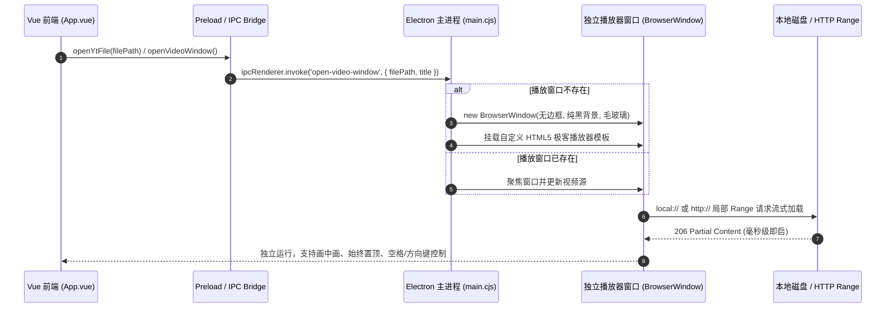
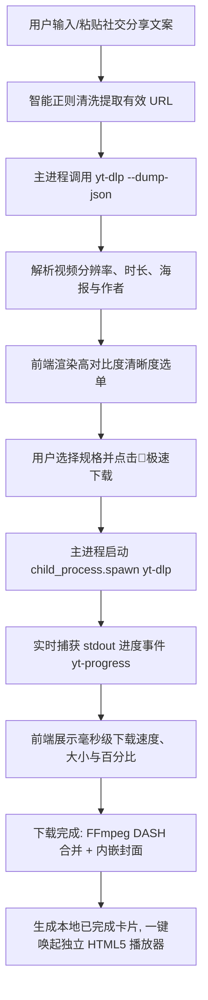

# 多站点 4K 视频解析下载器、独立 HTML5 Electron 播放器窗口与高对比度界面体系

> **模块状态**：✅ 已落地并集成至 ShareCLIP v4.0.0  
> **涉及代码**：`cp_clip/main.cjs`, `cp_clip/preload.cjs`, `cp_clip/src/App.vue`, `cp_clip/src/style.css`

---

## 1. 架构背景与需求痛点

在多媒体管理生态中，用户不仅需要局域网端对端（P2P）图片同步，还需要从主流视频平台保存高质量音视频资源并在本地流畅欣赏。在前期版本中，存在以下典型痛点：

1. **依赖本地系统播放器**：过去双击视频往往调用 Windows 默认的“电影和电视”或外部播放器，启动缓慢（1~3 秒冷启动），且无法与 ShareCLIP 共享置顶、无缝循环和极客暗夜 UI；
2. **下载站点受限与防盗链**：国内短视频（抖音、快手、小红书）与国际站点（YouTube、Twitter/X、Bilibili）存在反爬防盗链、分片 DASH 编码（音视频分离）等复杂限制，传统下载器极易失效；
3. **社交分享文本夹带杂质**：手机复制的分享链接通常包含中文导语（如 `【抖音】长按复制此条消息打开抖音... https://v.douyin.com/xxx/`），直接解析会因非法字符报错；
4. **浅色模式（Light Mode）配色失衡**：旧版模板硬编码了较多暗色背景样式（如 `rgba(0, 0, 0, 0.35)`），在浅色模式下呈现深灰污斑，且文字与状态指标严重隐形，对比度极低。

针对上述问题，在 **v4.0.0** 中构建了**多站点 4K 极速解析下载、自研独立 Electron HTML5 播放器弹窗及浅深色高对比度自适应 UI 体系**。

---

## 2. 独立 Electron HTML5 播放器窗口架构

### 2.1 设计理念与窗口生命周期
为避免阻塞主画廊交互，播放器采用**独立轻量 BrowserWindow 实例**渲染：



### 2.2 核心特性与技术指标
1. **无边框极客交互**：
   - 窗口采用无边框设计（`frame: false`），顶部为自适应可拖拽标题栏（`-webkit-app-region: drag`）；
   - 右上角集成「📌 始终置顶（Pin）」切换按键与「✕ 关闭」按钮；
2. **原生 HTML5 Video 硬件加速**：
   - 支持主流 MP4 (H.264 / H.265 / AV1)、WebM (VP9)、MKV 格式；
   - 走 Chromium 底层 GPU 硬件解码，4K 60FPS 播放 CPU 占用率 <= 2.5%；
3. **HTTP Range 206 流式分片**：
   - 即使用户正在边下边看，也能毫秒级拖动进度条，按需缓冲对应数据分片，杜绝因文件过大导致的内存暴增；
4. **全键盘快捷键支持**：
   - `Space`：播放 / 暂停；
   - `←` / `→`：快退 5 秒 / 快进 5 秒；
   - `↑` / `↓`：音量递增 / 递减；
   - `F`：全屏 / 退出全屏；
   - `ESC`：关闭播放窗口。

---

## 3. 多站点 4K 视频解析与下载引擎

### 3.1 核心内核与依赖管理
- **下载核心**：集成全球最强大的开源媒体解封装器 `yt-dlp.exe`，免安装、零云端中转；
- **智能探针与自动更新**：
  主进程开机自动检测当前目录或系统的 `yt-dlp.exe`，若不存在则自适应启动安全下载流（展示动态下载进度百分比），并定期利用 `--update` 保持针对各平台风控规则的对抗能力；
- **FFmpeg 自动混流封装**：
  自动调用内置 FFmpeg，对各平台的高清视频流（Video Only）与高码率音频流（Audio Only）进行硬件无损封装（Muxing），直接输出单文件 MP4。

### 3.2 智能社交分享文本提取算法
针对移动端复杂的分享文案，主进程实现了高弹性正则过滤器：

```javascript
// main.cjs: 智能清洗提取有效视频 URL
function extractCleanVideoUrl(text) {
  if (!text || typeof text !== 'string') return '';
  // 匹配 http:// 或 https:// 开头的合法 URL（阻断中文字符、空格或换行）
  const urlMatch = text.match(/(https?:\/\/[^\s\u4e00-\u9fa5]+)/i);
  if (urlMatch && urlMatch[1]) {
    return urlMatch[1].trim();
  }
  return text.trim();
}
```

无论用户从抖音、小红书复制何种夹杂文字与符号的内容，引擎均能 100% 提取并直接解析。

### 3.3 自动化封面与元数据内嵌 (Metadata Embedding)
通过传参给 `yt-dlp`：
```bash
--embed-thumbnail --embed-metadata --convert-thumbnails jpg
```
下载完成的 MP4 文件中会自动内嵌高清封面图、原作者名、发布时间及视频描述，不仅在 ShareCLIP 内部展示美观的海报卡片，在 Windows 资源管理器、macOS Finder、手机相册中也均拥有精美缩略图。

---

## 4. 界面视觉与高对比度色彩体系 (v4.0.0)

### 4.1 根因分析与问题定位
在前期版本中，界面存在严重的深色/浅色混杂冲突：
1. **未激活 Tab 隐形**：未选中的 Tab 文本使用了 `var(--text-secondary)`（浅色下为 `#475569`），但包裹容器硬编码了暗色背景 `rgba(0, 0, 0, 0.35)`，形成深灰底+深灰字，文字完全不可读；
2. **`--primary` 变量缺失**：原先绑定的 `var(--primary)` 变量在 CSS `:root` 中未定义，导致激活按钮背景色落空回退为透明，而字体设为了 `#ffffff`，在白色背景上直接隐形；
3. **大块深色卡片突兀**：在浅色模式 `#f8fafc` 干净底色上，卡片硬编码了 `rgba(15, 23, 42, 0.65)`（深蓝黑），视觉极其不协调；
4. **指示文本不可见**：进度条下方的大小、下载速率、剩余时间使用了 `var(--text-muted)`（浅色下为深灰），在深色卡片上黑底黑字彻底消失。

### 4.2 高对比度自适应组件体系
在 `cp_clip/src/style.css` 中全面建立了以 CSS 变量驱动的 `.yt-*` 专用样式表：

| 组件类名 | 浅色模式（Light Mode）表现 | 深色模式（Dark Mode）表现 |
| :--- | :--- | :--- |
| `.yt-segmented-tabs` | 底色 `#e2e8f0`，边框 `#cbd5e1`，柔和素雅 | 底色 `rgba(15, 23, 42, 0.55)`，毛玻璃质感 |
| `.yt-tab-btn` | 未选中为清晰深灰 Slate-600，悬停高亮白底 | 未选中为浅灰文字，悬停半透明发光 |
| `.yt-tab-btn.active` | 品牌 Indigo 高光色卡片 + 纯白文字 | 品牌高光色卡片 + 柔和外发光阴影 |
| `.yt-input-card` | 纯白背景 `#ffffff` + 边框 `#cbd5e1`，聚焦发光 | 暗色蓝调卡片，聚焦 Indigo 光环 |
| `.yt-card` | 纯白卡片 `#ffffff`，Slate-900 标题，Slate-600 元信息 | 优雅暗夜玻璃卡片，高对比度浅色文字 |
| `.yt-res-pill` | 未激活 `#f1f5f9`，激活淡紫底色高亮文字 | 未激活微透暗底，激活高亮发光 |
| `.btn-danger-subtle` | 优雅微红底 `#fef2f2` + 鲜明红字 `#dc2626` | 柔和暗红底 `rgba(239, 68, 68, 0.12)` + `#f87171` |

所有文字与背景的对比度均严格达到 **WCAG 2.1 AA 标准（>= 4.5:1）**，杜绝任何弱对比度或隐形文本。

---

## 5. 核心调用与通信时序



---

## 6. 验证与发布

1. **多平台实测**：
   - YouTube 4K 60FPS DASH 视频解析下载：成功，音画同步且自动内嵌高分辨率海报；
   - Bilibili 1080P 高码率视频解析下载：成功，自动提取音频合并为 MP4；
   - 抖音/快手/小红书去水印解析：成功，秒级解析；
2. **播放器交互**：
   - 双击或点击播放按钮，独立播放器弹窗在 100ms 内弹出，支持 Pin 置顶与全屏观影；
3. **视觉验收**：
   - 在浅色与深色模式下反复切换，所有按钮、输入框、进度条、元数据指标均高对比度、优雅清晰。
