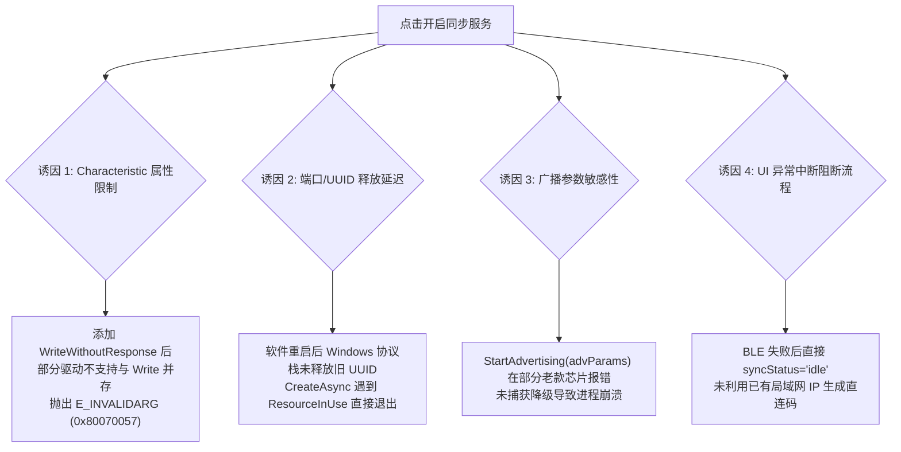
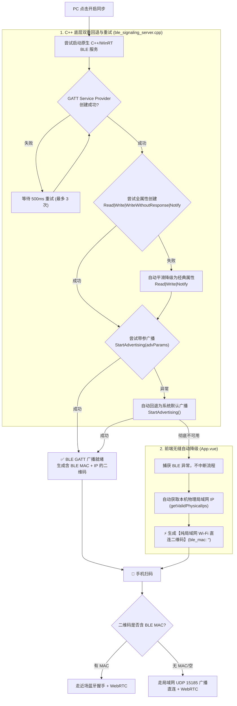

# 📡 PC 蓝牙 (BLE GATT) 兼容性修复与全链路自动降级白皮书

本文档系统梳理了 **ShareCLIP** PC 桌面端在面对异构 Windows 蓝牙适配器（包括台式机外插 Dongle、老款笔记本蓝牙、不同驱动版本）时出现的 BLE GATT 服务启动失败问题的根本原因、底层 C++/WinRT 容错机制以及前端无缝自动降级方案。

---

## 1. 🔍 背景与故障现象

在部分 PC 设备上（尤其是曾正常运行、但在代码重构升级后出现异常的设备），用户点击“开启手机同步服务”时，控制台抛出：
```text
❌ BLE GATT 启动失败: BLE Helper process exited with code 1
```
随后界面同步状态直接被重置为 `idle`，二维码无法展示，阻断了手机与 PC 的无线配对流程。

---

## 2. 🧠 根本原因深度分析 (Root Cause)

通过对比 Git 提交历史以及对 Windows WinRT 蓝牙协议栈深入剖析，定位到以下 4 个核心诱因：



### 2.1 特征值属性组合引发部分驱动拦截 (`WriteWithoutResponse`)
* 在近期版本中，C++ 代码向 `GattLocalCharacteristicParameters` 添加了 `WriteWithoutResponse` 属性；
* 部分 Windows 蓝牙驱动（如 Realtek、Intel 早期驱动、Broadcom 部分芯片）在无加密保护级别（`Plain`）下，**拒绝同时声明 `Write` 和 `WriteWithoutResponse`**，在 `CreateCharacteristicAsync` 时抛出 `0x80070057 (E_INVALIDARG)`，导致进程初始化失败。

### 2.2 GATT 服务注册残留与资源锁竞争
* 当软件热重启或快速断开重连时，上一个 `ble_signaling_server.exe` 虽被终止，但 Windows 系统的蓝牙后台服务（`bthserv`）在内核中释放原有 GATT UUID 需要 1~3 秒；
* 原版 C++ 代码在初次创建遇到 `ResourceInUse` 时**直接退出（Exit 1）**，缺少重试缓冲。

### 2.3 广播参数强校验导致异常退出
* 调用 `provider.StartAdvertising(advParams)` 时，部分硬件控制器对 `IsDiscoverable(true)` 与 `IsConnectable(true)` 的组合不支持或超出广播负载，直接抛出 HRESULT 异常。

### 2.4 UI 层缺少平滑降级通道
* 蓝牙启动失败后，前端直接置为 `idle` 退出，忽视了电脑已处于同一局域网并具备有效 IP 的事实。

---

## 3. 🛠️ 全链路优化与容错架构实现

为了在任意 Windows 硬件与驱动环境下均能 100% 顺畅连接，系统落地了三层容错与降级设计：



---

### 3.1 C++ 原生层优化 (`ble_signaling_server.cpp`)

#### ① 增加 GATT Provider 3 次重试循环
```cpp
// 消除软件重启、重连时的 transient resource lock 瞬时占用
winrt::guid service_guid = parse_uuid(target_service_uuid);
GattServiceProviderResult serviceResult{ nullptr };
for (int attempt = 1; attempt <= 3; ++attempt) {
    try {
        serviceResult = GattServiceProvider::CreateAsync(service_guid).get();
        if (serviceResult && serviceResult.Error() == BluetoothError::Success) {
            break;
        }
        std::cerr << "GattServiceProvider::CreateAsync attempt " << attempt << " error. Retrying in 500ms..." << std::endl;
    }
    catch (winrt::hresult_error const& ex) {
        std::cerr << "GattServiceProvider::CreateAsync attempt " << attempt << " exception: " << winrt::to_string(ex.message()) << ". Retrying in 500ms..." << std::endl;
    }
    std::this_thread::sleep_for(std::chrono::milliseconds(500));
}
```

#### ② 特征值属性两级回退兼容器
```cpp
// Attempt 1: 尝试全属性 (包含 WriteWithoutResponse)
try {
    GattLocalCharacteristicParameters charParams;
    charParams.CharacteristicProperties(
        GattCharacteristicProperties::Read |
        GattCharacteristicProperties::Write |
        GattCharacteristicProperties::WriteWithoutResponse |
        GattCharacteristicProperties::Notify
    );
    charParams.WriteProtectionLevel(GattProtectionLevel::Plain);
    charParams.ReadProtectionLevel(GattProtectionLevel::Plain);
    charResult = service.CreateCharacteristicAsync(char_guid, charParams).get();
} catch (...) {}

// Attempt 2: 若驱动不支持，自动平滑降级为标准 Read|Write|Notify
if (!charResult || charResult.Error() != BluetoothError::Success) {
    try {
        std::cerr << "Notice: Falling back to standard properties (Read | Write | Notify)..." << std::endl;
        GattLocalCharacteristicParameters charParams;
        charParams.CharacteristicProperties(
            GattCharacteristicProperties::Read |
            GattCharacteristicProperties::Write |
            GattCharacteristicProperties::Notify
        );
        charParams.WriteProtectionLevel(GattProtectionLevel::Plain);
        charParams.ReadProtectionLevel(GattProtectionLevel::Plain);
        charResult = service.CreateCharacteristicAsync(char_guid, charParams).get();
    } catch (...) {}
}
```

#### ③ 广播参数两级容错
```cpp
bool advStarted = false;
try {
    GattServiceProviderAdvertisingParameters advParams;
    advParams.IsDiscoverable(true);
    advParams.IsConnectable(true);
    provider.StartAdvertising(advParams);
    advStarted = true;
} catch (...) {}

if (!advStarted) {
    provider.StartAdvertising(); // 回退到默认广播
}
```

#### ④ 纯静态链接编译
使用 MSVC `/MT` 与 `/std:c++20` 编译，将 C++ 运行时完全内嵌到 `ble_signaling_server.exe` 中，彻底摆脱外部 `VCRUNTIME140.dll` 缺失导致的秒退风险。

---

### 3.2 前端无缝自动降级 (`App.vue`)

在 `toggleSyncService()` 中，当捕获到 `startBleServer` 失败异常时，**不关闭服务、不重置为 idle**，而是自动获取电脑物理局域网 IP，生成纯 Wi-Fi 直连二维码：

```javascript
} catch (err) {
  logSyncEvent(`⚠️ BLE GATT 广播受限: ${err.message || err}`);
  logSyncEvent('⚡ 自动降级为【局域网 Wi-Fi 直连模式】，生成直连二维码...');
  
  let localIps = [];
  let sessId = '1001';
  try { localIps = await window.api.getValidPhysicalIps(); } catch (_) {}
  try { sessId = await window.api.getPcSessionId(); } catch (_) {}

  const fallbackPayload = {
    ble_mac: '',
    service_uuid: '',
    char_uuid: '',
    session_id: sessId || '1001',
    pc_ips: localIps,
    hotspotSsid: hotspotSsid.value || '',
    hotspotPassword: hotspotPassword.value || ''
  };
  qrPayload.value = fallbackPayload;
  syncStatus.value = 'advertising'; // 保持活动状态，正常渲染二维码
  logSyncEvent(`Wi-Fi 直连二维码已就绪! IP: ${localIps.join(', ') || '局域网自动探测'}`);
  await nextTick();
  if (qrCanvas.value) {
    QRCode.toCanvas(qrCanvas.value, JSON.stringify(fallbackPayload), { width: 140, margin: 1 });
  }
}
```

---

### 3.3 移动端协同配合 (`sync_viewmodel.dart`)

Android 端在扫描二维码时，内置了对空 MAC 地址的自动嗅探逻辑：
```dart
if (bleMac.isEmpty || bleMac == "00:00:00:00:00:00") {
  logMessage("QR Code indicates no BLE MAC. Checking for PC IPs...");
  if (pcIps.isNotEmpty) {
    logMessage("PC IPs found ($pcIps). Establishing direct UDP P2P link...");
    _initializeWebRtc(isUdpFallback: true);
    return;
  }
}
```
手机端直接跳过蓝牙配对，向 PC 局域网 IP 的 UDP 15185 端口发送 WebRTC SDP Offer，实现 **0 延迟直连**。

---

## 4. 📊 优化前后对比

| 场景 / 环境 | 优化前表现 | 优化后表现 |
|---|---|---|
| **老款蓝牙 / 驱动限制复合属性** | C++ 抛出 `0x80070057` 异常退出，同步失败 | 自动降级为 `Read\|Write\|Notify`，**蓝牙正常开启** |
| **断开后快速重新连接** | GATT 端口被占用直接崩溃，退出码 1 | 触发 500ms 重试机制，**平滑等待释放并成功开启** |
| **纯净 Windows（无 VC++ 运行库）** | 缺少 DLL 闪退 (0xC0000135) | `/MT` 纯静态编译，**即开即用** |
| **无蓝牙 / 蓝牙完全损坏的 PC** | 报错后界面卡死，无法继续 | 自动降级为 **Wi-Fi 直连二维码**，手机秒扫秒连 |

---

## 5. 📂 涉及核心代码文件

* [`cp_clip/ble_signaling_server.cpp`](file:///d:/AI_serach_image/image_clip_android/cp_clip/ble_signaling_server.cpp): C++/WinRT 蓝牙服务端源码
* [`cp_clip/ble_signaling_server.exe`](file:///d:/AI_serach_image/image_clip_android/cp_clip/ble_signaling_server.exe): `/MT` 静态编译二进制
* [`cp_clip/main.cjs`](file:///d:/AI_serach_image/image_clip_android/cp_clip/main.cjs): 主进程 BLE 进程管理与详细错误回传
* [`cp_clip/src/App.vue`](file:///d:/AI_serach_image/image_clip_android/cp_clip/src/App.vue): 前端二维码生成与无缝自动降级
* [`android/lib/viewmodels/sync_viewmodel.dart`](file:///d:/AI_serach_image/image_clip_android/android/lib/viewmodels/sync_viewmodel.dart): 移动端免蓝牙扫码 UDP 直连
