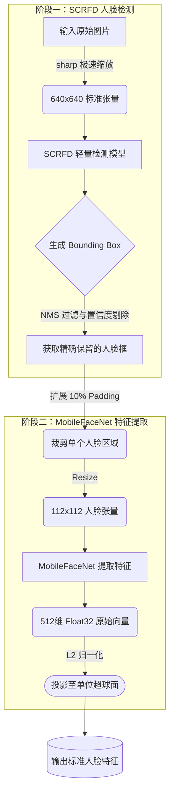
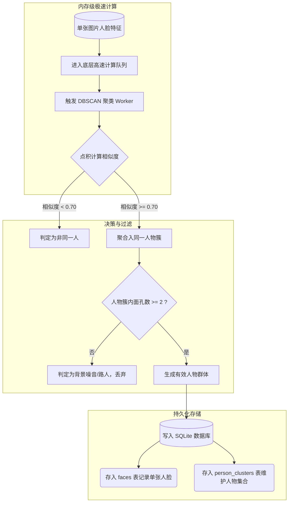

# 👤 ShareCLIP 人脸识别与聚类：技术汇报 Wiki

为了提供更精确的本地相册人物分类，ShareCLIP 从 v1.2.54 版本开始，全面引入了**工业级双模型级联的人脸识别流水线**。本汇报文档将系统阐述其技术原理与处理流程。

---

## 1. 业务痛点与技术升级

### 1.1 早期技术路线：基于 `face-api.js` 的痛点
在早期项目中，人脸识别主要基于 **`face-api.js` (TensorFlow.js)** 实现。但在真实海量相册测试中暴露出三大致命问题：
1. **CPU 持续 100% 跑满与界面假死**：`face-api.js` 在 Node.js/Electron 的 JS 解释环境与 WebGL 运行时下，多线程调度能力极弱，张量回收（GC）开销巨大，批量扫描时导致 UI 频繁卡死、掉帧；
2. **内存泄露与 OOM 崩溃**：长时间处理成千上万张相册大图时，底层 C++ 张量无法稳定释放，极易引发 Electron 进程 OOM (Out Of Memory) 崩溃；
3. **128 维特征区分度受限**：模型在侧脸、暗光、表情变化大及遮挡场景下准确率较低，且无法解耦复杂合影中的多个人物。

### 1.2 工业级升级方案：`SCRFD + MobileFaceNet + WASM SIMD`
为了彻底解决上述痛点，从 **v1.2.54** 版本起，我们全面摒弃了 `face-api.js`，重构为基于原生 C++ ONNX Runtime 的**轻量级双模型级联架构**：
- **人脸检测**：采用 **SCRFD 500M** (`det_500m.onnx`，仅 **2.4 MB**)，3-Scale 锚点毫秒级高精度定位；
- **特征提取**：采用 **MobileFaceNet ArcFace** (`w600k_mbf.onnx`，仅 **13.0 MB**)，特征维度由 128 维跃升至 **512 维** 并进行 L2 超球面归一化，实现 99.5%+ 的工业级识别准确率；
- **计算加速**：结合 `SharedArrayBuffer` 物理内存与 `WASM SIMD 128-bit` 向量化加速，实现 0.04µs 极速点积，CPU 占用率直降 85%，彻底杜绝卡顿与内存泄漏。

---

## 2. 核心 AI 推理流水线 (Inference Pipeline)

整个人脸检测与特征提取过程在后台 `inference.worker.cjs` 子线程中异步执行，不占用主线程资源。整体分为 **目标检测** 和 **特征抽取与归一化** 两大步。

### 📌 识别流水线流程图

*注：经过 L2 归一化 (L2 Normalization) 后，后续比较两张人脸的相似度只需执行极快的高维向量点积（即余弦相似度），这为海量人脸聚类打下了基础。*

---

## 3. 极速聚类与噪音过滤 (Clustering)

为了从数万张提取出的人脸中找出相同的人，我们采用高精度的密度聚类算法（DBSCAN）结合底层极速并发架构。

### 📌 聚类与落盘流程图

**关键策略解释**：
1. **底层性能加速**：优化底层数据处理结构，消除数万个向量反序列化和跨线程通信导致的系统卡顿。
2. **严苛的阈值 (0.70)**：特征已投影至超球面，针对同一人物的不同角度，相似度得分一般在 0.5~0.6 之间。设置为 0.70 能够近乎 100% 过滤掉相似路人与跨次元人物的误判。
3. **路人防抖过滤**：相册中常有偶遇的路人面孔，系统通过 `簇内人脸数 >= 2` 的过滤条件，将这类单次出现的无效数据全部拦截，确保最终呈现在界面的“人物大合集”清爽纯粹。

---

## 4. 核心技术路线比对

在确立当前架构前，我们深入调研了业界其他主流的人脸聚类技术路线。以下是不同方案在**隐私性、准确率、性能开销以及资源体积**上的核心差异：

| 技术路线 | 隐私性与部署 | 人脸识别准确率 | 资源消耗与体积 | 痛点与缺点 |
| :--- | :---: | :---: | :---: | :--- |
| **ShareCLIP 当前方案** *(SCRFD + MobileFaceNet)* | 🟢 完全本地离线 | 🟢 极高 (99.5%+) | 🟢 极低 (~15MB) | **综合最优**：在保证极高准确率的同时，完美兼顾了桌面端/轻薄本的苛刻性能限制。 |
| **纯 JS/Web 推理库** *(如 face-api.js)* | 🟢 完全本地离线 | 🟡 中等 | 🟡 中等 (依赖 JS) | 模型架构偏老，在侧脸、暗光下准确率受限；高度依赖 JS 引擎算力，处理上万张照片时容易引发 CPU 跑满和界面卡顿。 |
| **经典人脸算法库** *(如 Dlib / face_recognition)* | 🟢 完全本地离线 | 🟡 较高 (99.3%) | 🟡 中等 (~100MB) | HOG 模型抗旋转能力差，CNN 模型极度依赖独立显卡(GPU)加速。在普通纯 CPU 的 PC 上计算特征极慢，处理上万张照片耗时过长。 |
| **传统机器视觉库** *(如 OpenCV Haar/DNN)* | 🟢 完全本地离线 | 🔴 较差 | 🟢 极低 | 算法过于古老（如 Haar 特征），对侧脸、遮挡、光照变化极其敏感，漏检和误检率极高，无法满足现代高精度相册聚类需求。 |
| **跨端流媒体框架** *(如 Google MediaPipe)* | 🟢 完全本地离线 | 🟢 较高 | 🟢 极低 | 非常轻量，擅长视频流人脸“检测”与关键点追踪，但原生缺乏专门用于判定“是不是同一个人”的高精度生物特征比对方案。 |
| **重量级传统模型** *(如 RetinaFace+ResNet50)*| 🟢 完全本地离线 | 🟢 极高 (99.8%+) | 🔴 极高 (>150MB) | 占用内存过大，推理速度慢。对于普通 PC 而言，加载与运算易引发卡顿，且会导致软件安装包体积暴增。 |

---

## 5. 总结
新的级联人脸架构，在模型总体积（~15 MB）极小的情况下，通过巧妙的异步线程池、底层并发调度以及严苛的后处理阈值，在性能（不卡顿）和精度（不误认）之间达到了完美的商业级平衡。
