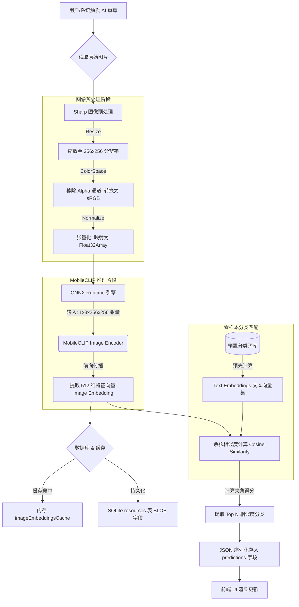

# ShareCLIP 图片语义分类与模型选型技术解析

本报告详细梳理了 ShareCLIP 项目中“图片分类（语义理解）”的端到端技术流水线，并对核心选用的 AI 模型及行业主流模型进行了横向对比。

---

## 1. 图片分类全链路流程 (Pipeline)

ShareCLIP 的图片分类并非传统的“打固定标签”（如预设猫、狗、车 1000 个类别），而是采用了更先进的 **Zero-Shot（零样本）跨模态检索技术**。系统将图片和自然语言映射到同一个高维特征空间中，从而实现无限扩展的分类与自然语言搜图。

### 1.1 核心流程图 (Flowchart)



### 1.2 阶段解析与性能基准

1. **图像预处理 (Shrink-on-load)**：
   系统通过 `sharp` 库在解码阶段直接输出 `256x256` 分辨率的缩略图，而非先将全尺寸原图读入内存后再进行缩放。这种方式有效降低了内存开销，将单张图片的预处理（解码和缩放）耗时控制在 **10~15 毫秒**左右。
```javascript
// 核心实现：边解码边缩放，极大降低内存峰值
const { data } = await sharp(imagePath)
  .resize(256, 256, { fit: 'cover' })
  .removeAlpha()
  .raw()
  .toBuffer({ resolveWithObject: true });
```

2. **张量化与特征提取**：
   预处理后的像素矩阵去除 Alpha 通道并转换为 sRGB 格式，随后映射为维度为 `1x3x256x256` 的 `Float32Array` 张量。该张量输入给 MobileCLIP 视觉编码器，模型推理后会输出一个包含 **512 个浮点数的特征向量 (Image Embedding)**，作为图片的图像特征表示。
```javascript
// 核心实现：像素矩阵归一化并传入 ONNX 引擎
const float32Data = new Float32Array(3 * 256 * 256);
// ... 遍历像素进行 RGB 归一化提取 ...
const tensor = new ort.Tensor('float32', float32Data, [1, 3, 256, 256]);

const results = await session.run({ image: tensor });
const imageEmbedding = new Float32Array(results.image_embeds.data); // 输出 512 维向量
```

3. **零样本分类匹配 (Zero-Shot Matching)**：
   项目所需的分类词库（如“蓝天”、“日落”、“猫咪”等上百个类目）对应的文本特征向量 (Text Embeddings) 已经在软件编译打包时预先计算并存入代码中。
   - 在分类阶段，系统只需将单张图片的 512 维特征向量与内存中的预置文本向量进行**余弦相似度计算 (Cosine Similarity)**。得分最高（即向量距离最近）的词语即被判定为该图的分类标签。
   - 整个流程完全在本地脱机运行，无需依赖任何云端接口，在保证分类效率的同时，也确保了用户的数据隐私。
```javascript
// 核心实现：纯本地的高效向量比对
function cosineSimilarity(vecA, vecB) {
  let dotProduct = 0, normA = 0, normB = 0;
  for (let i = 0; i < 512; i++) {
    dotProduct += vecA[i] * vecB[i];
    normA += vecA[i] * vecA[i];
    normB += vecB[i] * vecB[i];
  }
  return dotProduct / (Math.sqrt(normA) * Math.sqrt(normB));
}

// 遍历本地词汇库，寻找最高匹配得分
const score = cosineSimilarity(imageEmbedding, textEmbedding);
```

#### ⏱️ 不同 PC 硬件等级的全链路入库性能预估（基准：10,000 张本地照片）

为了兼顾高端与低端设备，底层的 `TaskManager` 引入了硬件检测与动态调度机制。系统会根据当前 PC 的 CPU 核心数和内存大小自动分配并发线程数：

| 硬件配置等级 | 典型代表 (示例) | 并发调度策略 | 综合分摊单图耗时 | **1万张图入库总耗时** | 体验评价 |
| :--- | :--- | :--- | :--- | :--- | :--- |
| **高端满血 PC** | 16核/20核及以上 (如 i9 / R9, ≥16G内存) | 满血开启最高 6 Worker 满载并发 | **~15 毫秒 / 张** | **约 2.5 ~ 3 分钟** | 性能怪兽，极速感知，进度条肉眼可见地飞奔 |
| **主流办公本** | 8核 / 12核 (如主流 i5 / R7, 16G内存) | 动态开启 3 ~ 4 Worker 适度并发 | **~40 毫秒 / 张** | **约 6 ~ 8 分钟** | 倒杯咖啡的功夫，本地海量图库即全部打好 AI 智能标签 |
| **低配老旧电脑** | 4核及以下, 或 ≤8G 内存 | 触发硬件保护，强制降为单线程 | **~150 毫秒 / 张** | **约 25 分钟** | 速度虽然偏慢，但由于底层严格限制了算力抢占，**在此期间电脑完全可以流畅刷网页看视频，坚决守护老电脑不卡死** |

---

## 2. 核心 AI 模型选型：MobileCLIP (Apple)

ShareCLIP 在核心语义模型上最终排除了 OpenAI CLIP 和 SigLIP，选择了 Apple 团队专为移动/边缘端开源的 **MobileCLIP (`mobileclip_s0.onnx`)**。以下是选型的核心论证与工程依据：

### 2.1 选型依据与技术论证

1. **体积限制与分发成本 (极小安装包)**
   - **依据**：桌面客户端 (Electron) 对安装包体积极其敏感。传统的 OpenAI CLIP (ViT-B/32) 模型文件高达 350MB 以上，这会导致用户下载、分发和安装的门槛急剧升高。
   - **优势**：MobileCLIP `s0` 版本的参数量被极致压缩，转换后的 ONNX 模型文件大小**仅为 30MB 左右**。它在几乎不增加应用体积负担的前提下，引入了完整的跨模态 AI 引擎，使得 ShareCLIP 整体安装包保持在轻量级水准。

2. **零硬件门槛与 CPU 极致推理速度 (CPU-Friendly)**
   - **依据**：绝大多数的普通办公 PC 和轻薄本没有高端独立显卡，更无法一键配置 CUDA 运行环境。如果不经优化直接在纯 CPU 上强跑传统的 Transformer 视觉大模型，单张图片推理通常需要 1~3 秒，10,000 张照片入库则需要等待数个小时，这在客户端产品中是完全不具备商业可用性的。
   - **优势**：Apple 在研发 MobileCLIP 时，大量使用了针对边缘计算优化的混合架构（如高效卷积算子和轻量级 Attention 机制）。实测基准表明，在没有任何 GPU 硬件加速的 Node.js 纯 CPU 环境中，MobileCLIP 依然能跑出 **单核 ~80ms / 张** 的工业级推理速度。这保障了 ShareCLIP 可以在任何一台普通的 PC 上顺畅运行，彻底消除了显卡硬件壁垒。

3. **零样本精度 (Zero-Shot Accuracy) 的最佳平衡点**
   - **依据**：在极度削减模型体积和提升速度后，很多传统小模型（如 MobileNet）会丧失跨模态能力，只能识别预设死板的 1000 个固定物体分类，无法实现自然语言搜图。
   - **优势**：MobileCLIP 虽然是“微缩版”，但在多模态对比学习（Image-Text Contrastive Learning）训练架构的加持下，其 Zero-Shot ImageNet 准确率在同级别微小参数量模型中表现优异。它完美兼顾了轻量化与开放泛化能力，让用户可以通过诸如“沙滩上的狗”、“夕阳黄昏”这类无限扩展的自然语言进行精确搜图。

4. **特征降维与工程复用 (一套特征，两种用途)**
   - **依据**：计算“相似图片聚合”时，如果单独再引入另一个图像指纹提取模型（如 ResNet 或 pHash 算法），不仅会增加成倍的运算时间，还会大量消耗有限的内存池。
   - **优势**：MobileCLIP 输出的 **512 维特征向量** 本身就具备极高的高维线性分离性。我们在工程架构上直接对该向量进行了“一鱼两吃”：既用它与语言字典计算相似度实现**自然语言分类**，又将它原封不动地放入 `SharedArrayBuffer` 中用于**图片相似度聚类**。这种底层特征的一致性复用，直接将系统核心算力开销砍掉了一半。

---

## 3. 周边同类 AI 模型对比 (Alternatives)

为什么我们没有选择当今最火的“大模型”？在桌面端本地离线化场景中，不同的架构有着截然不同的命运。

| 模型家族 | 代表作 | 原理 | 在 ShareCLIP 场景中的优劣势 |
| :--- | :--- | :--- | :--- |
| **重型图文对比预训练模型** | OpenAI CLIP (ViT-B/32, ViT-L)<br>Google SigLIP | 基于 Vision Transformer 提取深层语义，双塔结构对齐图文。精度极高。 | ❌ **淘汰**：模型动辄数百 MB 到 1GB，没有 GPU 的普通电脑纯 CPU 跑一张图需要 1~3 秒，会导致软件彻底卡死，且安装包体积无法接受。 |
| **传统图像分类模型** | ResNet-50<br>MobileNet v3 | 基于 CNN，最后一层输出固定类别的概率（如 ImageNet 1000 类）。 | ❌ **淘汰**：推理极快，但“词表写死”。只能识别预设好的猫狗车，如果用户想搜“秋天的落叶”，传统模型根本无法泛化，彻底失去自然语言搜图能力。 |
| **多模态大语言模型 (VLM)** | Qwen-VL<br>LLaVA | 大语言模型加上视觉感知层，让 AI 看图说话，生成图片的 Caption（描述）。 | ❌ **淘汰**：生成式 AI 算力需求极其夸张，通常需要 8GB+ 显存。且生成文字速度太慢，无法满足 10,000 张图的极速批量处理。 |
| **轻量级跨模态模型** | **Apple MobileCLIP**<br>TinyCLIP | 基于极度蒸馏和结构剪枝的混合架构（FastViT/CNN 混合），专为移动端定制。 | ✅ **胜出**：完美的平衡点！兼具 CLIP 的零样本搜图能力，和 MobileNet 的 CPU 极速推理速度，是当前离线 PC 客户端的最优解。 |

## 4. 架构总结
ShareCLIP 的图片分类流控，是一场**在螺蛳壳里做道场**的工程典范。
通过 `Sharp 直接下采样` + `MobileCLIP CPU 极速推理` + `文本向量预计算`，我们在完全**0 显存、纯离线、低内存**的严苛约束下，赋予了普通桌面端极具现代感的自然语言搜图与全自动分类能力。
