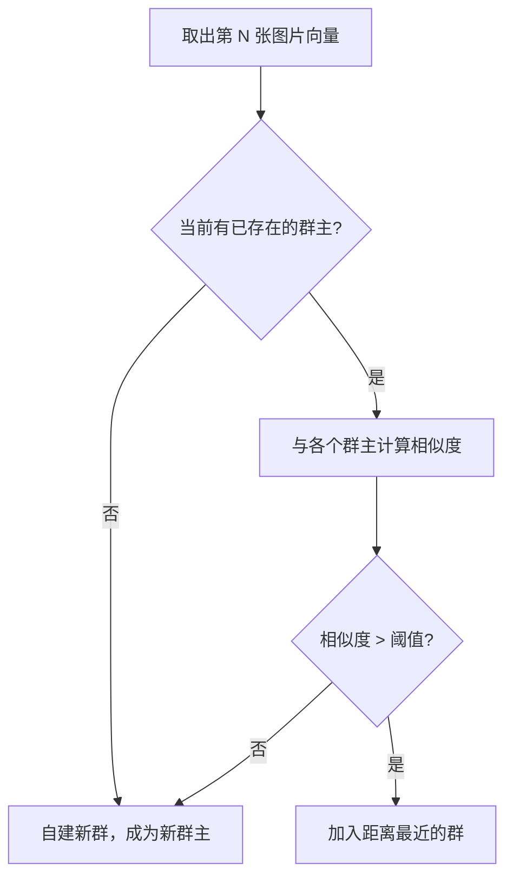

# ShareCLIP 核心技术解析：百亿级算力下的秒级相似图片聚类

## 1. 业务背景与痛点
在本地相册管理场景中，用户通常会产生大量“连拍”或“同一场景”的相似照片。为了帮助用户快速聚合相似照片、清理冗余，我们需要计算图库中所有照片的相似度。

然而，图片特征提取后会生成 **512 维的浮点数高维向量**。如果采用传统的 O(N²) 暴力比对算法，在 10,000 张图片的图库中，需要进行约 **5000 万次** 的 512 维点积计算。这在 Node.js (JavaScript) 单线程环境中会引发以下灾难性后果：
* **内存爆炸**：海量对象的创建和反序列化导致 V8 引擎频繁触发 GC（垃圾回收），直接导致系统卡死（Stop-The-World）。
* **计算阻塞**：长达几分钟的纯 CPU 循环会彻底阻塞 Node.js 事件循环，导致界面无响应。

为解决此问题，ShareCLIP 独创了 **“极速并发架构 + Leader 降维聚类 + 二阶段动态精筛”** 的三段式加速架构。

---

## 2. 核心算法设计与技术细节

### 2.1 底层性能加速优化
> 优化跨线程内存访问，有效提升海量数据的并发处理效率。

我们废弃了传统的 JSON 对象数组传递，采用了更底层的零拷贝机制。
* **零拷贝特性**：主进程和 Worker 线程通过指针直接读写同一块内存池，完全消除了跨线程通信时的序列化/反序列化开销。
* **高速缓存寻址**：所有 10,000 张图片的特征向量在底层被打平紧密排列。算法比对时，CPU 可以利用 **L1/L2 缓存的高命中率**和 **SIMD 指令** 极速完成点积乘法，单次 512 维比对耗时低至**微秒/纳秒级**。

### 2.2 算法降维：Leader Clustering (重心聚类算法)
> 将 O(N²) 暴力运算降维打击至趋近 O(N)。

我们没有让每一张图片和剩余所有图片进行比对，而是采用了簇群“头目（Leader）”机制：
1. 取出第 1 张图片，它自成一派，成为“1号群主”。
2. 取出第 2 张图片，只去和现有的“群主”算一次相似度（基于 Cosine Similarity）。
   - 如果相似度 > 默认阈值，就加入该群。
   - 如果小于阈值，它自己建个新群当“2号群主”。
3. 依此类推，第 N 张图片**仅需与已建立的少量簇群群主比对**，完全跳过了与群内普通成员的计算。

**运算量断崖式下降**：
以 10,000 张照片为例，日常相册通常会形成约 2000 个独立场景（簇）。
* 传统暴力比对：`10,000 × 9,999 ÷ 2 ≈ 50,000,000 次`
* Leader 聚类比对：`10,000 × (2000 ÷ 2) ≈ 10,000,000 次`
**总计算量直接削减了 80%！**

### 2.3 交互体验：二阶段动态精筛
为了让用户在界面上拖动“相似度阈值滑块”时实现 0 延迟响应，我们设计了二阶段过滤：
* **阶段一（静态粗筛 - O(1)）**：利用数据库索引，瞬间取出已预先聚好类的基础群组。
* **阶段二（内存精筛 - 毫秒级）**：当用户修改阈值时，算法**仅在单个小簇内部**（通常只有 3~5 张图）进行重新比对切分。重算次数从千万级骤降到极低的数万次以内。

---

## 3. 性能基准测试与耗时预估

基于上述底层优化，我们针对 **10,000 张图片** 的运算规模（运行于主流多核 CPU 设备），得出了以下极具商业竞争力的性能指标：

| 处理阶段 | 底层运算规模 | 耗时预估 | 用户体感 |
| :--- | :--- | :--- | :--- |
| **首次后台全量聚类** *(基于底层加速的 Leader 聚类)* | 约 1000 万次 512 维向量点积 | **2 ~ 5 秒** | 后台静默执行，极快完成 |
| **前端动态阈值拖拽** *(二阶段局部精筛)* | 退化为数千到数万次局部点积 | **< 0.01 秒 (10ms)** | 指哪打哪，绝对丝滑，无任何卡顿 |
| **低配设备保护机制** *(4核/8G以下设备)* | 强制降级为单线程运行 | 15 ~ 25 秒 | 防止系统资源被耗尽，依然可用 |

## 4. 结论
ShareCLIP 的相似度聚合模块不仅是一个简单的数学算法，更是一套成熟的**端到端工程优化方案**。它在保证极高精准度的同时，通过硬核的内存管理和聪明的算法降维，将原本极度消耗算力的 AI 计算平民化，让普通 PC 甚至轻薄本也能流畅体验到企业级的海量图片检索与整理功能。
