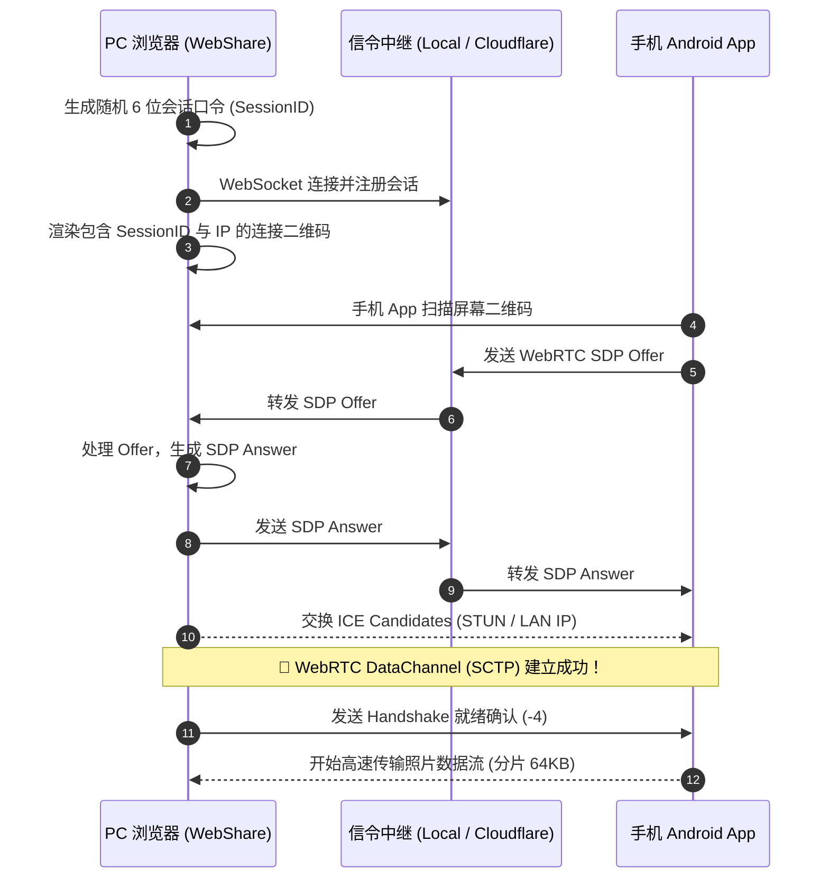

# 01. 系统架构与 WebRTC P2P 通信协议

WebShare 采用**零服务器参与的点对点数据传输架构**。手机 App 与电脑浏览器仅在初始扫码连接时通过信令通道交换极少量的 SDP 与 ICE 候选信息，一旦 WebRTC 建立连接，所有照片传输全部在局域网 Wi-Fi 内直连完成。

---

## 1. 整体连接与通信流图



---

## 2. 信令中继机制（Signaling）

### 2.1 双模信令支持
1. **本地开发/局域网模式**：
   - 电脑端运行 Vite 插件或本地 Node 服务，开启 UDP 15185 监听与 `/ws` WebSocket 服务；
   - 手机端扫码后通过 UDP 组播直接在局域网内投递 SDP Offer。
2. **GitHub Pages / 纯公网静态模式**：
   - 电脑端通过 WSS 连接到轻量级云端信令（如 Cloudflare Workers）；
   - 手机端扫描二维码获取 `web_session_id`，通过 HTTPS/WSS 将 SDP 转发至对应房间。

---

## 3. 二进制数据帧封包协议（Binary Packet Framing）

WebShare 在 WebRTC DataChannel 之上构建了与原有 Electron 桌面端及 Android 客户端 100% 兼容的二进制封包协议。

### 3.1 帧结构定义（16 字节大端序 Header）
每一个从手机传输到电脑的数据包，前 16 字节固定为协议头：

| 字节偏移 | 字段名称 | 数据类型 | 字节序 | 说明 |
| :--- | :--- | :--- | :--- | :--- |
| `0 ~ 3` | `fileId` | `int32` | Big-Endian (高位在前) | 消息/文件唯一标识符（特殊负数代表控制指令） |
| `4 ~ 7` | `chunkIndex` | `int32` | Big-Endian | 当前分片编号（从 0 开始） |
| `8 ~ 11` | `totalChunks` | `int32` | Big-Endian | 文件总分片数 |
| `12 ~ 15` | `payloadSize` | `int32` | Big-Endian | 紧随其后的二进制负载字节大小 |
| `16 ~ ...` | `payload` | `byte[]` | - | 真实数据内容（图片二进制切片或 JSON 字符串） |

### 3.2 控制指令与魔数映射（Control FileIDs）

| `fileId` | 作用 | 传输方向 | 负载说明 |
| :--- | :--- | :--- | :--- |
| **`-1`** | **Heartbeat Ping** | 手机 ➔ 电脑 | 心跳检测包，用于保活连接 |
| **`-2`** | **Heartbeat Pong** | 电脑 ➔ 手机 | 心跳应答包，电脑收到 `-1` 必须立即回送 `-2` |
| **`-3` / `-5`** | **握手请求包** | 手机 ➔ 电脑 | 手机端携带设备信息与已同步列表的 JSON |
| **`-4`** | **握手确认包** | 电脑 ➔ 手机 | 电脑向手机发送 `{"status": "ready", "device": "Chrome"}` |
| **`-6`** | **⚡ 缩略图批量同步指令** | 电脑 ➔ 手机 | 电脑通知手机快速提取相册内所有 400x400 WebP/JPEG 缩略图并批量回传 |
| **`-7`** | **📦 全量高清原图同步指令** | 电脑 ➔ 手机 | 电脑通知手机开始全量原图顺序流水线传输 |
| **`>= 0`** | **真实图片数据流** | 手机 ➔ 电脑 | 实际照片文件的二进制分片流（通常按 64KB 切片） |

---

## 4. 接收重组与 MIME 嗅探

前端 `WebRtcReceiver`（`src/services/webrtc.js`）维护了 `incomingFiles = new Map()` 接收缓冲池：

```javascript
// 1. 根据 totalChunks 分配连续分片数组
if (!this.incomingFiles.has(fileId)) {
  this.incomingFiles.set(fileId, {
    chunks: new Array(totalChunks),
    received: 0,
    totalChunks,
    totalBytes: 0
  });
}

// 2. 存入分片并累计进度
const file = this.incomingFiles.get(fileId);
file.chunks[chunkIndex] = new Uint8Array(payload);
file.received++;
file.totalBytes += payload.byteLength;

// 3. 所有分片接收完成时拼接为完整 ArrayBuffer 并嗅探图片格式
if (file.received >= totalChunks) {
  const fullBuffer = new Uint8Array(file.totalBytes);
  let offset = 0;
  for (let i = 0; i < totalChunks; i++) {
    fullBuffer.set(file.chunks[i], offset);
    offset += file.chunks[i].length;
  }
  // 识别魔数：JPEG (FF D8 FF), PNG (89 50 4E 47), WebP (52 49 46 46)
  const mime = detectMimeType(fullBuffer);
  this.onPhotoReceived({ fileId, buffer: fullBuffer.buffer, mime, size: file.totalBytes });
}
```
