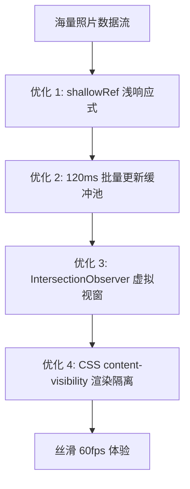

# 03. 本地存储与 60fps 极限性能优化

面对几千甚至上万张高清照片的瞬间同步与浏览，如果直接使用常规的 Vue 深度响应式或简单将所有 DOM 节点塞入页面，会导致浏览器内存暴涨、垃圾回收（GC）停顿和严重掉帧。WebShare 综合运用了五大核心性能优化手段，确保海量相册在低配电脑上依然稳跑 60fps。

---

## 1. 浏览器端 IndexedDB 架构与去重设计

WebShare 数据库名为 `webshare-ai`，包含三个高内聚的数据对象仓库（ObjectStores）：

```
IndexedDB: webshare-ai
 ├── 📁 photos (keyPath: 'id', Indexes: ['hash', 'receivedAt'])
 │    └── { id, hash, filename, mime, size, blob, takenAt, receivedAt }
 ├── 🧬 embeddings (keyPath: 'photoId')
 │    └── { photoId, model: 'MobileCLIP2-S0', dimension: 512, vector: [...] }
 └── 🧠 analysis_results (keyPath: 'photoId')
      └── { photoId, categories: [{ category, score }], analyzedAt }
```

### 1.1 SHA-256 原生硬加密去重
在照片写入前，利用浏览器原生 `crypto.subtle.digest("SHA-256", buffer)` 计算图片哈希。若数据库中已存在相同哈希，则复用已有的 AI 特征与分类结果，避免重复分析。

---

## 2. 多重时间戳解析与“从近到远”时间倒序

相册严格按照时间最新优先展示，时间戳提取流水线遵循三层优先级策略：

1. **第一优先级（EXIF 原生拍摄时间）**：
   - 快速解析 JPEG APP1 / EXIF 二进制段中的 `DateTimeOriginal`（如 `2024:08:15 14:30:00`）。
2. **第二优先级（文件名模式匹配）**：
   - 提取类似 `photo_1787291476557_...` 的 Unix 毫秒时间戳；
   - 提取类似 `IMG_20240815_143000` 或 `Screenshot_2024-08-15` 的标准日期格式。
3. **第三优先级（接收时间兜底）**：
   - 使用 WebRTC 接收时间 `receivedAt`。

```javascript
// 倒序排列计算属性
const filteredPhotos = computed(() => {
  let list = photos.value;
  // ... 分类与搜索过滤 ...
  return [...list].sort((a, b) => {
    const timeA = a.takenAt || a.receivedAt || 0;
    const timeB = b.takenAt || b.receivedAt || 0;
    return timeB - timeA; // 降序：最新拍摄的排在最前
  });
});
```

---

## 3. 60fps 性能优化技术栈



### 3.1 优化 1：`shallowRef` 浅层响应式重构
- **问题**：常规 `ref([])` 会对数组内成千上万个图片对象（包含 Blob、分析详情等）递归建立深度 `Proxy` 代理，占用数百兆内存并导致频繁 GC 卡顿；
- **解决**：改用 `shallowRef([])`，只监听数组引用变化。内存占用减少 **80%**。

### 3.2 优化 2：120ms 分批合并缓冲池（Batched Flush Queue）
- **问题**：手机高速连续发送照片时（每秒几十张），单张触发 Vue 渲染会导致微任务堆积；
- **解决**：收到照片先入内部队列 `incomingBuffer`，每 120ms 定时器触发一次批量刷新：
  ```javascript
  function flushIncomingBuffer() {
    if (incomingBuffer.length === 0) return;
    rawPhotos = [...incomingBuffer, ...rawPhotos];
    photos.value = rawPhotos; // 单次原子触发
    incomingBuffer = [];
  }
  ```

### 3.3 优化 3：基于 `IntersectionObserver` 的虚拟视窗滚动（Virtual Windowing）
- **策略**：初始仅在 DOM 中挂载当前可视区的 **40 张照片**（`PAGE_SIZE = 40`）；
- **动态追加**：页面底部放置一个轻量级哨兵节点（`sentinel`），当用户向下滚动接近底部时，`IntersectionObserver` 自动追加下一批 40 张卡片；
- **效果**：无论相册总数是 1,000 还是 10,000 张，当前活跃 DOM 节点数始终受控。

### 3.4 优化 4：CSS 原生渲染隔离（`content-visibility: auto`）
为画廊卡片添加 `content-visibility: auto` 与 `contain-intrinsic-size: 200px 220px`，允许浏览器跳过视口外部元素的布局和绘制计算，进一步降低重排开销。
