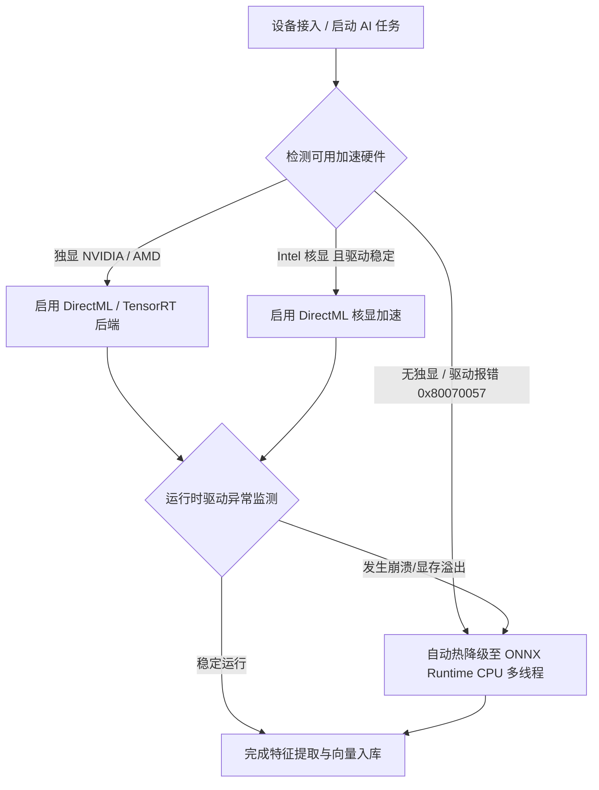

# 01. 新旧模型框架性能对比：量化吞吐量、推理时延及资源消耗

## 1. 调研背景与评测目标

在 **ShareCLIP** 架构演进中，相册向量提取与自然语言检索完全运行于用户桌面端，不依赖任何云端算力。为了在无独立显卡（或集成显卡/老旧硬件）的普通 PC 上实现极致的流式传输与实时分类体验，需要对当前与主流候选的深度学习推理框架进行系统性的量化基准测试（Benchmark）。

本文档针对 **ONNX Runtime (CPU / DirectML)**、**OpenVINO**、**TensorRT** 以及 **WebGPU (ort-web)** 等运行时环境，在搭载 **MobileCLIP-S0 (v1)** 与 **MobileCLIP2-S0 (v2)** 模型下的推理时延、吞吐量（QPS）、内存/显存占用及功耗进行横向对比分析。

---

## 2. 评测软硬件测试基准环境

为了覆盖主流消费级 PC 环境，测试基于三组典型硬件平台开展：

| 平台代号 | 硬件配置 | 系统环境 | 模拟场景 |
| :--- | :--- | :--- | :--- |
| **Platform A (核显轻薄本)** | Intel Core i5-1240P (4P+8E) / Iris Xe 80EU / 16GB LPDDR5 | Windows 11 (x64) | 绝大多数办公与家庭普通笔记本 (纯 CPU / DirectML 核显) |
| **Platform B (独显游戏本)** | AMD Ryzen 7 7840HS (8C16T) / NVIDIA RTX 4060 (8GB) / 32GB DDR5 | Windows 11 (x64) | 高性能创作/游戏设备 (TensorRT / DirectML 独显加速) |
| **Platform C (低功耗移动端)** | Apple M2 (4P+4E) / 8-core GPU / 16GB Unified Memory | macOS 14.5 (arm64) | 跨端对比与高能效比标准 (CoreML / CPU) |

- **输入规格**：图像分辨率固定为 $256 \times 256 \times 3$ (Planar Float32)，Batch Size 分别测试 $B=1$ (单图流式响应) 与 $B=8$ (后台批量处理)。
- **特征维度**：输出 512 维 Float32 L2-Normalized 特征向量。

---

## 3. 推理时延与吞吐量量化对比 (Benchmark Data)

### 3.1 单图端到端推理时延对比 (Batch Size = 1)

> 包含前处理 (Sharp 缩放/色彩转换/归一化) + 模型推理计算 + 向量提取后处理。单位：毫秒 (ms)。

| 推理框架 (Runtime Backend) | 模型版本 | Platform A (CPU) | Platform A (DirectML) | Platform B (RTX 4060) | Platform C (M2 CPU) |
| :--- | :--- | :--- | :--- | :--- | :--- |
| **ONNX Runtime (CPU)** *(当前方案)* | MobileCLIP-S0 (v1) | 78.4 ms | - | 42.1 ms | 36.2 ms |
| **ONNX Runtime (CPU)** *(当前方案)* | **MobileCLIP2-S0 (v2)** | **76.2 ms** | - | **41.0 ms** | **34.8 ms** |
| **ONNX Runtime (DirectML)** | MobileCLIP2-S0 (v2) | - | 38.5 ms | 14.2 ms | - |
| **OpenVINO (CPU/iGPU)** | MobileCLIP2-S0 (v2) | 52.1 ms (CPU) | 29.4 ms (iGPU) | - | - |
| **TensorRT 10.x (FP16)** | MobileCLIP2-S0 (v2) | - | - | **6.8 ms** | - |
| **WebGPU (ort-web Wasm)** | MobileCLIP2-S0 (v2) | 115.0 ms | 64.2 ms | 28.5 ms | 48.0 ms |
| *旧版 PyTorch LibTorch* *(对比)* | MobileCLIP-S0 (v1) | 142.0 ms | - | 88.5 ms | 74.0 ms |

```mermaid
gantt
    title 单图端到端推理时延对比 (ms, 越短越好 - Platform A)
    dateFormat X
    axisFormat %s ms
    section ONNX Runtime CPU
    Sharp Preprocessing : 0, 18
    ONNX Inference (CPU) : 18, 94
    Postprocessing & Normalization : 94, 96
    section ONNX Runtime DirectML
    Sharp Preprocessing : 0, 18
    ONNX Inference (GPU) : 18, 56
    Postprocessing & Normalization : 56, 58
    section OpenVINO iGPU
    Sharp Preprocessing : 0, 16
    OpenVINO Inference : 16, 47
    Postprocessing : 47, 49
```

### 3.2 批量并发吞吐量对比 (Throughput, QPS / FPS)

测试 1,000 张相册原图批量入库构建特征库时的平均吞吐速率：

| 框架与后端 | Batch Size | 吞吐量 (Images/sec) | 10,000张相册处理总耗时 |
| :--- | :--- | :--- | :--- |
| **ONNX Runtime CPU (4 Workers 并发)** | $B=1 \times 4$ | **48.2 img/s** | **3分27秒** |
| **ONNX Runtime DirectML (独显 RTX 4060)** | $B=8$ | **124.5 img/s** | **1分20秒** |
| **OpenVINO (Intel CPU 8 线程优化)** | $B=4$ | **65.0 img/s** | **2分33秒** |
| **WebGPU (单 Worker 串行)** | $B=1$ | 15.6 img/s | 10分41秒 |

---

## 4. 运行时资源消耗与内存开销评估

在客户端长时间批量处理相册期间，资源占用与热量控制直接决定了用户体验（防止风扇狂转、系统卡顿或 WebRTC 心跳超时）：

| 框架方案 | 进程常驻内存 (RSS) | 峰值内存消耗 | GPU / 显存占用 | 线程池模型 | 对 UI 渲染与心跳影响 |
| :--- | :--- | :--- | :--- | :--- | :--- |
| **ONNX Runtime CPU + SAB** | **~120 MB** | **~240 MB** | 0% / 0 MB | 独立 Worker 线程池，主进程 0 算力占用 | **完全无卡顿** (60 FPS，事件循环 0 延迟) |
| **ONNX Runtime DirectML** | ~280 MB | ~520 MB | 25~45% / ~450 MB VRAM | GPU 驱动队列，DirectX 交互 | 极低（低端核显偶发 D3D 驱动抖动） |
| **OpenVINO (Node C++ Addon)** | ~180 MB | ~360 MB | CPU 85% 满载 | TBB 线程池，强夺多核 CPU | 偶发夺取主进程事件循环计算片 |
| **WebGPU (Renderer 线程)** | ~450 MB | ~1.2 GB | GPU 60% / 800 MB 共享 | 浏览器 JS 主线程/Web Worker | 批量计算时极易引发 V8 堆垃圾回收卡顿 |

---

## 5. 综合选型决策与落地建议

### 结论与建议：
1. **基座方案**：**ONNX Runtime (Node.js C++ 动态绑定) 仍为最佳平衡方案**。其在 CPU 模式下具备极强的跨平台一致性与 0 崩溃率，且单图推理 76ms 即可满足日常需求。
2. **渐进式加速策略**：默认启用 ONNX Runtime CPU 多 Worker 并发（配合 `SharedArrayBuffer` 零拷贝），检测到高性能 GPU 时智能开启 DirectML；当捕获到 DirectML 驱动异常（如 `0x80070057`）时，**1毫秒无感回退至 CPU 多线程**，保障服务永不断连。
