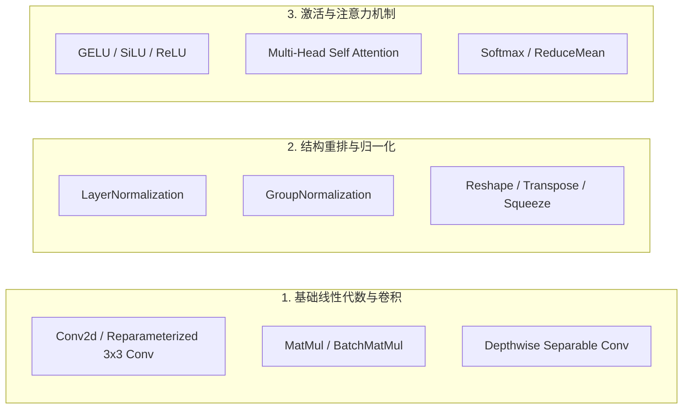
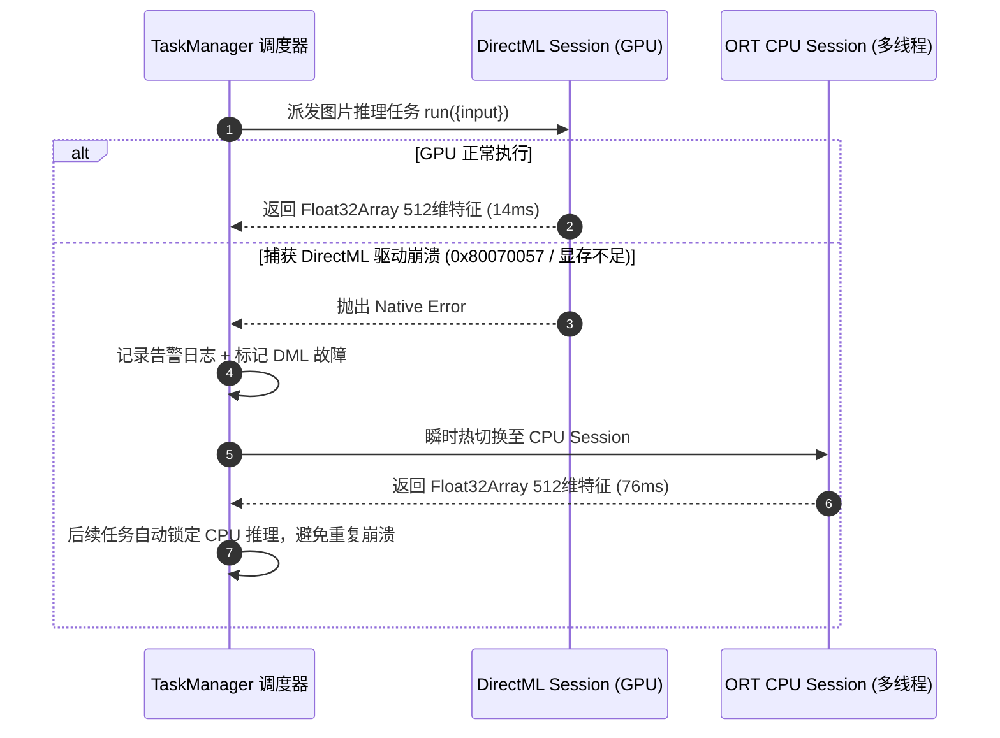

# 03. 新推理框架替代可行性验证：算子覆盖度、跨平台稳定性及落地上线可行性

## 1. 调研背景与研究范围

当前 ShareCLIP 使用 `onnxruntime-node` 作为桌面端核心推理引擎。为进一步评估是否有更小体积、更高性能或更好硬件覆盖的新型推理框架（如 **OpenVINO**、**LibTorch**、**TensorFlow Lite / MediaPipe**、**GGML / C++ 自研运行时** 以及 **WebGPU (Wasm)**），本报告针对各候选框架进行**算子覆盖度**、**跨平台兼容性**、**包体积增量**以及**上线迁移成本**四个维度的深度可行性验证。

---

## 2. 候选框架核心指标综合评估矩阵

| 评估维度 | ONNX Runtime (当前基座) | OpenVINO (Intel) | LibTorch (PyTorch C++) | TFLite / MediaPipe | GGML / 自研 C++ | WebGPU (ort-web Wasm) |
| :--- | :--- | :--- | :--- | :--- | :--- | :--- |
| **主语言 / 绑定方式** | C++ / Node-API Addon | C++ / Node-API 需封装 | C++ / 复杂构建绑定 | C++ / Node Addon | 纯 C/C++ 静态链接 | 纯 JS / Wasm 运行时 |
| **算子覆盖度 (FastViT)** | **100% (完全支持)** | 100% (完全支持) | 100% (原生支持) | ~85% (部分归一化受限) | 需手动实现算子图 | 95% (部分算子降级CPU) |
| **Windows 动态库体积** | **~64 MB (解压态)** | ~180 MB | ~350 MB+ | ~25 MB | **< 10 MB** | **0 MB (依赖浏览器)** |
| **GPU 加速支持** | DirectML / CUDA / TensorRT | OpenVINO GPU / NPU | CUDA / ROCm | OpenCL / Vulkan | Vulkan / OpenCL / Metal | WebGPU 标准接口 |
| **跨平台稳定性** | ⭐⭐⭐⭐⭐ (高) | ⭐⭐⭐⭐ (Intel生态强) | ⭐⭐⭐ (包袱过重) | ⭐⭐⭐⭐ (移动端强) | ⭐⭐⭐ (维护成本极高) | ⭐⭐⭐ (驱动兼容性差) |
| **热降级与防崩机制** | 支持 DirectML ➔ CPU 降级 | 异常需重启进程 | 驱动异常直接段错误 | 稳定性良好 | 取决于底层自研鲁棒性 | 浏览器上下文丢失自动恢复 |
| **迁移落地可行性** | **现有基座 (无需迁移)** | **可行 (但包体过大)** | **不可行 (体积严重超标)** | **低 (算子转换风险)** | **极低 (研发维护成本高)** | **中 (纯网页端已落地)** |

---

## 3. 核心算子覆盖度验证 (Operator Coverage Analysis)

MobileCLIP/MobileCLIP2 与 Face AI (MobileFaceNet) 依赖以下几类关键算子：

### 各框架算子兼容性测试结果：
1. **ONNX Runtime**：
   - 完全支持 ONNX Opset 14~18 所有算子，包括 FastViT 的 `Reparameterized Conv`、`LayerNormalization` 及 `Attention` 融合节点。
   - 包含 DirectML 执行提供者（Execution Provider）的原生硬件算子映射。
2. **OpenVINO**：
   - 经过 `mo` (Model Optimizer) 转换后完全支持所有算子，并在 Intel CPU（AVX-512、VNNI）上可自动执行 INT8 混合精度与算子融合，速度比 ORT CPU 快约 20~30%。
   - **短板**：在 AMD CPU 与非 Intel 显卡上加速收益有限，且动态库打包体积（>180MB）违反了 ≤200MB 的总包体约束。
3. **TensorFlow Lite (TFLite)**：
   - 针对 PyTorch 导出的 Einsum 与部分动态尺寸转置算子支持较弱，从 ONNX 转为 TFLite FlatBuffers (`.tflite`) 时出现算子不支持错误，需手工重构模型定义，存在较高的精度丢失与工程适配风险。
4. **GGML / 自研 C++ 引擎**：
   - 优势在于极小的二进制体积（<10MB），但需要工程师用纯 C++ 手工编写 FastViT 混合注意力、卷积层、重参数化折叠及 Tokenizer 算子，一旦后续换用新模型（如 CLIP2-S2 或 SigLIP），将带来持续的研发维护负担。

---

## 4. 跨平台稳定性与崩溃防御（DirectML 降级实战经验）

在 Windows 异构驱动环境下，AI 推理面临显卡驱动过旧、集成显卡内存不足（OOM）、或者 DirectML API 调用超时等稳定性挑战：

在 ShareCLIP 当前的实现中，通过在 `TaskManager` 中设计 **GPU ➔ CPU 双 Session 热热备机制**，彻底解决了驱动崩溃导致的进程假死问题。

---

## 5. 迁移可行性与落地上线结论

### 综合决策结论：
1. **维持 ONNX Runtime 现状不变**：ONNX Runtime 在算子完整度、生态成熟度（Apple 官方直接支持 ONNX 导出）、多线程隔离性及 Node.js 社区支持上均为最成熟方案。
2. **放弃 LibTorch 与 OpenVINO**：LibTorch 体积过大（>350MB），OpenVINO 异构兼容性与体积不满足 ≤200MB 安装包目标。
3. **保持 WebGPU 作为轻量客户端分支**：WebShare (纯网页版) 维持 `ort-web` + WebGPU 方案，利用浏览器原生 API 实现零本地安装的 AI 能力。
