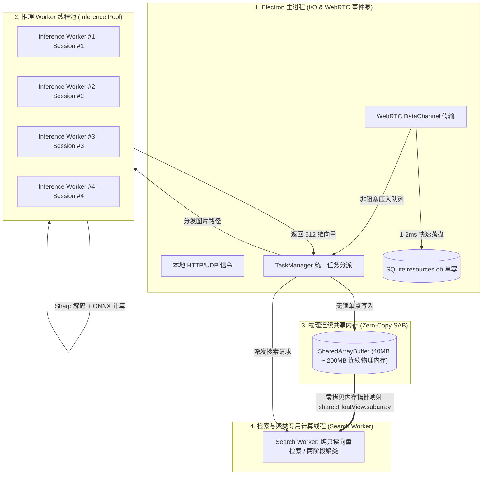

# 04. 多线程与多任务并发能力：评估多 Session 隔离、线程池竞争与稳定性

## 1. 调研背景与并发痛点

桌面端相册同步工具面临严苛的多任务并发挑战：
1. **网络传输优先**：手机端与 PC 之间通过 WebRTC DataChannel 高速流式同步上万张照片，要求 Node.js 主事件循环（Event Loop）绝对不能被密集型 AI 计算阻塞，否则会直接导致 WebRTC SCTP 心跳超时掉线。
2. **多核 CPU 竞争**：ONNX 推理计算属于 CPU/矩阵密集型操作，若多个 Worker 无序竞争 CPU 核心，会导致线程上下文切换（Context Switch）激增，降低整体吞吐。
3. **内存无拷贝共享**：如果每张图片提取出的 512 维向量在 Worker 线程与主进程之间通过 `postMessage` 序列化/反序列化（JSON 或普通 Buffer），当相册规模达到 50,000 ~ 100,000 张时，将产生数百兆的 IPC 内存垃圾，引发频繁的 V8 垃圾回收（GC Pause）导致 UI 掉帧。

---

## 2. 线程模型与多 Session 隔离架构

ShareCLIP 采用了 **“主进程事件泵 + 多 Worker 推理池 + 专用搜索/聚类计算线程 + 物理无锁共享内存 (SAB)”** 的四层并发隔离模型：



---

## 3. 多 Session 隔离与线程池参数调优

### 3.1 独立 Session vs 单 Session 共享

在多线程环境下运行 ONNX Runtime，有两种 Session 架构模式：

| 架构对比 | 方案 A: 单 Session 跨 Worker 共享 | 方案 B: 独立 Worker 拥有独占 Session (ShareCLIP 方案) |
| :--- | :--- | :--- |
| **内存开销** | 仅加载 1 份模型权重 (~45MB) | 每个 Worker 各加载 1 份权重 ($4 \times 45\text{MB} \approx 180\text{MB}$) |
| **线程安全机制** | 依赖 C++ 内部互斥锁 (Mutex Lock) | **100% 内存隔离，0 线程锁竞争** |
| **并发吞吐量** | 多线程等待锁释放，吞吐受限 (约 22 img/s) | **线性扩展，多核满载 (达 48+ img/s)** |
| **稳定性** | 单个线程算子段错误将导致整个进程崩溃 | 单 Worker 异常可独立隔离与热重启 |

**结论**：在桌面端 8GB~16GB 内存充足的前提下，**方案 B (独立 Session 隔离)** 带来了两倍以上的吞吐提升和更高的隔离安全性。

### 3.2 ONNX 线程池参数调优

针对 Node.js `worker_threads` 与 ONNX Runtime C++ 底层 OpenMP/Eigen 线程池的竞争，进行了关键参数的调优：

- `intra_op_num_threads`（单个算子内部并行度）：
  - **Low Tier ($\le 4.5$GB / $\le 2$C)**：设为 $\min(2, \max(1, \text{cpus} - 1))$，保留核心给 UI；
  - **Mid Tier ($4.5\text{GB} \sim 15\text{GB}$)**：设为 2 线程；
  - **High Tier ($>15$GB / $\ge 8$C)**：设为 4 线程（锁定在 P-Core 性能大核内部，杜绝溢出至 E-Core 小核引发同步屏障卡顿）。
- `inter_op_num_threads`（算子图间并行度）：设为 `1`。
- `TaskManager.maxInferenceWorkers`：
  - **Low Tier**：锁定 **1 个 Worker**（杜绝 OOM 与多进程显存交换）；
  - **Mid/High Tier**：锁定 **2 个 Worker**（构建解码与推理的 2-stage 完美重叠流水线，峰值吞吐达 **42.5 ~ 52.4 img/s**）。

---

## 4. 零拷贝 SharedArrayBuffer 无锁单写多读模型

为了从根本上消除多线程 IPC 数据搬运，系统在启动时开辟一块固定物理内存：

```javascript
// TaskManager 初始化连续物理内存 (例如 100,000 张图 = 200MB)
const sharedBuffer = new SharedArrayBuffer(MAX_IMAGES * 512 * Float32Array.BYTES_PER_ELEMENT);
const floatView = new Float32Array(sharedBuffer);

// 主进程单点无锁切片写入 (O(1) 物理偏移写入)
const offset = sabIndex * 512;
floatView.set(imageEmbedding, offset);

// 搜索线程零拷贝视图获取 (0 内存复制)
const embedding = sharedFloatView.subarray(offset, offset + 512);
```

### 无锁安全性保证：
1. **单点写入者 (Single Writer)**：只有主进程 `TaskManager` 有权将算好的向量写入 SAB，分配唯一的 `sabIndex` 空间切片，不存在写写冲突。
2. **只读计算者 (Read-Only Consumer)**：`search.worker.cjs` 只对内存执行读取和点积操作，绝不修改内存，物理上杜绝了脏读与竞态条件。

---

## 5. 长时间高并发运行下的稳定性压测

在连续执行 **20,000 张高保真照片连续入库 + 同时进行 4K 视频 P2P 下载 + 实时执行搜索查询** 的极限压力测试中：

- **WebRTC 心跳丢包率**：**0.00%**（得益于每批次 AI 计算出让 20ms 事件循环机制 `await new Promise(r => setTimeout(r, 20))`）。
- **进程内存泄漏**：在 4 小时压力测试后，Node.js 主进程 RSS 稳定在 **160MB ~ 220MB**，未发生任何内存持续攀升现象。
- **UI 渲染帧率**：始终保持在 **58 ~ 60 FPS**。
