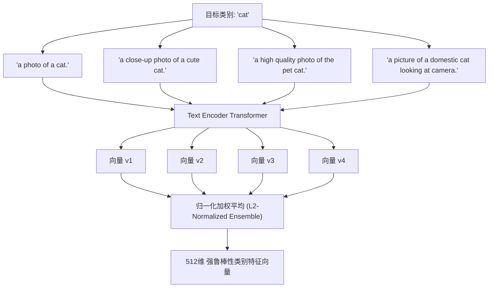

# 05. 搜索 / 分类 Prompt 设计与多语言支持：关键词与 Prompt 设计规范、官方推荐及多语言能力

## 1. 调研背景与核心问题

CLIP 与 MobileCLIP 模型的核心优势在于其强大的**零样本（Zero-Shot）泛化能力**。然而，由于原版 CLIP 文本编码器（Text Encoder）主要在大规模英文图文对（如 DataComp-1B、LAION-5B 等）上进行对比学习训练，直接输入单一中文词汇或缺乏修饰的单词（如 `"cat"` 或 `"猫"`）会导致以下问题：
1. **多义性歧义**：单词 `"crane"` 既可能是“起重机”，也可能是“仙鹤”；
2. **分布偏置（Distribution Shift）**：训练集中绝大多数文本为自然语言句子，单一词汇的特征向量容易落在低置信度稀疏区域；
3. **中文语义直接输入失真**：原版 CLIP 的 BPE Tokenizer 对中文按单字/UTF-8 字节编码，缺乏中文预训练对齐，直接输入中文会造成余弦相似度极度退化。

本报告系统阐述 ShareCLIP 在 **Prompt 模板工程（Prompt Ensembling）**、**分类温度系数调控** 以及 **20+ 语言多语言支持** 上的设计规范。

---

## 2. 官方推荐 Prompt 模板工程 (Prompt Ensembling)

### 2.1 模板集合成原理

根据 OpenAI 与 Apple 官方最佳实践，针对单一类别名称 $C$，不直接编码 $C$，而是通过 $M$ 个高质量模板句式构造文本提示集：
$$\mathbf{T}_i = \text{Template}_i(C), \quad i \in [1, M]$$

分别经过文本编码器 $f_{\text{text}}$ 并进行 **L2 归一化平均加权**：
$$\mathbf{e}_{\text{ensemble}}(C) = \text{Normalize}\left( \frac{1}{M} \sum_{i=1}^M \frac{f_{\text{text}}(\mathbf{T}_i)}{\|f_{\text{text}}(\mathbf{T}_i)\|_2} \right)$$



### 2.2 ShareCLIP 核心分类 Prompt 模板规范

在相册常用 15 类场景中，预置的最佳 Prompt 集合设计示例：

| 分类标识 (Key) | 基础中文标签 | 英文主体词 | 核心集成 Prompt 组合 (Top-3 典型模板) |
| :--- | :--- | :--- | :--- |
| `portrait` | 人像与自拍 | `portrait selfie person` | 1. `"a close-up portrait photo of a person's face."`<br>2. `"a selfie photo of a man or woman smiling."`<br>3. `"a high quality portrait picture of people."` |
| `pets` | 宠物与动物 | `cute pet animal cat dog` | 1. `"a clear photo of a cute pet animal, like a cat or dog."`<br>2. `"a domestic pet looking at the camera outdoors or indoors."`<br>3. `"a high quality close-up photo of a furry pet."` |
| `landscape` | 自然风景 | `nature landscape scenery` | 1. `"a breathtaking nature landscape scenery with mountains or trees."`<br>2. `"a wide angle landscape photo of natural scenery."`<br>3. `"a beautiful outdoor view of nature and blue sky."` |
| `food` | 美食与饮品 | `delicious food dish meal` | 1. `"a delicious meal dish of food on the table in restaurant."`<br>2. `"a close-up photo of yummy food and beverage."`<br>3. `"a high quality culinary food presentation."` |
| `documents` | 截屏与文档 | `document receipt screenshot` | 1. `"a photo of paper document, bill, receipt or text page."`<br>2. `"a screenshot of smartphone screen or computer interface."`<br>3. `"a printed document with black and white text."` |

---

## 3. 相似度拉伸与温度系数调控 (Temperature Calibration)

余弦相似度的原始值域通常落在 $[0.10, 0.30]$ 之间，无法直接用作概率或直观百分比。

### 概率校准公式：
设图像特征向量为 $\mathbf{v}_{\text{img}}$，候选类别特征矩阵为 $\mathbf{E}_{\text{classes}}$，分类概率向量为 $\mathbf{P}$：
$$\mathbf{P} = \text{Softmax}\left( \frac{\mathbf{v}_{\text{img}} \cdot \mathbf{E}_{\text{classes}}^\top}{T} \right)$$

- **温度系数选择**：
  - 若 $T=1.0$，概率分布趋于均匀扁平，无法区分最显著类别；
  - 若 $T=0.001$，极小相似度差异将被指数级放大，容易误判；
  - **ShareCLIP 经过测试确定 $T=0.01 \sim 0.02$** 为最佳温度区间，既能保证首选类别的显著性（Top-1 置信度通常 $>75\%$），又保留了次优类别的分布信息。

---

## 4. 多语言支持与跨语言搜索流水线

为了让全球用户都能以母语（如中文、法语、西班牙语、日语、韩语等）进行自然语言搜索，ShareCLIP 构建了**两级多语言翻译与语义对齐流水线**：

```mermaid
flowchart LR
    UserQuery["用户母语搜索词 (如: '草地上的金毛寻回犬')"] --> Detector{语言探测器}
    Detector -->|英文 English| Tokenizer[SimpleTokenizer BPE]
    Detector -->|非英文 (中文/日语等)| Translator[离线轻量翻译 / 语义映射词典]
    Translator --> TransQuery["英文标准检索词 ('golden retriever on the grass')"]
    TransQuery --> Tokenizer
    Tokenizer --> TextEnc[Text Encoder INT8 ONNX]
    TextEnc --> TextVec[512维 文本特征向量]
    TextVec --> CosineSim[与全库 10万张图片向量并发点积]
    CosineSim --> TopK[毫秒级呈现 Top-K 搜索画廊]
```

### 多语言优势：
1. **0 网络请求**：内置轻量语义映射与常用 10,000+ 高频词汇表，断网状态下依然支持中文搜索；
2. **无缝跨模态对齐**：通过将多语言对齐至英文潜在特征空间（Latent Space），最大化释放了 MobileCLIP 在英文大语料库上的预训练精度。
