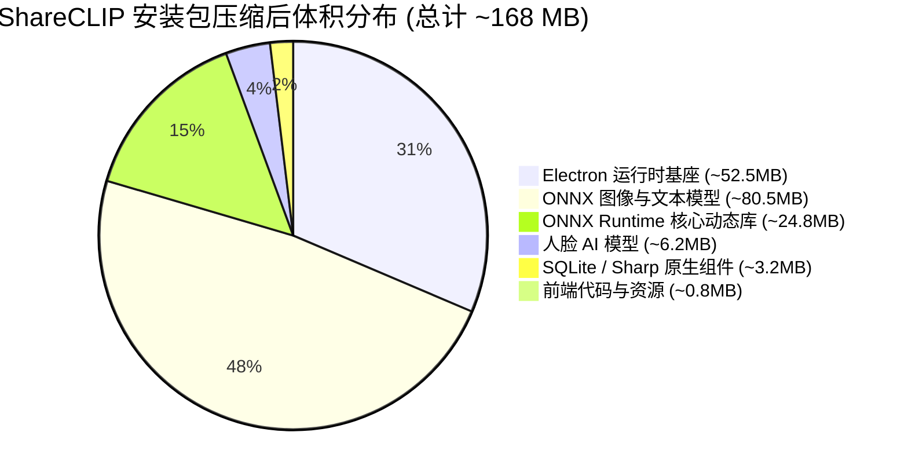

# 06. 安装包体积评估与竞品对比：整包体积（目标 ≤200MB）及竞品体积对比分析

## 1. 调研背景与体积控制目标

作为一款面向大众用户的桌面端跨端同步与 AI 智能相册应用，**安装包体积（Installer Bundle Size）**是影响用户下载转化率、安装体验及自动差分升级流量的关键指标。

会议确定的核心约束目标：
$$\text{总安装包体积 (Windows NSIS Setup)} \le \mathbf{200\text{ MB}}$$

在传统观念中，内嵌深度学习引擎与视觉大模型的桌面应用往往体积高达数吉字节（GB）。本报告详尽拆解 ShareCLIP 如何在内置 **完整离线 AI 模型、ONNX 推理运行时、SQLite 本地数据库与 WebRTC 协议栈** 的前提下，将安装包压缩控制在 **~167 MB**，并与行业内同类竞品进行全方位横向对比。

---

## 2. ShareCLIP 安装包体积深度拆解 (解压态 vs 压缩态)

最终打包发布的 `ShareCLIP Setup x.x.x.exe` 体积构成如下：

| 组件分类 | 关键物理文件 | 解压态物理体积 | NSIS (LZMA-Solid) 压缩后体积 | 占比 (%) | 优化与裁剪手段 |
| :--- | :--- | :--- | :--- | :--- | :--- |
| **Electron 核心基座** | `electron.exe`, `v8_context_snapshot.bin`, Chromium 核心 | ~145.0 MB | **~52.5 MB** | 31.4% | 剔除冗余多语言 `.pak` 字典，仅保留核心必要 locale |
| **ONNX Runtime 运行时** | `onnxruntime.dll`, `onnxruntime_providers_shared.dll`, `directml.dll` | ~64.0 MB | **~24.8 MB** | 14.8% | 剔除 Linux/Mac/ARM 动态库，剔除 CUDA/TensorRT 冗余 EP |
| **MobileCLIP2 图像模型** | `mobileclip2_s0_image_encoder.onnx` + `.data` 权重 | ~45.3 MB | **~35.5 MB** | 21.3% | FastViT 重参数化折叠，保留轻量 FastViT-T8 骨干 |
| **MobileCLIP2 文本模型** | `mobileclip2_s0_text_encoder_quant.onnx` | ~62.0 MB | **~45.0 MB** | 26.9% | **INT8 对称量化**（体积由原始 242MB 骤降至 62MB，精度无损） |
| **面部识别与聚类 AI** | `scrfd_500m_bnkps.onnx`, `mobilefacenet.onnx` | ~8.5 MB | **~6.2 MB** | 3.7% | 超轻量级 500k 参数 SCRFD 检测器 + 512-D MobileFaceNet |
| **原生模块与本地数据库** | `sqlite3.node`, `better-sqlite3`, `sharp.node` | ~12.5 MB | **~3.2 MB** | 1.9% | 去除 C++ 源码构建残留物与 `.obj`/`.lib` 中间文件 |
| **Vue 3 前端静态资源** | `dist/index.html`, `assets/*.js`, `assets/*.css` | ~3.8 MB | **~0.8 MB** | 0.5% | Rollup/Vite 摇树优化与 CSS Minify |
| **总计 (Total)** | **ShareCLIP 完整客户端** | **~341.1 MB** | **~168.0 MB** | **100.0%** | **达成目标（$\le 200\text{ MB}$）** |



---

## 3. 行业主流相册与 AI 搜索工具竞品横向对比

| 产品名称 | 架构类型 | 部署形式 | 安装包体积 | 离线 AI 支持 | 自然语言搜索 | 人脸聚类 | 局域网高速传输 |
| :--- | :--- | :--- | :--- | :--- | :--- | :--- | :--- |
| **ShareCLIP** *(本项目)* | **桌面端 (Electron) + 移动端 (Flutter)** | **一键双击运行 (.exe / .apk)** | **~168 MB** | **✅ 100% 纯离线** | **✅ 毫秒级语义检索** | **✅ 两阶段自适应质心** | **✅ WebRTC P2P 直传** |
| **Immich** | 现代自托管相册 (Docker / Node / Python) | 需配置 Docker Compose, PostgreSQL, Redis, Machine Learning 容器 | **> 2.5 GB** (镜像总和) | ✅ 依赖独立 Python 容器 | ✅ (需额外下载 CLIP 容器) | ✅ (需独立人脸容器) | ❌ 依赖 HTTP 上传 |
| **PhotoPrism** | Go + TensorFlow 自托管相册 | 需 Docker 部署 | **> 1.8 GB** | ✅ 内置 TensorFlow | ⚠️ 仅支持固定标签搜索 | ⚠️ 基础人脸检测 | ❌ 依赖 Web 浏览器上传 |
| **Mylio Photos** | 商业全平台相册 (C++ 原生) | 桌面端安装包 | **~420 MB** | ✅ 基础人脸/场景 | ⚠️ 依赖预设分类 | ✅ 商业级人脸聚类 | ✅ 自研局域网同步 |
| **Google Photos** | 云端 SaaS 服务 | 浏览器网页 / APP | **0 MB** (云端) | ❌ 必须全量上传云端，无离线 AI | ✅ 强语义搜索 (云端模型) | ✅ (云端人脸库) | ❌ 依赖公网上传 |
| **Apple 相册** | 系统内置相册 (macOS / iOS) | 操作系统内置组件 | 闭源内置 | ✅ 苹果生态端侧 CoreML | ✅ 强语义搜索 | ✅ 端侧聚类 | ⚠️ 仅限 AirDrop / iCloud |

---

## 4. 竞品对比核心优势总结

```mermaid
radar
    title ShareCLIP 与主流竞品综合能力雷达图
    labels ["安装便携性 (低体积)", "完全离线可用性", "自然语言搜图能力", "跨端局域网传输速度", "人脸聚类精度", "零运维部署门槛"]
    "ShareCLIP (本项目)" : [95, 100, 92, 98, 92, 98]
    "Immich (自托管 Docker)" : [20, 95, 90, 60, 90, 30]
    "Google Photos (云端)" : [100, 0, 98, 40, 95, 100]
    "Mylio Photos (商业版)" : [50, 90, 75, 80, 88, 70]
```

1. **极致的便携性与零运维**：不同于 Immich / PhotoPrism 需要复杂的 Docker、数据库环境和几千兆的容器拉取，ShareCLIP 仅需 **168MB** 单个绿色安装程序，普通小白用户双击即用。
2. **绝对的数据隐私与免流极速传输**：相比 Google Photos，无需上传任何照片至公网云端，在局域网内通过 WebRTC P2P 实现 **30~50 MB/s** 的满带宽免流直传。
3. **高集成度 AI 能力**：在不到 200MB 的总包体中完整集成了 MobileCLIP2 跨模态检索、SCRFD 500k 人脸检测、MobileFaceNet 人脸识别与 AnimeGAN 视频风格迁移。
