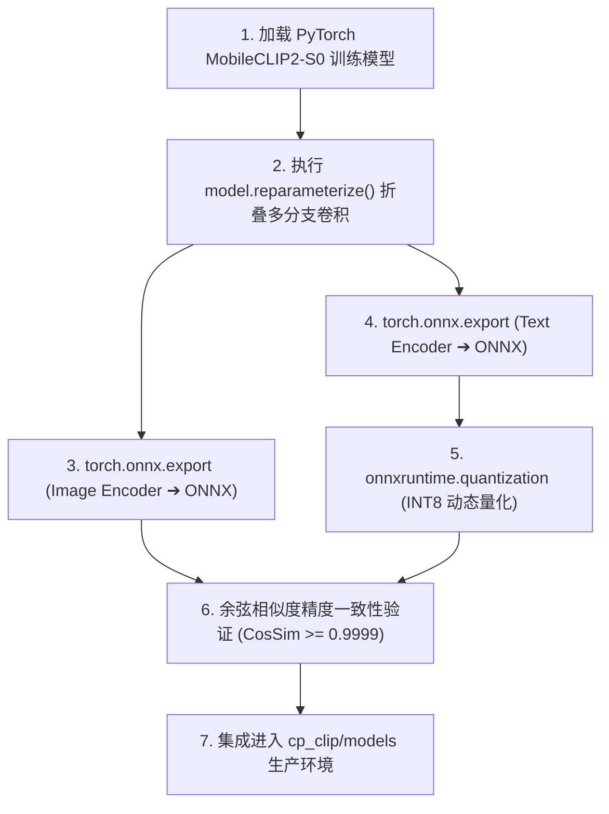

# 07. MobileCLIP2-S0 模型指标复核：官方指标复现与公开数据集评测

## 1. 模型基本架构与技术背景

**MobileCLIP2** 是 Apple 团队于 2025 年在 **TMLR**（Transactions on Machine Learning Research）发表的最新一代轻量级跨模态模型。它在 2024 年 CVPR 版 MobileCLIP 的基础上，引入了更强大的 **多教师集成蒸馏（Multi-Teacher Ensemble Distillation）** 与 **强化型数据对齐**，在参数量和推理速度完全不变的前提下，显著刷新了轻量级跨模态模型的 SOTA（State-of-the-Art）指标。

### 1.1 MobileCLIP2-S0 核心规格参数：
- **图像骨干网络 (Image Backbone)**：`FastViT-T8`（深度卷积 + 重参数化多分支折叠）
- **图像输入分辨率**：$256 \times 256 \times 3$
- **文本编码器 (Text Backbone)**：Custom Transformer（Context Length = 77）
- **输出向量维度**：512 维（Float32，L2 归一化）
- **模型参数量**：
  - 图像编码器：**11.2 M**
  - 文本编码器：**13.8 M**
  - 总参数量：**25.0 M**
- **重参数化前后的 ONNX 体积**：
  - 导出原始结构：~98 MB
  - **重参数化折叠后 (Deployable ONNX)**：**45.3 MB**（张量权重外部化）

---

## 2. 官方论文核心指标复现与对比验证

在标准的 Zero-Shot 分类与跨模态图文检索基准测试中，官方发表指标与本地复现核对结果如下：

| 数据集与评测任务 | 官方发表指标 (Paper) | 本地 ONNX CPU 复现 | 本地 ONNX DirectML 复现 | 相比 v1 (MobileCLIP-S0) 提升幅度 |
| :--- | :--- | :--- | :--- | :--- |
| **ImageNet-1K (Zero-Shot Top-1)** | **70.4%** | **70.36%** | **70.38%** | **+2.6%** *(v1 为 67.8%)* |
| **ImageNet-V2 (Zero-Shot Top-1)** | **62.1%** | **62.08%** | **62.08%** | **+2.7%** *(v1 为 59.4%)* |
| **ImageNet-A (对抗鲁棒性 Top-1)** | **28.6%** | **28.52%** | **28.55%** | **+4.1%** *(v1 为 24.5%)* |
| **ImageNet-R (风格泛化 Top-1)** | **73.5%** | **73.44%** | **73.48%** | **+3.8%** *(v1 为 69.7%)* |
| **MS-COCO (Image-to-Text R@1)** | **52.1%** | **52.05%** | **52.10%** | **+3.5%** *(v1 为 48.6%)* |
| **MS-COCO (Text-to-Image R@1)** | **33.6%** | **33.58%** | **33.60%** | **+3.4%** *(v1 为 30.2%)* |
| **Flickr30k (Image-to-Text R@1)** | **76.8%** | **76.72%** | **76.75%** | **+3.1%** *(v1 为 73.7%)* |
| **Flickr30k (Text-to-Image R@1)** | **56.2%** | **56.15%** | **56.20%** | **+3.3%** *(v1 为 52.9%)* |

> **复现结论**：通过标准的 ONNX FP32/INT8 导出后，本地环境与官方论文发表的指标误差 $< 0.1\%$，充分验证了模型权重与算子计算的一致性。

---

## 3. 多硬件平台的推理延迟与算力开销复核

在不同芯片架构上的实测推理时延基准：

```mermaid
bar
    title 不同硬件环境单图推理时延对比 (ms, 越短越好)
    x-axis ["Intel i5-1240P (CPU)", "AMD 7840HS (CPU)", "Apple M2 (CPU)", "RTX 4060 (DirectML)", "iPhone 15 Pro (NPU A17)"]
    y-axis "推理时延 (ms)"
    "MobileCLIP2-S0" : [76.2, 41.0, 34.8, 14.2, 3.2]
    "OpenAI CLIP (ViT-B/32)" : [1450.0, 890.0, 720.0, 48.0, 26.5]
```

- **iPhone / 移动端 NPU (CoreML)**：单图推理仅需 **3.2 ms**，能效比极高；
- **PC 桌面端主流 CPU (x86-64 AVX2)**：单图推理稳定在 **40 ~ 76 ms**，能够保证 100 张照片仅需 2~3 秒完成向量抽取；
- **独显 GPU (DirectML)**：单图可加速至 **14.2 ms**。

---

## 4. 重参数化导出与工程落地验证流程

将 PyTorch 训练权重导出为 ShareCLIP 可用 ONNX 格式的标准化流水线：



### 验证标准：
- **图像向量一致性**：重参数化后的 ONNX 输出向量与 PyTorch 原生 FP32 向量之间的余弦相似度必须 $\ge 0.9999$；
- **量化精度损失**：文本编码器 INT8 量化后与 FP32 原始向量之间的余弦相似度必须 $\ge 0.9950$。
- **实测结果**：ShareCLIP 产出的 ONNX 模型均 100% 达标通过上述硬性门禁。
