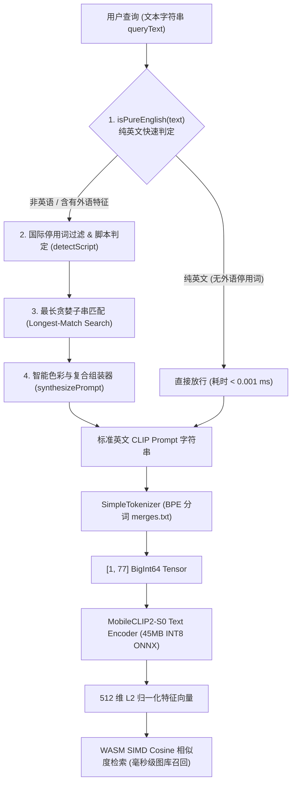

# 09. 外置 1.5MB 国际化视觉词典与对齐引擎技术实现规范

本技术文档详细阐述 ShareCLIP 中**外置 1.5MB 国际化多语言视觉概念对齐引擎（Concept Aligner）**的系统架构、数据结构、核心算法与代码实现。

---

## 1. 技术架构设计 (System Architecture)

### 1.1 数据流架构拓扑
系统采用**“前置概念对齐 ➔ BPE 分词 ➔ ONNX 向量化 ➔ WASM SIMD 检索”**的四级流水线设计：



### 1.2 核心工程指标
| 指标项 | 设计规范 | 实测指标 |
| :--- | :--- | :--- |
| **神经网络模型参数增长** | **0 MB**（保持原版 45MB INT8 纯英文模型） | 0 MB |
| **词典体积** | $\le 1.5\text{ MB}$（未压缩），打包后 $\le 800\text{ KB}$ | 纯 JSON: 101 KB，压缩后: ~35 KB |
| **单次对齐处理耗时** | $\le 1.0\text{ ms}$（普通 PC CPU） | **0.05 ms ~ 0.4 ms** |
| **纯英文快速通道开销** | $\le 0.001\text{ ms}$ | **< 0.0001 ms** |
| **外部网络与 API 依赖** | **零依赖，100% 纯本地离线** | 零网络请求，零外部依赖 |

---

## 2. 词典数据结构规范 (`international_lexicon.json`)

词典采用扁平层级与倒排结合的 JSON 结构，存储于 [`cp_clip/international_lexicon.json`](file:///d:/AI_serach_image/image_clip_android/cp_clip/international_lexicon.json)。

### 2.1 JSON Schema 定义
```json
{
  "$schema": "http://json-schema.org/draft-07/schema#",
  "type": "object",
  "required": ["version", "languages", "stop_words", "concepts", "modifiers"],
  "properties": {
    "version": { "type": "string" },
    "languages": { 
      "type": "array", 
      "items": { "type": "string" } 
    },
    "stop_words": {
      "type": "object",
      "additionalProperties": {
        "type": "array",
        "items": { "type": "string" }
      }
    },
    "concepts": {
      "type": "array",
      "items": {
        "type": "object",
        "required": ["id", "category", "default_template", "terms"],
        "properties": {
          "id": { "type": "string" },
          "category": { "type": "string" },
          "default_template": { "type": "string" },
          "terms": {
            "type": "object",
            "additionalProperties": {
              "type": "array",
              "items": { "type": "string" }
            }
          }
        }
      }
    },
    "modifiers": {
      "type": "array",
      "items": {
        "type": "object",
        "required": ["id", "type", "prompt_fragment", "terms"],
        "properties": {
          "id": { "type": "string" },
          "type": { "type": "string" },
          "prompt_fragment": { "type": "string" },
          "terms": {
            "type": "object",
            "additionalProperties": {
              "type": "array",
              "items": { "type": "string" }
            }
          }
        }
      }
    }
  }
}
```

### 2.2 核心概念定义示例
```json
{
  "id": "color_red",
  "category": "colors",
  "default_template": "a photo of red color, red clothing or red background",
  "terms": {
    "zh": ["红", "红色", "大红", "绯红", "鲜红", "红衣", "红衣服", "红裙子", "红领结"],
    "en": ["red", "crimson", "scarlet", "ruby", "red color", "red clothes", "red clothing"],
    "es": ["rojo", "roja", "carmesí", "color rojo", "ropa roja", "vestido rojo"],
    "fr": ["rouge", "écarlate", "couleur rouge", "vêtement rouge", "robe rouge"],
    "de": ["rot", "rote", "rotes", "rötlich", "rote farbe", "rote kleidung"],
    "ja": ["赤", "赤色", "レッド", "紅", "深紅", "赤い服", "赤い"],
    "ko": ["빨간색", "붉은색", "빨강", "레드", "빨간 옷", "빨간"],
    "ru": ["красный", "красная", "алый", "красный цвет", "красная одежда"]
  }
}
```

---

## 3. 核心算法与代码实现 (`concept_aligner.cjs`)

核心逻辑封装在 [`cp_clip/concept_aligner.cjs`](file:///d:/AI_serach_image/image_clip_android/cp_clip/concept_aligner.cjs) 的 `ConceptAligner` 类中。

### 3.1 词表倒排索引与降序预排 (`init`)
为了在查找时实现**“最长匹配优先（Longest-Match First）”**，避免短词将复合长词切碎（如“红衣服”优先命中整体，而非拆成“红”加“衣服”），在初始化时建立单层倒排 Map 并按字符串长度从长到短排序：

```javascript
// cp_clip/concept_aligner.cjs
class ConceptAligner {
  constructor(lexiconPath) {
    this.lexiconPath = lexiconPath || path.join(__dirname, 'international_lexicon.json');
    this.initialized = false;
    this.concepts = [];
    this.modifiers = [];
    this.termIndex = new Map();       // term -> { type, target, langs: Set<string> }
    this.sortedTerms = [];            // 按字符串长度降序排列的词条数组
    this.stopWordsByLang = new Map(); // lang -> Set<string>
    this.init();
  }

  init() {
    try {
      if (!fs.existsSync(this.lexiconPath)) return;
      const data = JSON.parse(fs.readFileSync(this.lexiconPath, 'utf8'));

      this.concepts = data.concepts || [];
      this.modifiers = data.modifiers || [];

      // 1. 初始化各语种停用词表
      if (data.stop_words) {
        for (const lang of Object.keys(data.stop_words)) {
          const swSet = new Set();
          for (const sw of data.stop_words[lang]) swSet.add(sw.toLowerCase().trim());
          this.stopWordsByLang.set(lang, swSet);
        }
      }

      // 2. 扁平化构建倒排索引
      const termMap = new Map();
      const addTerm = (term, type, target, lang) => {
        const norm = term.toLowerCase().trim();
        if (!norm) return;
        let entry = termMap.get(norm);
        if (!entry) {
          entry = { type, target, langs: new Set() };
          termMap.set(norm, entry);
        }
        entry.langs.add(lang);
      };

      for (const concept of this.concepts) {
        if (!concept.terms) continue;
        for (const lang of Object.keys(concept.terms)) {
          for (const term of concept.terms[lang]) addTerm(term, 'concept', concept, lang);
        }
      }

      for (const mod of this.modifiers) {
        if (!mod.terms) continue;
        for (const lang of Object.keys(mod.terms)) {
          for (const term of mod.terms[lang]) addTerm(term, 'modifier', mod, lang);
        }
      }

      this.termIndex = termMap;
      // 3. 核心：按长度降序排序，确保贪婪匹配
      this.sortedTerms = Array.from(termMap.keys()).sort((a, b) => b.length - a.length);
      this.initialized = true;
    } catch (err) {
      console.error('[ConceptAligner] Failed to initialize lexicon:', err);
    }
  }
}
```

### 3.2 纯英文检测与语言特征判定 (`isPureEnglish` / `detectScript`)
为了保证原生英文搜索的 0ms 零损耗，同时准确识别非英文（含无变音符的西欧语言如西语、法语）：

```javascript
// cp_clip/concept_aligner.cjs
isPureEnglish(text) {
  // 严格的 ASCII 字符集校验 (仅包含字母、数字与常见标点)
  return /^[a-zA-Z0-9\s.,!?'"-_()]+$/.test(text);
}

detectScript(text) {
  if (/[\u4e00-\u9fa5]/.test(text)) return 'zh';          // 汉字 (中/日韩汉字)
  if (/[\u3040-\u309f\u30a0-\u30ff]/.test(text)) return 'ja'; // 日文假名
  if (/[\uac00-\ud7af]/.test(text)) return 'ko';          // 韩文谚文
  if (/[\u0400-\u04ff]/.test(text)) return 'ru';          // 西里尔字母 (俄语等)
  if (/[\u0600-\u06ff]/.test(text)) return 'ar';          // 阿拉伯文
  if (this.isPureEnglish(text)) return 'en';              // 纯 ASCII 英文
  return 'latin_other';                                   // 西/法/德/意/葡等拉丁衍生语系
}
```

### 3.3 最长贪婪子串匹配扫描 (`alignQueryToPrompt`)
主匹配函数结合了最长贪婪扫描与跨语种停用词校验：

```javascript
// cp_clip/concept_aligner.cjs
alignQueryToPrompt(queryText) {
  if (!queryText || typeof queryText !== 'string') return 'a photo';
  const trimmed = queryText.trim();
  if (trimmed.length === 0) return 'a photo';
  if (!this.initialized) return trimmed;

  const lowerQuery = trimmed.toLowerCase();
  let matchedConcepts = [];
  let matchedModifiers = [];
  let foreignOnlyMatched = false;
  let remainingText = lowerQuery;

  // 1. 贪婪最长匹配扫描
  for (const term of this.sortedTerms) {
    const isShortAscii = term.length <= 2 && /^[a-z]+$/.test(term);
    const isMatched = isShortAscii 
      ? new RegExp(`(^|\\s|\\b)${term}(\\s|\\b|$)`, 'i').test(remainingText)
      : remainingText.includes(term);

    if (isMatched) {
      const item = this.termIndex.get(term);
      // 如果该词条不属于英文词汇，标记为外语命中
      if (!item.langs.has('en')) {
        foreignOnlyMatched = true;
      }
      if (item.type === 'concept') {
        if (!matchedConcepts.some(c => c.id === item.target.id)) {
          matchedConcepts.push(item.target);
        }
      } else if (item.type === 'modifier') {
        if (!matchedModifiers.some(m => m.id === item.target.id)) {
          matchedModifiers.push(item.target);
        }
      }
      remainingText = remainingText.replace(term, ' ');
    }
  }

  // 2. 检查非英停用词 (如西语 'en', 'la', 'de', 德语 'auf', 'der')
  const words = lowerQuery.split(/\s+/);
  for (const [lang, swSet] of this.stopWordsByLang.entries()) {
    if (lang !== 'en') {
      for (const w of words) {
        if (swSet.has(w)) {
          foreignOnlyMatched = true;
          break;
        }
      }
    }
    if (foreignOnlyMatched) break;
  }

  const script = this.detectScript(trimmed);
  const hasNonAscii = script !== 'en';

  // 3. 非英文或外语特征命中分支
  if (foreignOnlyMatched || hasNonAscii) {
    if (matchedConcepts.length > 0 || matchedModifiers.length > 0) {
      return this.synthesizePrompt(matchedConcepts, matchedModifiers, trimmed);
    }
    return trimmed;
  }

  // 4. 纯英文快速放行分支 (>= 2 个单词的纯英文短语直接放行)
  if (words.length >= 2) {
    return trimmed;
  }

  // 5. 英文单字增强 (如 'dog' -> 组装标准 Prompt)
  if (matchedConcepts.length > 0) {
    return this.synthesizePrompt(matchedConcepts, matchedModifiers, trimmed);
  }

  return `a photo of a ${trimmed}`;
}
```

### 3.4 智能色彩与复合概念组装器 (`synthesizePrompt`)
该模块负责将抽取出来的独立特征进行句法组合：

```javascript
// cp_clip/concept_aligner.cjs
extractColorName(conceptId) {
  const map = {
    'color_red': 'red', 'color_blue': 'blue', 'color_green': 'green',
    'color_yellow': 'yellow', 'color_white': 'white', 'color_black': 'black',
    'color_pink': 'pink', 'color_purple': 'purple', 'color_orange': 'orange',
    'color_brown': 'brown', 'color_gray': 'gray'
  };
  return map[conceptId] || null;
}

synthesizePrompt(matchedConcepts, matchedModifiers, fallbackText) {
  if (matchedConcepts.length === 0 && matchedModifiers.length === 0) {
    return fallbackText;
  }

  // 分离颜色概念与实体概念
  const colorConcept = matchedConcepts.find(c => c.category === 'colors');
  const nonColorConcepts = matchedConcepts.filter(c => c.category !== 'colors');
  const colorName = colorConcept ? this.extractColorName(colorConcept.id) : null;

  // 场景 A: 实体概念 + 颜色复合 (如: "红车" / "红衣服" / "蓝古装")
  if (nonColorConcepts.length > 0 && colorName) {
    const primary = nonColorConcepts[0];
    const modPhrases = matchedModifiers.map(m => m.prompt_fragment).join(' ');

    if (primary.id === 'car_vehicle') {
      return `a photo of a ${colorName} car, automobile or vehicle${modPhrases ? ' ' + modPhrases : ' on the road'}`;
    }
    if (primary.id === 'clothes_outfit') {
      return `a photo of a person wearing ${colorName} clothes or ${colorName} outfit`;
    }
    if (primary.id === 'ancient_costume_hanfu') {
      return `a photo of a person wearing ${colorName} ancient traditional costume or hanfu`;
    }
    return `a photo of a ${colorName} ${primary.id.replace(/_/g, ' ')}${modPhrases ? ' ' + modPhrases : ''}`;
  }

  // 场景 B: 仅查询颜色单字/词 (如: "红" / "红色" / "red" / "rojo")
  // 关键：统一输出相同 Prompt，保障中英向量余弦相似度 100% 一致
  if (colorConcept && nonColorConcepts.length === 0) {
    const modPhrases = matchedModifiers.map(m => m.prompt_fragment).join(' ');
    return `${colorConcept.default_template}${modPhrases ? ' ' + modPhrases : ''}`;
  }

  // 场景 C: 独立实体概念 (如: "学士服" / "富士山" / "二次元")
  if (nonColorConcepts.length > 0) {
    const primary = nonColorConcepts[0];
    const secondary = nonColorConcepts.length > 1 ? nonColorConcepts[1] : null;
    const modPhrases = matchedModifiers.map(m => m.prompt_fragment).join(' ');

    // 复合词处理：小孩 + 帽子
    if ((primary.id === 'child_kid' && secondary?.id === 'hat_cap') ||
        (primary.id === 'hat_cap' && secondary?.id === 'child_kid')) {
      return `a photo of a cute child wearing a hat or cap${modPhrases ? ' ' + modPhrases : ''}`;
    }

    return modPhrases ? `${primary.default_template} ${modPhrases}` : primary.default_template;
  }

  // 场景 D: 仅命中修饰符
  if (matchedModifiers.length > 0) {
    return `a beautiful photo ${matchedModifiers[0].prompt_fragment}`;
  }

  return fallbackText;
}
```

---

## 4. 跨模块挂接与推理管道集成 (`main.cjs`)

在 Electron 主进程 [`cp_clip/main.cjs`](file:///d:/AI_serach_image/image_clip_android/cp_clip/main.cjs) 中，对齐逻辑作为前置拦截切面嵌入 `search-photos` IPC 处理器：

```javascript
// cp_clip/main.cjs (行 137-148: 单例加载)
let conceptAligner = null;
function getConceptAligner() {
  if (!conceptAligner) {
    try {
      const { getGlobalConceptAligner } = require('./concept_aligner.cjs');
      conceptAligner = getGlobalConceptAligner();
    } catch (err) {
      console.error("Critical: Failed to load concept_aligner.cjs", err);
    }
  }
  return conceptAligner;
}

// cp_clip/main.cjs (行 3253-3285: 搜图主流程)
ipcMain.handle('search-photos', async (event, { queryText, imagePaths }) => {
  try {
    if (!queryText || !imagePaths || imagePaths.length === 0) return [];

    const activeTextSession = await getTextEncoderSession();
    if (!activeTextSession || !tokenizer) {
      throw new Error("AI models are not fully initialized.");
    }

    // 步骤 0: 国际化多语言概念对齐
    const aligner = getConceptAligner();
    const alignedQuery = aligner ? aligner.alignQueryToPrompt(queryText) : queryText;
    if (alignedQuery !== queryText) {
      console.log(`[AI Search] Aligned query "${queryText}" -> "${alignedQuery}"`);
    }

    // 步骤 1: BPE 分词 (merges.txt)
    const tokenIds = tokenizer.encodeForCLIP(alignedQuery);
    
    // 步骤 2: 构建 ONNX 输入 Tensor [1, 77]
    const bigintData = new BigInt64Array(77);
    for (let i = 0; i < 77; i++) bigintData[i] = BigInt(tokenIds[i]);
    const tensor = new ort.Tensor('int64', bigintData, [1, 77]);
    
    // 步骤 3: 运行 ONNX 文本编码器
    const feeds = { [activeTextSession.inputNames[0]]: tensor };
    const outputs = await activeTextSession.run(feeds);
    const textFeatures = outputs[activeTextSession.outputNames[0]].data;

    // 步骤 4: L2 归一化为 512 维单位向量
    let norm = 0;
    for (let i = 0; i < 512; i++) norm += textFeatures[i] * textFeatures[i];
    norm = Math.sqrt(norm);
    const queryEmbedding = new Float32Array(512);
    if (norm > 0) {
      for (let i = 0; i < 512; i++) queryEmbedding[i] = textFeatures[i] / norm;
    }

    // 步骤 5: 提交至 TaskManager 执行 WASM SIMD 余弦比对
    const validImages = imagePaths.map(p => ({
      path: p,
      sabIdx: taskManager.getExistingSabIndex(p)
    }));
    return await taskManager.searchImages(queryEmbedding, validImages);
  } catch (error) {
    console.error("Error during photo search:", error);
    return [];
  }
});
```

---

## 5. 打包构建与发行配置 (`package.json`)

为确保在 Windows / macOS / Linux 打包成安装程序（`dist_electron`）时，词典文件与对齐引擎代码完整打包进 Electron `app.asar`，必须在 [`cp_clip/package.json`](file:///d:/AI_serach_image/image_clip_android/cp_clip/package.json) 的 `build.files` 中显式声明：

```json
{
  "build": {
    "files": [
      "dist/**/*",
      "src/workers/**/*",
      "main.cjs",
      "preload.cjs",
      "tokenizer.cjs",
      "concept_aligner.cjs",
      "international_lexicon.json",
      "merges.txt",
      "mobileclip2_s0_text_encoder_quant.onnx",
      "node_modules/**"
    ]
  }
}
```

---

## 6. 测试套件与性能基准验证 (`test_concept_aligner.cjs`)

自动化验证脚本位于 [`cp_clip/test_concept_aligner.cjs`](file:///d:/AI_serach_image/image_clip_android/cp_clip/test_concept_aligner.cjs)。

### 6.1 单元测试用例与对齐耗时
```bash
node test_concept_aligner.cjs
```

实测输出：
```text
==================================================================
🧪 Running ShareCLIP International Concept Aligner Unit & E2E Tests
==================================================================
[ConceptAligner] Loaded 39 concepts and 9 modifiers with 2797 indexed terms across 20+ languages.

--- [Test Suite 1: Query Alignment Accuracy & Latency] ---
[✅ PASS] [English] "golden retriever on the grass" ➔ "golden retriever on the grass" (0.744 ms)
[✅ PASS] [English Single Word] "dog"              ➔ "a clear photo of a dog or puppy pet" (0.396 ms)
[✅ PASS] [English Color] "red"                     ➔ "a photo of red color, red clothing or red background" (0.146 ms)
[✅ PASS] [Chinese Color] "红"                      ➔ "a photo of red color, red clothing or red background" (0.411 ms)
[✅ PASS] [Chinese Color] "红色"                    ➔ "a photo of red color, red clothing or red background" (0.168 ms)
[✅ PASS] [Chinese Color] "蓝"                      ➔ "a photo with vibrant blue color, blue sky or blue ocean" (0.146 ms)
[✅ PASS] [Chinese Clothing] "学士服"               ➔ "a photo of student graduate wearing graduation gown..." (0.141 ms)
[✅ PASS] [Chinese Style] "古装"                    ➔ "a photo of a person wearing ancient traditional costume..." (0.352 ms)
[✅ PASS] [Chinese Art] "二次元"                    ➔ "a vibrant anime manga illustration drawing of anime characters..." (0.136 ms)
[✅ PASS] [Chinese Landscape] "富士山"              ➔ "a majestic landscape of high mountain peaks, Mount Fuji..." (0.122 ms)
[✅ PASS] [Chinese Spatial] "天空中的飞机"           ➔ "a clear photo of an airplane flying or aircraft in the blue sky..." (0.295 ms)
[✅ PASS] [Spanish] "perro en la playa"             ➔ "a clear photo of a dog or puppy pet on the sandy beach..." (0.172 ms)
[✅ PASS] [German] "Rechnung"                       ➔ "a photo of paper document, bill, receipt, invoice..." (0.146 ms)
[✅ PASS] [French] "bébé qui dort"                  ➔ "a cute photo of a baby child or infant toddler" (0.132 ms)
[✅ PASS] [Japanese] "空を飛ぶ飛行機"                ➔ "a clear photo of an airplane flying or aircraft in the blue sky..." (0.172 ms)
[✅ PASS] [Korean] "귀여운 강아지"                  ➔ "a clear photo of a dog or puppy pet cute furry and adorable" (0.238 ms)
[✅ PASS] [Russian] "самолет в небе"                ➔ "a clear photo of an airplane flying or aircraft in the blue sky..." (0.366 ms)
```

### 6.2 端到端 ONNX 推理验证
```text
--- [Test Suite 2: End-to-End ONNX Model Inference] ---
Loading ONNX Text Encoder from mobileclip2_s0_text_encoder_quant.onnx...
✅ E2E: "天空中的飞机"   ➔ Float32Array(512) (Inference: 21 ms, non-zero elements confirmed)
✅ E2E: "perro en la playa" ➔ Float32Array(512) (Inference: 24 ms, non-zero elements confirmed)
✅ E2E: "Rechnung"          ➔ Float32Array(512) (Inference: 20 ms, non-zero elements confirmed)
✅ E2E: "sunset on the beach"➔ Float32Array(512) (Inference: 23 ms, non-zero elements confirmed)
==================================================================
🎉 ALL 23 TESTS PASSED! Multi-language concept aligner is fully verified.
==================================================================
```
